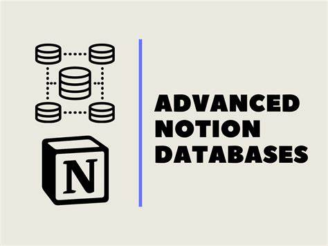
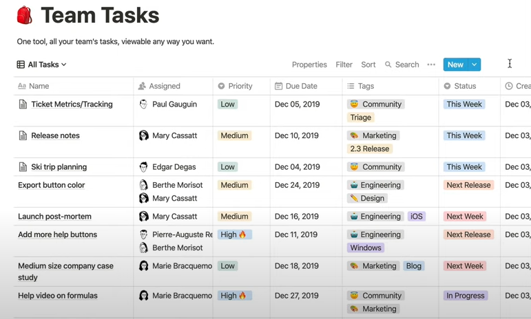
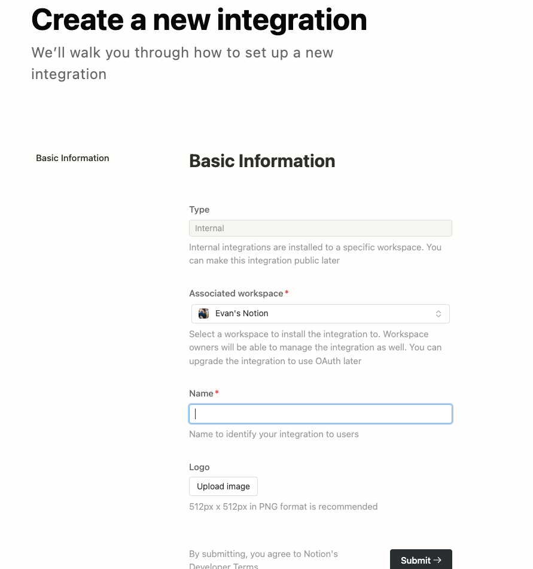
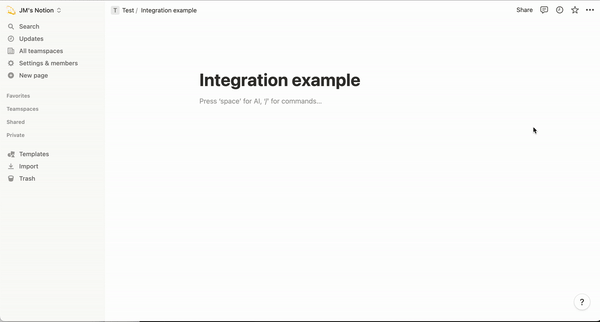
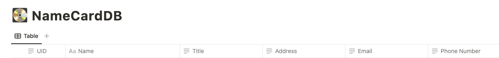
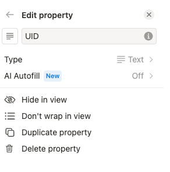
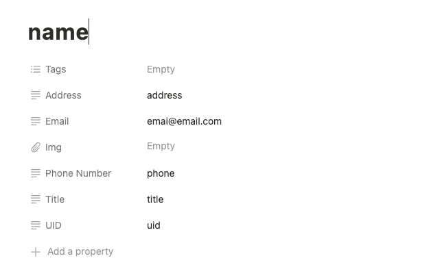

# 前提

在撰寫許多 Side Project 的時候，除了網路服務伺服器之外，最困擾的大概就是資料庫的問題。雖然之前我的文章 [[學習心得\][Golang] 把 Github Issue 當成資料庫來用](https://www.evanlin.com/go-github-issue/) 曾經教過透過 Github Golang API 來將簡單的一些資料放在 Github Issue 上，但是如果資料格式比較複雜的時候。可能就會需要透過類似資料庫格式的儲存體來處理。 偏偏許多線上資料庫都是算時間與用量，對於想寫一些有趣的 Side Project 卻沒有那麼友善。

本篇文章將使用 [Notion Database](https://www.notion.so/help/guides/creating-a-database) 作為資料的儲存體，並且透過 Golang 去查詢，插入相關的資料處理。 本篇文章也會從如何設定一個 [Notion Integration](https://developers.notion.com/docs/create-a-notion-integration) 開始教導，讓你透過 Golang 來操控  [Notion Database](https://www.notion.so/help/guides/creating-a-database)  沒有任何痛苦。


#### 本篇文章將透過: [https://github.com/kkdai/linebot-smart-namecard](https://github.com/kkdai/linebot-smart-namecard) 來說明。

# 關於 Notion Database 

<iframe width="560" height="315" src="https://www.youtube.com/embed/O8qdvSxDYNY?si=HpjDcPf42mp5TqTR" title="YouTube video player" frameborder="0" allow="accelerometer; autoplay; clipboard-write; encrypted-media; gyroscope; picture-in-picture; web-share" allowfullscreen></iframe>

以上是一段 [Notion 官方教學影片 Notion Database](https://www.youtube.com/watch?v=O8qdvSxDYNY) 裡面有提到如何建立一個 Database ，並且有稍微解釋：

- Create -> 選擇 Database 欄位中 ->  Table 

## 使用 Notion Database 的好處:



- Notion Database 支援相當豐富的格式，並且有很漂亮的視覺化介面。
- 並且 [Notion Database](https://www.notion.so/help/guides/creating-a-database)  支援多種格式： Table, Board, Calendar, List,  and Gallery
- 除了蠻方便 coding 之外，如果有後台管理員，可以透過 Notion UI 來直接查看結果。

# 建立 Notion Integration

可以先到 N[otion Developer](https://developers.notion.com/)  建立第一個 [Notion Integration](https://www.notion.so/my-integrations) :



- **Type:** Internal 只有你可以用，其他人沒有辦法選到。
- **Name**: 只要可以辨識就好。

這樣就可以建立了 Integration ，並且取的 Internal Integration Secret (Notion API Key):


## 開啟 Notion Database 讓 Notion Integration 可以存取：

記得要讓 [Notion 頁面取得 Integration 權限](https://developers.notion.com/docs/create-a-notion-integration#give-your-integration-page-permissions) ，參考以下圖片。



官方給的 GIF 檔案相當的清楚，這也是最重要的其中一步。要讓你的資料可以讓 Integration 存取。

## 取得 Notion Database ID

這也是一個相當重要的事情，要使用 Golang 去存取你的 Notion Database 就需要以下兩個資料：

- **Notion Internal Integration Secret (API Key)**
- **Notion Page ID**

Notion DB 的頁面網址應該是 `https://www.notion.so/b764xxxxxa?v=dexxxx1` 那麼 `b764xxxxxa`就是你的 DatabasePageId。


# 了解 Notion Database Data Type:

在準備要連接 [Notion Database](https://www.notion.so/help/guides/creating-a-database)  的時候，你必須要先知道每個欄位的差別。




以我的資料庫為例子:

- **UID**: 存放 LINE OA User UID，做為辨識之用。資料格式是： Text



- 其他都是 Title, Address, Email, Phone Number 。
- **Name**: 使用了 Title 這個資料格式，其中差別為： Title 只能有一個欄位，並且會變成新頁面的標題。



#  開始撰寫 Golang Notion Database 程式碼：

#### 這邊使用的套件是：  [https://github.com/jomei/notionapi](https://github.com/jomei/notionapi)

## 先了解資料架構

```
// Person 定義了 JSON 資料的結構體
type Person struct {
	Name        string `json:"name"`
	Title       string `json:"title"`
	Address     string `json:"address"`
	Email       string `json:"email"`
	PhoneNumber string `json:"phone_number"`
}

// DatabaseEntry 定義了 Notion 資料庫條目的結構體。
type NotionDB struct {
	DatabaseID string
	Token      string
}
```

- **Person**: 來自名片掃描的 JSON 資料，也代表這裡每個欄位的資料。除了 UID 是要透過參數進來的。
- **NotionDB**:啟動 Notion 需要知道的資料：
  - **Token**: 就是 Notion Integration Secret
  - **DatabaseID**: 在 URL 即可取得。 Notion DB 的頁面網址應該是 `https://www.notion.so/b764xxxxxa?v=dexxxx1` 那麼 `b764xxxxxa`就是你的 DatabasePageId。

## 首先看 Query (search)

```
// QueryDatabase 根據提供的屬性和值查詢 Notion 資料庫。
func (n *NotionDB) QueryDatabase(UId, property, value string) ([]Person, error) {
	client := notionapi.NewClient(notionapi.Token(n.Token))

	// Add UId to the filter conditions
	// 建立查詢過濾條件
	filter := &notionapi.DatabaseQueryRequest{
		Filter: notionapi.AndCompoundFilter{
			notionapi.PropertyFilter{
				Property: property,
				RichText: &notionapi.TextFilterCondition{
					Equals: value,
				},
			},
			notionapi.PropertyFilter{
				Property: "UID",
				RichText: &notionapi.TextFilterCondition{
					Equals: UId,
				},
			},
		},
	}

	// 調用 Notion API 來查詢資料庫
	result, err := client.Database.Query(context.Background(), notionapi.DatabaseID(n.DatabaseID), filter)
	if err != nil {
		return nil, err
	}

	var entries []Person

	for _, page := range result.Results {
		entry := n.createEntryFromPage(&page)
		entries = append(entries, entry)
	}
	return entries, nil
}

```

這一段需要注意的是：

- 過濾條件使用的是 `AndCompoundFilter` ，也就是要兩個條件 A && B 。
- 其中要注意的 `PropertyFilter`如果資料格式不同的時候，需要處理不同資料。
  - Text: `TextFilterCondition`
  - Title: `TitleFilterCondition`
-  依此類推。

## 再來看如何新增資料

```
// AddPageToDatabase adds a new page with the provided field values to the specified Notion database.
func (n *NotionDB) AddPageToDatabase(Uid string, name string, title string, address string, email string, phoneNumber string) error {
	client := notionapi.NewClient(notionapi.Token(n.Token))

	// 建立 Properties 物件來設置頁面屬性
	properties := notionapi.Properties{
		"UID": notionapi.RichTextProperty{
			RichText: []notionapi.RichText{
				{
					PlainText: name,
					Text:      &notionapi.Text{Content: Uid},
				},
			},
		},
		"Name": notionapi.TitleProperty{
			Title: []notionapi.RichText{
				{
					PlainText: name,
					Text:      &notionapi.Text{Content: name},
				},
			},
		},
		// Address, Email, Phone Number....
	}

	// 創建一個新頁面的請求
	pageRequest := &notionapi.PageCreateRequest{
		Parent: notionapi.Parent{
			DatabaseID: notionapi.DatabaseID(n.DatabaseID),
		},
		Properties: properties,
	}

	// 調用 Notion API 來創建新頁面
	_, err := client.Page.Create(context.Background(), pageRequest)
	if err != nil {
		log.Println("Error creating page:", err)
		return err
	}

	log.Println("Page added successfully:", Uid, name, title, address, email, phoneNumber)
	return nil
}
```

- 大部分程式碼都是類似的，但是根據欄位不同。需要調整以下內容：

```
"UID": notionapi.RichTextProperty{
			RichText: []notionapi.RichText{
				{
					PlainText: name,
					Text:      &notionapi.Text{Content: Uid},
				},
			},
		},
```

- 其中的 `name` 是固定參數，不能改。
- 只有後面的 Content: `Uid` 可以改。

- 此外，根據欄位不同 `RichTextProperty` 也會變動。如果不正確，就無法正確地寫入資料。


## 最後測試範例程式碼：

```
func TestAddNotionDB(t *testing.T) {
	token := os.Getenv("NOTION_INTEGRATION_TOKEN")
	pageid := os.Getenv("NOTION_DB_PAGEID")

	// If not set token and pageid , skip this test
	if token == "" || pageid == "" {
		t.Skip("NOTION_INTEGRATION_TOKEN or NOTION_DB_PAGEID not set")
	}

	db := &NotionDB{
		DatabaseID: pageid,
		Token:      token,
	}

	err := db.AddPageToDatabase("uid", "name", "title", "address", "emai@email.com", "phone")
	if err != nil {
		t.Fatal(err)
	}
}

```


# 參考資料：

- [[學習心得\][Golang] 把 Github Issue 當成資料庫來用](https://www.evanlin.com/go-github-issue/) 
- [Notion Database](https://www.notion.so/help/guides/creating-a-database) 
- [Build your first Notion Integration](https://developers.notion.com/docs/create-a-notion-integration)
- [Notion 官方教學影片 Notion Database](https://www.youtube.com/watch?v=O8qdvSxDYNY)
