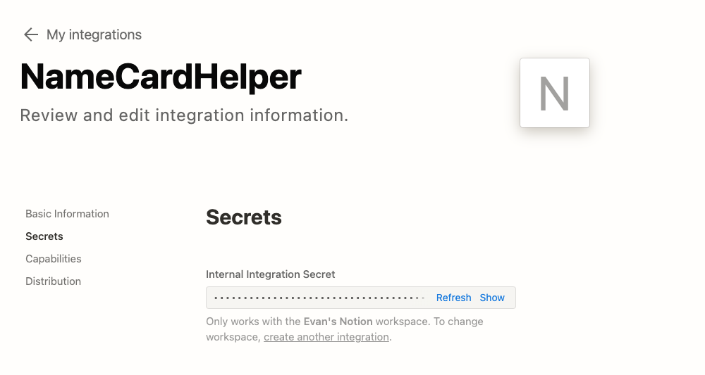

# 前提

在撰寫許多 Side Project 的時候，除了網路服務伺服器之外，最困擾的大概就是資料庫的問題。雖然之前我的文章 [[學習心得\][Golang] 把 Github Issue 當成資料庫來用](https://www.evanlin.com/go-github-issue/) 曾經教過透過 Github Golang API 來將簡單的一些資料放在 Github Issue 上，但是如果資料格式比較複雜的時候。可能就會需要透過類似資料庫格式的儲存體來處理。 偏偏許多線上資料庫都是算時間與用量，對於想寫一些有趣的 Side Project 卻沒有那麼友善。

本篇文章將使用 [Notion Database](https://www.notion.so/help/guides/creating-a-database) 作為資料的儲存體，並且透過 Golang 去查詢，插入相關的資料處理。 本篇文章也會從如何設定一個 [Notion Integration](https://developers.notion.com/docs/create-a-notion-integration) 開始教導，讓你透過 Golang 來操控  [Notion Database](https://www.notion.so/help/guides/creating-a-database)  沒有任何痛苦。

# 關於 Notion Database 

<iframe width="560" height="315" src="https://www.youtube.com/embed/O8qdvSxDYNY?si=HpjDcPf42mp5TqTR" title="YouTube video player" frameborder="0" allow="accelerometer; autoplay; clipboard-write; encrypted-media; gyroscope; picture-in-picture; web-share" allowfullscreen></iframe>

以上是一段 [Notion 官方教學影片 Notion Database](https://www.youtube.com/watch?v=O8qdvSxDYNY) 裡面有提到如何建立一個 Database ，並且有稍微解釋：

- Create -> 選擇 Database 欄位中 ->  Table 

## 使用 Notion Database 的好處:

- Notion Database 支援相當豐富的格式，並且有很漂亮的視覺化介面。
- 並且 [Notion Database](https://www.notion.so/help/guides/creating-a-database)  支援多種格式： Table, Board, Calendar, List,  and Gallery
- 除了蠻方便 coding 之外，如果有後台管理員，可以透過 Notion UI 來直接查看結果。

# 建立 Notion Integration

可以先到 N[otion Developer](https://developers.notion.com/)  建立第一個 [Notion Integration](https://www.notion.so/my-integrations) :

- **Type:** Internal 只有你可以用，其他人沒有辦法選到。
- **Name**: 只要可以辨識就好。

這樣就可以建立了 Integration ，並且取的 Internal Integration Secret (Notion API Key):

## 開啟 Notion Database 讓 Notion Integration 可以存取：

記得要讓 [Notion 頁面取得 Integration 權限](https://developers.notion.com/docs/create-a-notion-integration#give-your-integration-page-permissions) ，參考以下圖片。

官方給的 GIF 檔案相當的清楚，這也是最重要的其中一步。要讓你的資料可以讓 Integration 存取。

## 取得 Notion Database ID

這也是一個相當重要的事情，要使用 Golang 去存取你的 Notion Database 就需要以下兩個資料：

- **Notion Internal Integration Secret (API Key)**
- **Notion Page ID**

Notion DB 的頁面網址應該是 `https://www.notion.so/b764xxxxxa?v=dexxxx1` 那麼 `b764xxxxxa`就是你的 DatabasePageId。

# 參考資料：

- [[學習心得\][Golang] 把 Github Issue 當成資料庫來用](https://www.evanlin.com/go-github-issue/) 
- [Notion Database](https://www.notion.so/help/guides/creating-a-database) 
- [Build your first Notion Integration](https://developers.notion.com/docs/create-a-notion-integration)
- [Notion 官方教學影片 Notion Database](https://www.youtube.com/watch?v=O8qdvSxDYNY)
