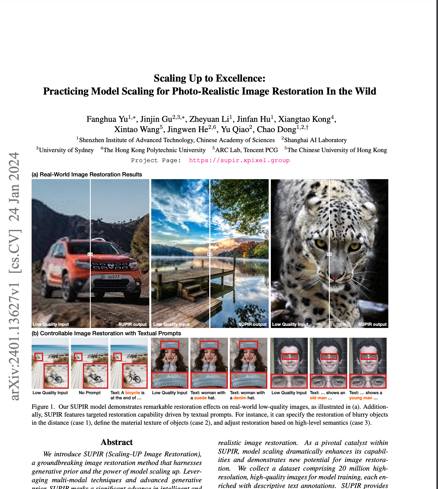
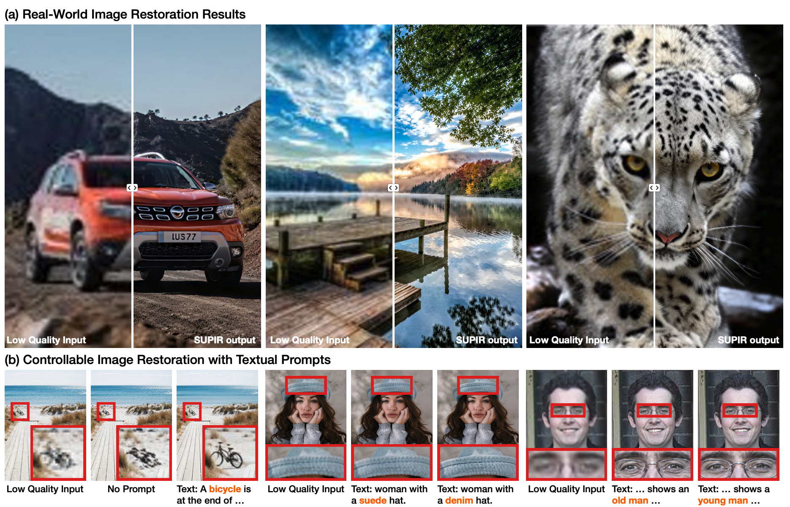
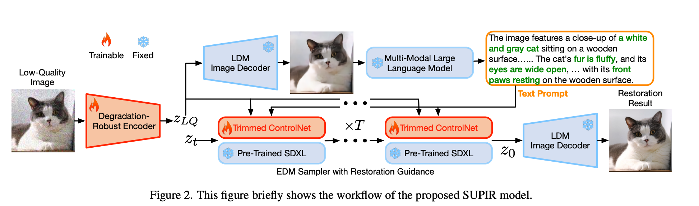

### 論文名稱: [Scaling Up to Excellence: Practicing Model Scaling for Photo-Realistic Image Restoration In the Wild](https://arxiv.org/abs/2401.13627)

# Scaleing Up to Excellence： 令人驚艷圖像恢復論文 

提出 SUPIR (Scaling-UP Image Restoration)，主要有以下方法: 

- 透過 prompt 提升修復能力，甚至透過 Negtive Prompt 來加強
-  超過 2000 萬張超高畫質訓練素材 。 

結果在品質上可以看到相當好的成效。

#### 論文: [https://arxiv.org/abs/2401.13627](https://arxiv.org/abs/2401.13627)

#### 網站： [https://supir.xpixel.group/](https://supir.xpixel.group/)

## 快速總結

- **研究主題**：使用生成式先驗和模型縮放的技術，實現針對真實場景的超高質量的圖像恢復方法。
- **數據集**：收集了2000萬張高分辨率、高質量的圖像，每張圖像都有描述性的文本註釋，用於模型的訓練。
- **創新點**：提出了一種通過文本提示來引導圖像恢復的方法，擴展了圖像恢復的應用範圍和潛力。並且引入了負質量提示來進一步提高感知質量。還開發了一種恢復引導採樣方法，以抑制生成式恢復中遇到的保真度問題。
- **實驗結果**：展示了SUPIR的卓越的圖像恢復效果，以及其通過文本提示進行恢復操作的新穎能力。

## 系統架構

 EDM Sampler with Restoration Guidance 的主要內容如下：

- **EDM Sampler with Restoration Guidance** 是一種用於圖像修復的採樣方法，它基於擴散模型的原理，並引入了一個新的超參數 τr 來控制採樣過程中對低質量圖像的引導程度。
- **目的**：該方法的目的是在保持圖像的感知質量的同時，提高圖像的忠實度，即使圖像在採樣過程中不會偏離低質量圖像的內容。
- **原理**：該方法的原理是在每一步的採樣中，根據 τr 的大小，將預測的結果 zt−1 與低質量圖像 zLQ 進行一定比例的混合，使得 zt−1 在保留生成的細節和紋理的同時，也接近於 zLQ。
- **效果**：該方法的效果通過在不同的合成和真實的低質量圖像上的實驗進行了驗證，並與其他的圖像修復方法進行了比較。結果顯示，該方法在非參考指標上取得了最好的表現，並在全參考指標上也有不錯的表現。此外，該方法還可以通過調整 τr 的大小，實現對圖像修復的靈活控制，從而達到不同的效果。
