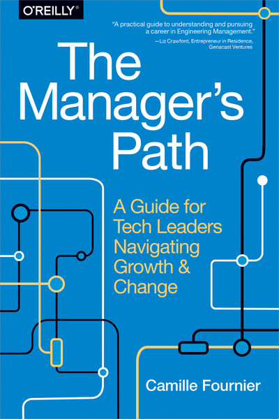
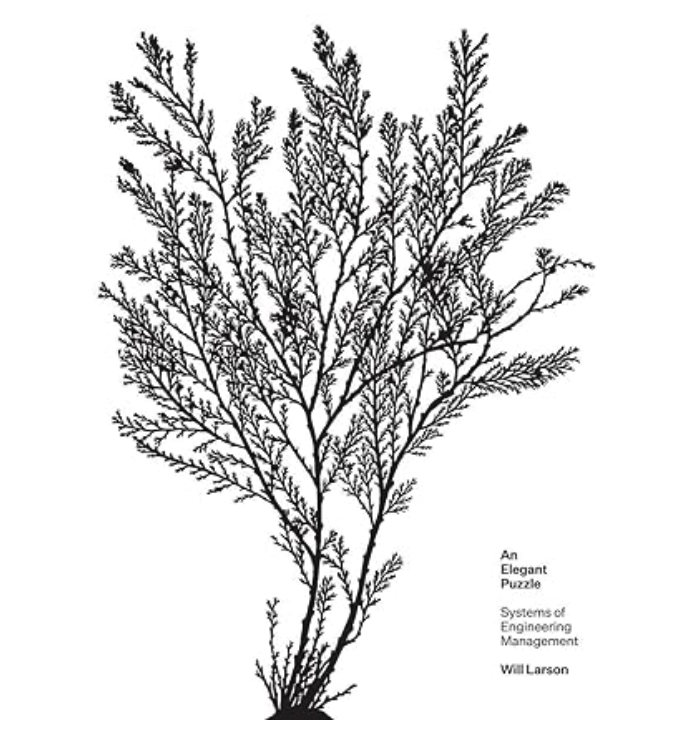
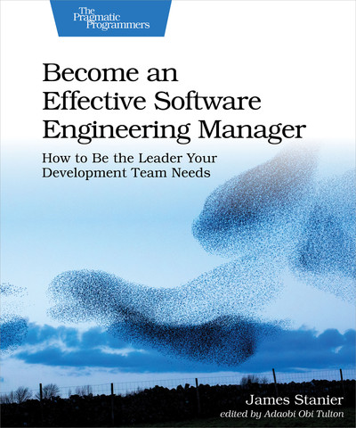
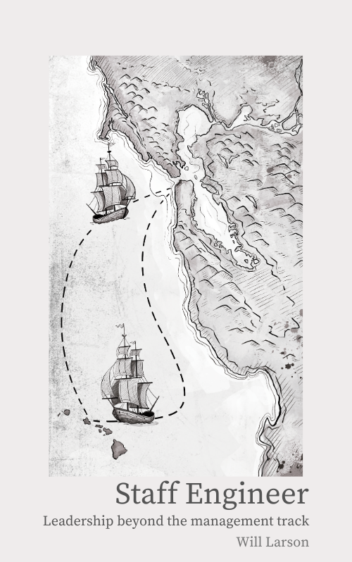
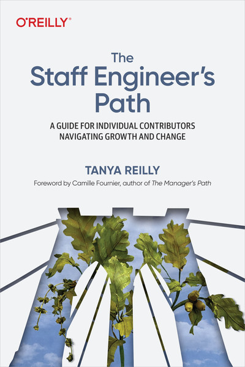

<blockquote class="twitter-tweet">
2023年，我最大的收益之一就是发现了许多优秀的书籍。这些书对我的职业发展提供了极大的帮助。照片中是我去年买的和职业发展相关的书籍。大致可以把这些书分为三个类别。  第一类，关于理解和成为（或选择不成为）Manager 的书籍：  - 《The Manager&#39;s Path》✨（经典必读，即使不想当 Manager） -《An… <a href="https://t.co/XZaubZD9U7">pic.twitter.com/XZaubZD9U7</a>
&mdash; 北火 (@beihuo) <a href="https://twitter.com/beihuo/status/1752112937337327939?ref_src=twsrc%5Etfw">January 29, 2024</a></blockquote> 

# 第一类，关于理解和成为（或选择不成为）Manager 的书籍：

### 《The Manager's Path》（经典必读，即使不想当 Manager） 

  

  這個在 [Safari Online](https://learning.oreilly.com/library/view/the-managers-path/9781491973882/) 有，也有 [audio Book](https://learning.oreilly.com/videos/the-managers-path/9781492036432/) 版本。 這本我也看完了，但是還沒寫心得分享。

### 《An Elegant Puzzle: Systems of Engineering Management》  from [Amazon](https://www.amazon.com/Elegant-Puzzle-Systems-Engineering-Management/dp/1732265186)

  

  

### 《Become an Effective Software Engineering Manager》（读的 Kindle 版，里面有非常实用的技巧) 

這個在 [Safari online](https://learning.oreilly.com/library/view/become-an-effective/9781680507867/) 也有。

# 第二类，旨在帮助你成为更出色的工程师的书籍： 

### 《Staff Engineer: Leadership beyond the management track》 

[原文](https://staffeng.com/book)有人做了中文翻譯，還[開放Gitbook](https://yucliu.gitbook.io/staff-engineer/)。

### 《The Staff Engineer Path》 

這個在 [Safari online](https://learning.oreilly.com/library/view/-/9781098118723/) 也有， 也有 [audio book](https://learning.oreilly.com/videos/-/9781663721174/) 版本。 我也有[心得](https://www.evanlin.com/reading-staff-eng-path/)分享。

# 第三类，专注于培养更优秀的团队和工作环境的书籍： 

### 《Shape Up》
### 《Rework》
### 《Remote》 
### 《It doesn't have to be crazy at work》

以上書籍帶查詢。
