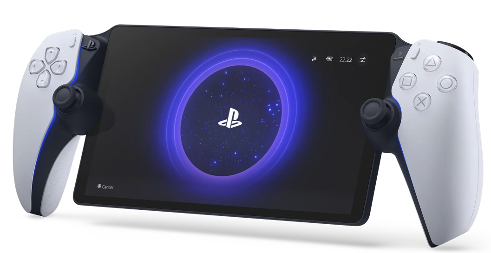

<iframe width="560" height="315" src="https://www.youtube.com/embed/5OJrBQvZNEA?si=3fO0Rs_eeL9W_Hfk" title="YouTube video player" frameborder="0" allow="accelerometer; autoplay; clipboard-write; encrypted-media; gyroscope; picture-in-picture; web-share" allowfullscreen></iframe>

## 前情提要：

上週五晚上用 [PS Portal Remote](https://www.playstation.com/ja-jp/accessories/playstation-portal-remote-player/) 打破第一款遊戲 「PS5 惡魔靈魂-重製版」，打一些感想： (跟著我唸三次: Playstation Portal Remote 是搖桿）

- [Portal](https://www.playstation.com/ja-jp/accessories/playstation-portal-remote-player/) 打籃球遊戲有點吃緊，但是魂系類可以打王。不打盾反的話，之前玩隻狼因為要抓防禦節奏，還是不太行。

- 整個續航力很強大，大概可以打到四五個小時以上（因為都是串流）

- 用 PS Portal 好處就是，每一場都有錄影可以用。 XDDD 

- 滿了 PS Portal 之後，我 Deck 開始變少用了。因為串流續航力真的很強。

  

## 接下來是「惡魔靈魂-重製版」的感想：

- 畫面真的超好，魂系列最好的畫質也不奇怪。（法環沒有 PS5 版本)
- 惡魔靈魂的王都比較簡單，倒是跑圖超遠。
- 全白跟全黑很農，到後期根本不想打了。
- 家人看韓劇，我在旁邊刷刷魂跟密斯特鐵鎚，其實很療癒。
- 不過我尾王還是拿打刀來收尾。

# 一些遊戲片段

## 1-2 如何用法師打紅龍

<iframe width="560" height="315" src="https://www.youtube.com/embed/Zvo949BMF98?si=C9M8vd2aH_m82uBo" title="YouTube video player" frameborder="0" allow="accelerometer; autoplay; clipboard-write; encrypted-media; gyroscope; picture-in-picture; web-share" allowfullscreen></iframe>

## 如何刷 密斯特鐵鎚 

<iframe width="560" height="315" src="https://www.youtube.com/embed/b9VZj8jaF2E?si=XSFS2Ftok7E9KPLB" title="YouTube video player" frameborder="0" allow="accelerometer; autoplay; clipboard-write; encrypted-media; gyroscope; picture-in-picture; web-share" allowfullscreen></iframe>

##  老勇士要怎麼打

<iframe width="560" height="315" src="https://www.youtube.com/embed/-kpIovtYK2A?si=g8Sov3_ersfaKuyQ" title="YouTube video player" frameborder="0" allow="accelerometer; autoplay; clipboard-write; encrypted-media; gyroscope; picture-in-picture; web-share" allowfullscreen></iframe>