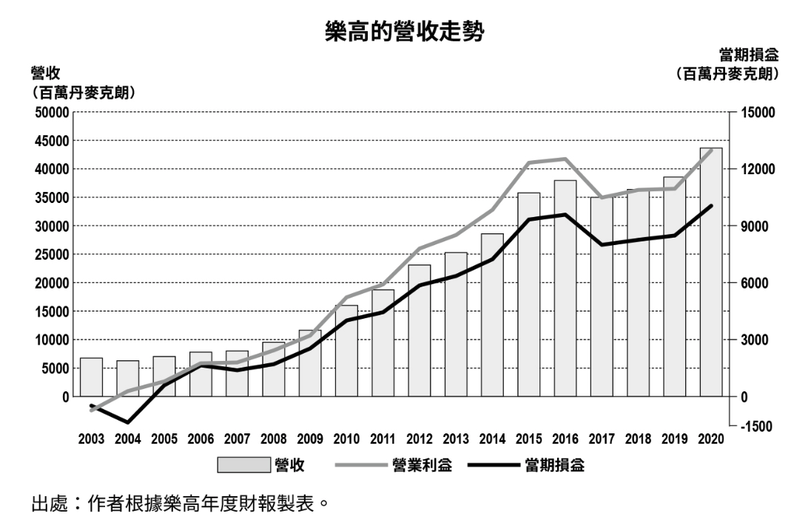
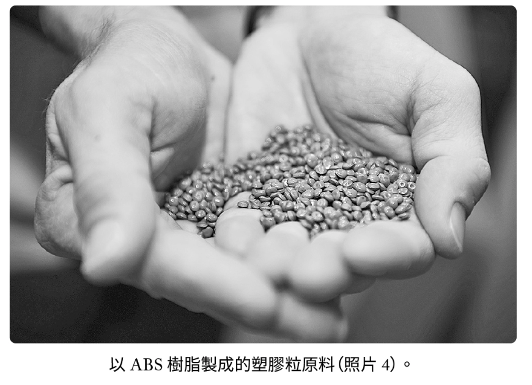
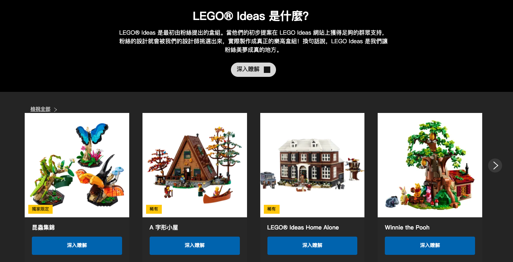
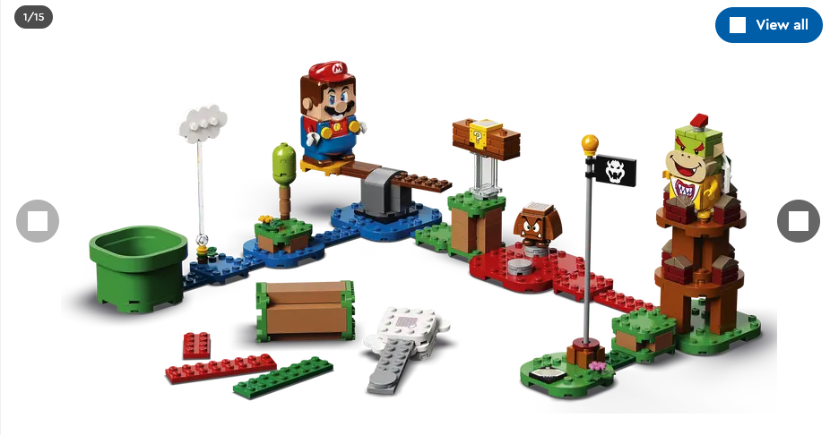

<div><a href="https://moo.im/a/569moO" title="樂高"></a></div>


```
樂高 - 小積木立大功，用玩具堆出財富帝國的秘訣
レゴ 競争にも模倣にも負けない世界一ブランドの育て方
作者： 蛯谷 敏  
譯者： 連雪雅  陳幼雯  蘇文淑  
出版社：大塊文化 
出版日期：2022/05/28 
語言：繁體中文 
```

#### 買書推薦網址：

- Readmoo: [購買網址](https://moo.im/a/569moO)

# 前言:

這是 2024 年第 1本讀完的書，這一本還蠻早之前就注意到的。但是因為真的超級厚一本，所以遲遲沒有開始看。去年年底開始喜歡看比較大本的書，以致於年底的書籍掛零。 這一本看完反而易猶未竟，真的蠻多小故事。不論是你是一個新創企業的老闆，還是一個成熟企業的主管。這一本書裡面有許多時期都是你會感同身受的。


# 內容摘要：

```
你一定玩過樂高，但你也許不知道：
 
任天堂、TOYOTA、Google、MIT、NASA⋯⋯都與樂高有著出乎意料的關聯！
 
樂高是現在世界上最大、利潤最高的玩具製造商，它曾被美國《財星》雜誌評為「世紀玩具」，更獲選為「全球最具影響力的品牌」，蟬聯「全球最佳聲譽企業」的寶座。在COOVID-19疫情下依然逆勢成長，營收屢創新高。
 
轉型創新必看！
面對時代新趨勢，向玩具龍頭學習變與不變的經營哲學
 
1932年創立於丹麥的樂高，發展至今近90年，在發展初期幾乎無人料想到其產品對於成人，能夠像對於兒童一樣具有吸引力。除了玩具外，還跨足不同商業領域，包含電影、遊戲、主題樂園等。
 
在今日如此成就下，其實鮮少人知道，樂高曾幾度陷入經營危機：因專利保護期結束，相繼產生，造成市場占有率急劇縮小；與《星際大戰》、《哈利波特》等知名 IP 合作，急於改革卻導致樂高一度面臨破產⋯⋯
 
在這些危機中，樂高如何活用原有的創造性，提高商品價值的產品開發、品牌養成、培育廣大粉絲群、進行異業合作等策略，突破經營困境，創下高收益？
創造競爭優勢，「拼」出好成績
向樂高學習品牌永續經營的核心關鍵
 
品牌經營永遠是進行式！本書揭開超越GAFA（GOOGLE、AMAZON、FACEBOOK、APPLE）的樂高成功法則，教你掌握連Google 、TOYOTA都受到影響，持續創造品牌價值的四大關鍵——
【關鍵1】理解自身強項
【關鍵2】創造能不斷收獲佳績的體系
【關鍵3】經營社群、強化連結
【關鍵4】明確的企業存在意義
```



樂高的年度財報表，可以看出來 2017 面臨著少見的營業利益與營收雙雙下滑的窘境。

# 心得:

在閱讀這本書前，我可能不是很清楚其實樂高已經是一間超過九十年的老公司。他高昂的單價，會讓我不知道其實他的專利在 1980 末期其實就已經過期。 現在你看到的所有「樂高-like」的組合積木其實都是合法的。 



那麼到底樂高是透過哪些方式在經歷了：

- 1980 末的專利權過期，市場競爭開始激烈。
- 2000 之後，電視遊樂器的興起更讓兒童對於樂高逐漸失去了興趣。
- 2017 年初的經營危機，連續十三年的獲利之後戶然在這一年遇到營收與獲利雙減。
- 2020 年之後，所有的民眾對於短視頻的熱衷。讓注意力更難在積木上專注。

究竟他們是如何專注與轉型？ 當然樂高不是沒有做錯事情，他們也有因為做了許多特有的樂高積木，造成過多的庫存與低迷的買氣。差點讓整個公司面臨到倒閉。


但是，回歸使用者創意的做法，讓他們更認真的思考會玩樂高的人，究竟要的是什麼？ 

- 是更多專屬的新樂高積木塊？
- 是更多電影系列的合作款？

之後他們也認真的將積木回歸了最基本的方式，反而與玩家一起成立特殊品牌  - 「 [Ideas 系列](https://www.lego.com/zh-tw/themes/ideas/about)」



這個系列將玩家變成了創作者，也讓「玩家社群化」更多與更多的玩家加入討論，搜集，投稿。一起跟公司成長。也造就了公司營收的復甦。 加上 2020 年之後的[瑪莉歐創作系列](https://www.lego.com/en-us/product/adventures-with-mario-starter-course-71360)，讓整個樂高的創作來的一個新的高度，並且讓更多的人願意一起加入。




最後，這整本書的編排其實不是依照時間的編排方式。 反而是透過許多單獨採訪的方式來敘述關於樂高這間公司的故事，在觀看上會稍嫌有點凌亂。 但是許多的重點還是有被完整的敘述，一間偉大的公司在經歷許多不同的嘗試過後。最重要的還是要回歸初衷，讓使用者找到他們真正的價值。
