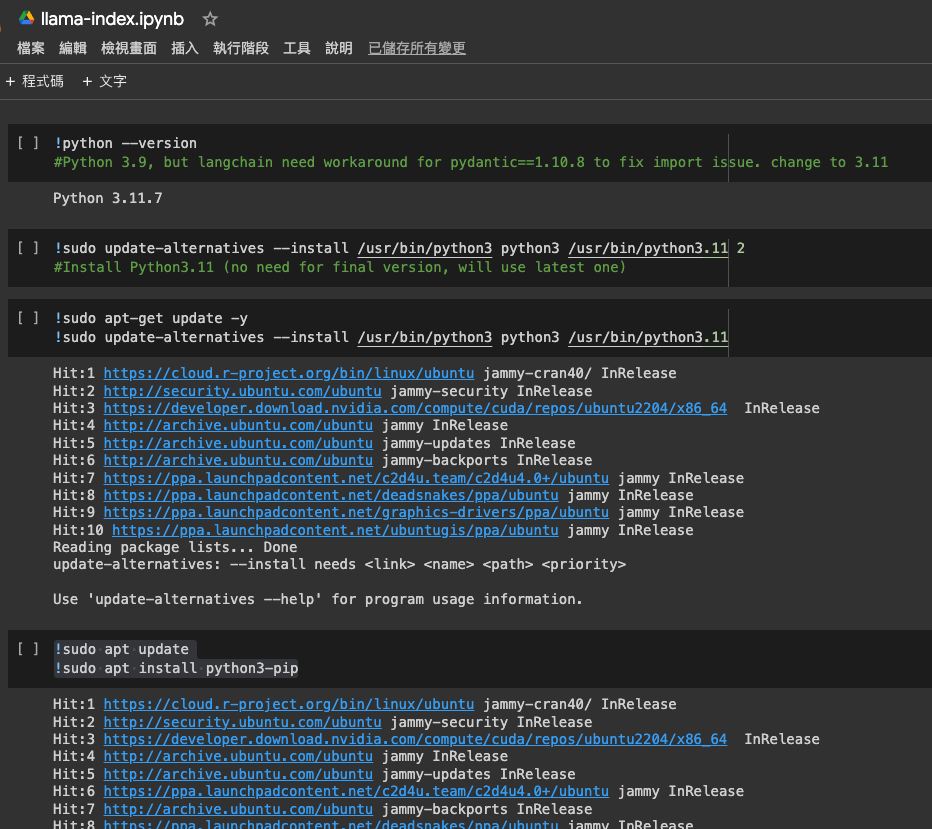

Google Colab 是一個免費的雲端 Jupyter 筆記本環境，可用於編寫和執行 Python 程式碼。Colab 預設的 Python 版本為 3.7，但有些情況下可能需要使用其他版本的 Python。


**如何查看 Google Colab 的 Python 版本**

要查看 Google Colab 的 Python 版本，請在程式碼編輯區域中輸入以下命令：


```
!python --version
```


**如何更改 Google Colab 的 Python 版本**


有兩種方法可以更改 Google Colab 的 Python 版本：

- **使用** `%env` **魔術命令**


```
%env PYTHONPATH=/usr/lib/python3.11

!python --version
```


- **使用** `update-alternatives` **命令**


```
sudo update-alternatives --install /usr/bin/python3 python3 /usr/bin/python3.11

!python --version
```


**注意事項**

- 更改 Google Colab 的 Python 版本可能會影響已安裝的套件。
- 更改 Python 版本後，請重新啟動 Colab 執行階段。


**以下是一些常見的 Google Colab Python 版本問題及其解決方案：**

- **問題：** 我需要使用 Python 3.9，但 Colab 預設的 Python 版本為 3.7。
  - **解決方案：** 使用上述方法之一將 Python 版本更改為 3.9。

- **問題：** 我更改了 Python 版本，但 Colab 仍使用舊版本的 Python。
  - **解決方案：** 重新啟動 Colab 執行階段。


- **問題：** 我更改了 Python 版本，但某些套件無法正常工作。
  - **解決方案：** 重新安裝這些套件。

**希望這篇教學文章能幫助您解決 Google Colab Python 版本號碼問題。**


以下為截圖上的程式碼擷取，放在這裡備用。

```
!python --version
#Python 3.9, but langchain need workaround for pydantic==1.10.8 to fix import issue. change to 3.11
```


```
!sudo update-alternatives --install /usr/bin/python3 python3 /usr/bin/python3.11
#Install Python3.11 (no need for final version, will use latest one)
```


```
!sudo apt update
!sudo apt install python3-pip
```


