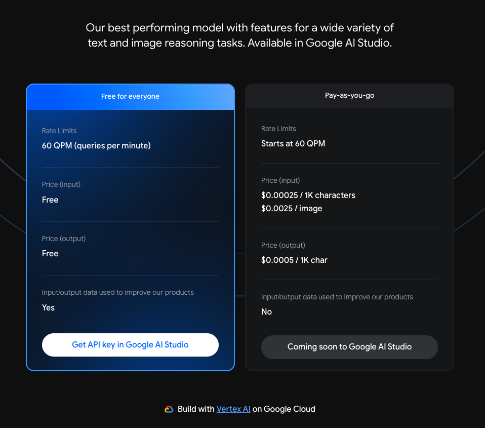
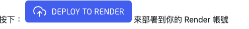
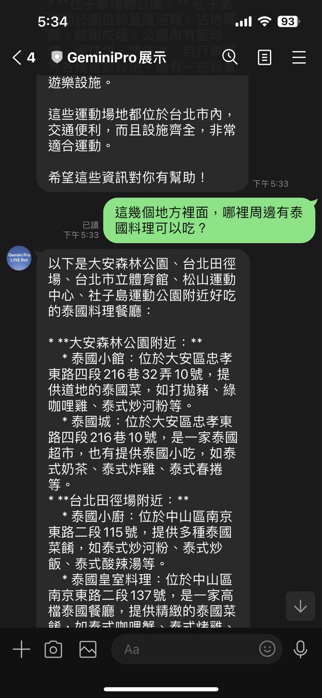

# 前提

前幾篇的文章 [[Golang\] 透過 Google Gemini Pro 來打造一個基本功能 LLM LINE Bot](https://www.evanlin.com/til-gogle-gemini-pro-linebot/) 曾經提過，如何整合基本的 Gemini Pro Chat 與 Gemini Pro Vision 兩個模型的使用。 本次將快速提一下，打造一個具有記憶體的 LINE Bot 該如何做。

##### 相關開源程式碼：

[https://github.com/kkdai/linebot-gemini-pro](https://github.com/kkdai/linebot-gemini-pro)

## 什麼叫做有記憶的聊天機器人

- 

## 目前 Gemini Pro 的收費

截至筆者寫完（2024/01/03) 目前的定價依舊是 (refer [Google AI Price](https://ai.google.dev/pricing))

- 一分鐘內 60次詢問都免費
- 超過的話:
  - $0.00025 / 1K characters
  - $0.0025 / image

## 透過 Render 來快速部署服務:

由於 Gemini Pro 目前在某些額度下，還是免費的。這裡也更改了專案，讓沒有信用卡的學生可以學習如何打造一個 LLM 具有記憶的聊天機器人。

### Render.com 簡介：

- 類似 Heroku 的 PaaS (Platform As A Services) 服務提供者。
- 他有免費的 Free Tier ，適合工程師開發 Hobby Project。
- 不需要綁定信用卡，就可以部署服務。

參考： [Render.com Price](https://render.com/pricing)

### 部署步驟如下：

- 到專案頁面 [kkdai/linebot-gemini-pro: LINE Bot sample code how to use Google Gemini Pro in GO (Golang) (github.com)](https://github.com/kkdai/linebot-gemini-pro)
- 按下 Deploy To Render

- 選擇一個服務名字

- 這邊有三個需要填寫：
  - **ChannelAccessToken**: 請到 [LINE Developer Console](https://developers.line.biz/console/) 取得。
  - **ChannelSecret**: 請到 [LINE Developer Console](https://developers.line.biz/console/) 取得。
  - **GOOGLE_GEMINI_API_KEY**: 請到 [Google AI Studio](https://makersuite.google.com/app/apikey) 取得。
- 這樣就部署成功了，記得還要跟 LINE Bot 串接起來。

## 成果

根據以上的圖片，可以知道其實 ChatSession 相當適合打造 LINE Bot。

- 只儲存使用者跟 OA 的相關對話。
- 回覆的內容很適合在 OA 上面跟使用者互動。

但是使用 Gemini Pro 的 Chat Session 幾件事情需要注意：

- 因為所以的記憶是儲存在 Services 的記憶體中，由於 Render.com 是會睡眠重啟的。到時候他會忘記。
- ChatSession 是跟著 model 走的，也就是說： "gemini-pro" 跟 gemini-pro-vision" 兩個的對話是不能共用。

謝謝大家的觀看，也期待各位一起打造出

# 參考資料：

- [OpenAI ChatCompletion API](https://platform.openai.com/docs/guides/text-generation/chat-completions-api)
- [google.generativeai.ChatSession](https://ai.google.dev/api/python/google/generativeai/ChatSession?hl=en)
- [Google AI Studio API Price](https://ai.google.dev/pricing)
- [GoDoc ChatSession Example](https://pkg.go.dev/github.com/google/generative-ai-go/genai#example-ChatSession)
- [Google GenerativeAI ChatSession Python Client](https://ai.google.dev/api/python/google/generativeai/ChatSession?hl=en) 
