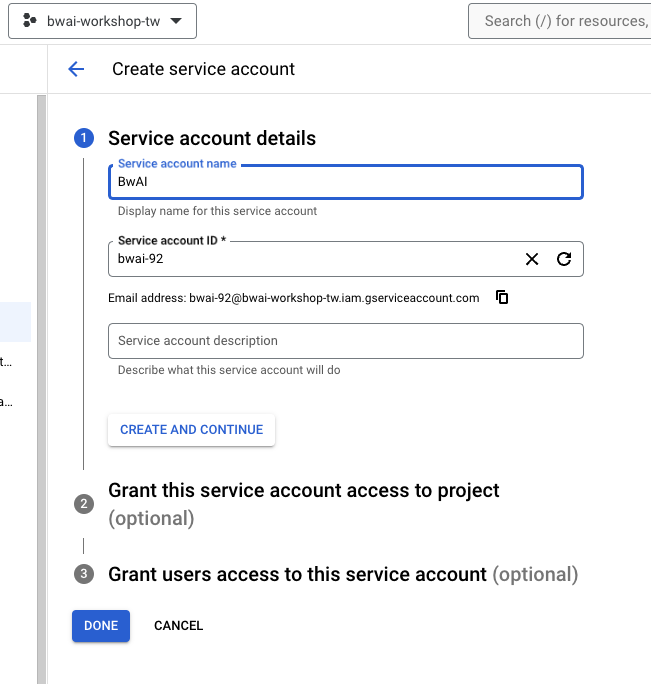

# 前提：

本篇文章將快速走過一次，如何申請 GCP Services Account Credential ，還有如何在 Cloud Function 使用這樣的資料，最後如何透 Golang 來在 Cloud Function 操控 Firebase Database ，還有可能發生的雷點。


## 申請 Services Account Credential 讓 Cloud Function 連接 Google 服務

這部分的教學，其實可以參考我另外一篇文章。[[學習文件] 如何在 Heroku 上面使用透過 Golang 來存取 Google Cloud 服務](https://www.evanlin.com/til-heroku-gcp-key/)，但是這邊還是快速走一次。

- 進入 Google Cloud Console ，到 IAM & Admin 選擇建立 Services Account


- Services Account Name 自己決定，要注意好 (上面專案跟 Firebase **專案名稱要一致**)



- Grant this service account access to project 在身份的時候，建議先用 Editor （比較大，需要小心使用）


- "Grant users access to this service account" 不需要特別設定
- 按下 "Manage Keys" 來準備下載 Credential 


- 選擇 Add Key -> Create new Key -> 下載 JSON 


## 使用 Golang Google Options 套件需要注意:

雖然已經將 Firebase Realtime Database 設定成每個人都可以讀寫，但是如果是透過 Golang 去存取的時候，你會出現 Unauthorized request 的錯誤訊息。 這時候就是因為你的 JSON 檔案的 Project 跟你的 Firebase Project 是不同的。 只要重新建立一個 Services Account 並且更新 JSON 內容即可。


# 如何在 Google Cloud Function 導入 Services Account Credential ?

接下來會來分享，要如何正確地能夠在 Cloud Function 內使用呢。 如果你想要直接使用 Cloud Function 去開啟 Credential JSON 檔案，你會一直得到無法正確拿到 credential 的錯誤訊息。

這時候需要先透過環境參數來加入:

- 將 JSON 檔案中所有內容複製起來
- 設定 `GOOGLE_APPLICATION_CREDENTIALS` 參數，然後把所有內容貼上環境參數。


- 接下來會跟大家講，如何修改相關程式碼？

```
	// Init firebase related variables
	ctx := context.Background()
	opt := option.WithCredentialsJSON([]byte(os.Getenv("GOOGLE_APPLICATION_CREDENTIALS")))
	config := &firebase.Config{DatabaseURL: os.Getenv("FIREBASE_URL")}
	app, err := firebase.NewApp(ctx, config, opt)
	if err != nil {
		log.Fatalf("error initializing app: %v", err)
	}
	client, err := app.Database(ctx)
	if err != nil {
		log.Fatalf("error initializing database: %v", err)
	}
```

- 首先`option.WithCredentialsJSON([]byte(os.Getenv("GOOGLE_APPLICATION_CREDENTIALS")))` 可以讓你從環境參數讀取到 credential 。
- 接下來 `&firebase.Config{DatabaseURL: os.Getenv("FIREBASE_URL")}` 則是將 FIREBASE_URL 內容設定好。
- 這樣就可以正確執行了，接下來要來看相關處理 Gemini 聊天記憶的部分了。

## 參考文章：

- [[學習文件] 如何在 Heroku 上面使用透過 Golang 來存取 Google Cloud 服務](https://www.evanlin.com/til-heroku-gcp-key/)

