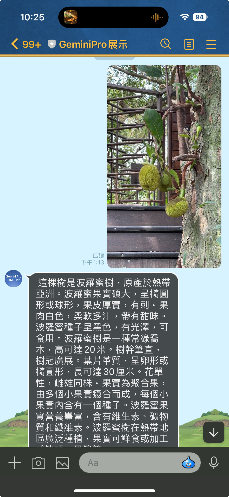
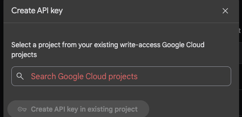
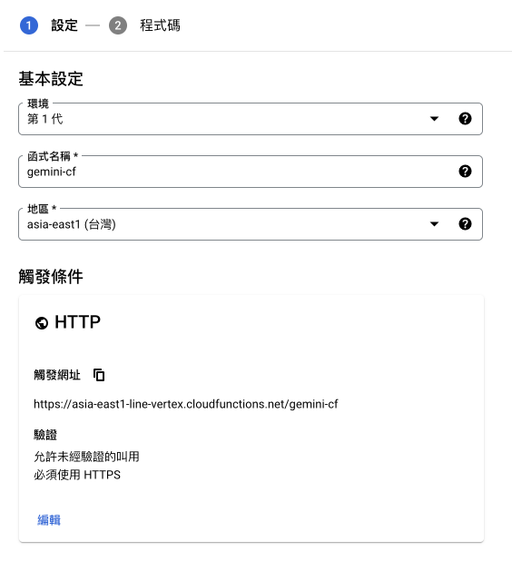
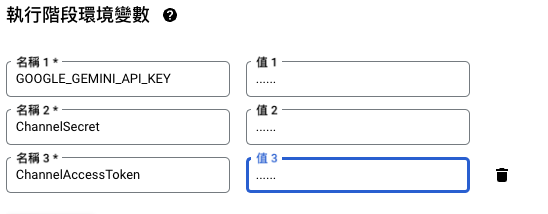
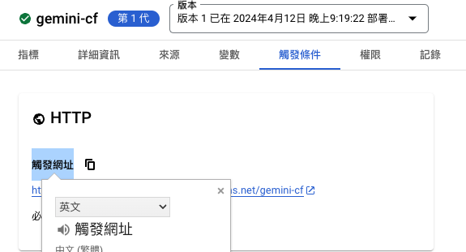
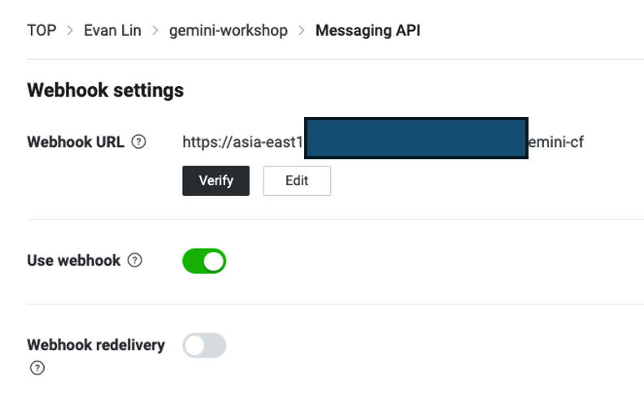
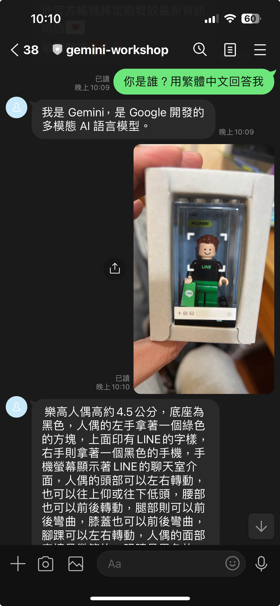

# 前言:

這是一篇為了 04/18 跟 Google Developer Group 合作的 BUILD WITH AI (BWAI) WORKSHOP 的第一篇系列文章（不知道還需要幾篇），裡面包含了完整的 LINE 開發者相關帳號設定與 GCP 相關設定，只需要有付費認證帳號，其實是不會花費到任何錢的。

# 文章列表：

-  [[BwAI workshop][Golang] LINE OA + CloudFunction + GeminiPro + Firebase = 旅行小幫手 LINE 聊天機器人(一)： 景色辨識小幫手](https://www.evanlin.com/linebot-cloudfunc-firebase-gemini-workshop/)
-  [[BwAI workshop][Golang] LINE OA + CloudFunction + GeminiPro + Firebase = 旅行小幫手 LINE 聊天機器人(2)： Firebase Database 讓 LINEBot 有個超長記憶](https://www.evanlin.com/linebot-cloudfunc-firebase-gemini-workshop2/)
- [ [BwAI workshop][Golang] LINE OA + CloudFunction + GeminiPro + Firebase = 旅行小幫手 LINE 聊天機器人(3)： 導入名片小幫手跟收據小幫手](https://www.evanlin.com/linebot-cloudfunc-firebase-gemini-workshop3/)


# 事前準備:

- **[LINE Developer Account](https://developers.line.biz/en/)**: 你只需要有 LINE 帳號就可以申請開發者帳號。
- [**Google Cloud Functions**](https://cloud.google.com/functions?hl=zh_cn)： ＧGo 程式碼的**部署平台**，生成供 LINEBot 使用的 webhook address。
- [**Firebase**](https://firebase.google.com/)：建立**Realtime database**，LINE Bot 可以記得你之前的對話，甚至可以回答許多有趣的問題。
- **[Google AI Studio](https://aistudio.google.com/)**:可以透過這裡取得 Gemini Key 。

## 關於 Gemini API Price

根據官方網站： [https://ai.google.dev/pricing?hl=zh-tw]( https://ai.google.dev/pricing?hl=zh-tw)


## 申請 Gemini API Key

- 到 Google AI Studio [https://aistudio.google.com/](https://aistudio.google.com/ ) 
- Click "Get API Key"
- 選擇你已經有綁定信用卡的付費帳號，來取得 API Key


# 申請一個 LINE 聊天機器人 (Messaging API)


- 到 [LINE Developer Console](https://developers.line.biz/en/services/messaging-api/) )並且登入
  
- 在挑選 Channel 的時候，如果要申請 LINE Chatbot (官方帳號)，就要申請 Messaging API
  
- 相關資料填寫上：
  - **Cmpany or owner's country or region**: 
  - **Channel Name**: 也就是你的 LINE Bot 名稱。
  - **Channel description**: 相關敘述來描述你 LINE Bot 做什麼。
  - 其他都可以隨便填寫即可。
- 接下來要到 Messaging API Tab 執行以下設定:
  - **Auto-reply messages**: 關閉它
    
- 接下來要取得兩個重要的參數：
  - 在 **Basic Setting** Tab 下方的 `Channel secret`
    
  - 在 **Messaging API** Tab 下方的 `Channel access token (long-lived) `
    
- 目前先到這邊，稍後還會回來設定相關 Webhook 。

# 建立一個新的 Google Cloud Function 

雖然 Google Cloud Function 跟 Firebase Realtime database 都是有免費額度的，但是可能你還是需要有一個付費帳號。也就是說你的 Google Cloud Account 需要填寫上你的信用卡資訊**（有效的帳單帳戶）**。

### 關於 Cloud Function (cloud function 第 1 代) 的費用部分

根據[網站定價](https://cloud.google.com/functions/pricing?hl=zh-tw)，基本上在以下的狀況是不需要費用的。白話文來說

```
免費方案
Cloud Functions 針對運算時間資源提供永久免費方案，當中包括 GB/秒和 GHz/秒的分配方式。除了 200 萬次叫用以外，這個免費方案也提供 400,000 GB/秒和 200,000 GHz/秒的運算時間，以及每月 5 GB 的網際網路資料傳輸量。免費方案的使用額度，是以上述級別 1 價格的同等美元金額計算。無論執行函式的區域採用的是級別 1 和/或級別 2 價格，系統都會分配同等美元金額給您。不過在扣除免費方案的額度時，系統將以函式執行區域的級別 (級別 1 或級別 2) 為準。

請注意，即便您採用的是免費方案，也必須擁有有效的帳單帳戶。
```

到 [Cloud Function](https://console.cloud.google.com/functions) 這邊，開始建立一個 Cloud Functions ，相關設定參考以下：

- 環境： **第 1 代**
- 函式名稱: 隨便填 
- 地區： **asia-east1 (台灣)**
- HTTP
  - 驗證： 允許未經驗證的叫用



- **執行階段、建構作業、連線和安全性設定**
  - 不需要修改，先使用 256MB 記憶體是足夠的。
- **執行階段環境變數**
  - 開始設定以下變數:
    - **GOOGLE_GEMINI_API_KEY**: 剛剛取得的 Gemini API Key
    - **ChannelAccessToken**: 在 LINE Developer Console 取得的 Channel Access Token
    - **ChannelSecret**: 在 LINE Developer Console 取得的 Channel Secret



## 開始修改 Cloud Function 的程式碼

- **「執行階段」**選擇 Go 1.21
- 確認**「進入點」**是呼叫 `HelloHTTP`
- 將程式碼，貼上以下的程式碼
- 完整程式碼，記得要修改 "function.go" ，請複製這一段完整程式碼： [https://github.com/kkdai/linebot-cloudfunc-gemini-go/blob/main/function.go]( https://github.com/kkdai/linebot-cloudfunc-gemini-go/blob/main/function.go)

<script src="https://gist.github.com/kkdai/7206ed95d66a762c4c8109e428a38c80.js"></script>

- 別忘記 "go.mod" 也要跟著修改，請複製這一段完整程式碼

- 按下**「部署」**，然後等待一下。
- 部署好之後，記得到**「觸發條件」**進去查詢**「觸發網址」** ，記得複製這個網址，等等需要使用。



# LINE Bot 完成最後設定

- 到 "Messaging API" Tab 
- 填入 "Webhook URL" 數值，將剛剛得「觸發網址填上去」
- 更新(update)後，使用 "Verify" 看看有沒有設定錯誤。
- 如果沒有問題，可以打開**「Use webhook」**




# 來測試吧




#  完整原始碼

你可以在這裡找到相關的開源程式碼: [https://github.com/kkdai/linebot-cloudfunc-gemini-go](https://github.com/kkdai/linebot-cloudfunc-gemini-go)


