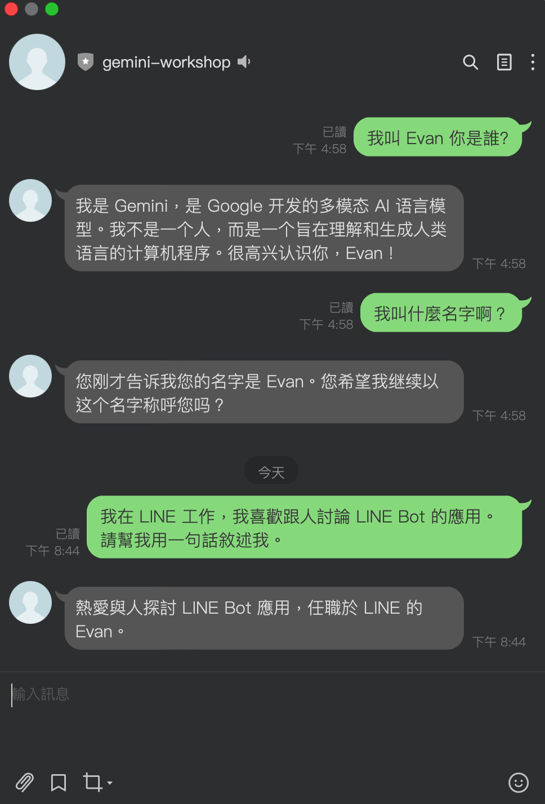

layout: post
title: "[BwAI workshop][Golang] LINE OA + CloudFunction + GeminiPro + Firebase = 旅行小幫手 LINE 聊天機器人"
description: ""
category: 
- Python
- TIL
tags: ["Golang", "LINEBot", "Firebase", "GoogleCloud", "CloudFunction"]



# 事前準備

- **[LINE Developer Account](https://developers.line.biz/en/)**: 你只需要有 LINE 帳號就可以申請開發者帳號。
- [**Google Cloud Functions**](https://cloud.google.com/functions?hl=zh_cn)： ＧGo 程式碼的**部署平台**，生成供 LINEBot 使用的 webhook address。
- [**Firebase**](https://firebase.google.com/)：建立**Realtime database**，LINE Bot 可以記得你之前的對話，甚至可以回答許多有趣的問題。
- **[Google AI Studio](https://aistudio.google.com/)**:可以透過這裡取得 Gemini Key 。

## 關於 Gemini API Price

根據官方網站： [https://ai.google.dev/pricing?hl=zh-tw]( https://ai.google.dev/pricing?hl=zh-tw)


# 申請一個 LINE 聊天機器人 (Messaging API)


- 到 [LINE Developer Console](https://developers.line.biz/en/services/messaging-api/) )並且登入
  
- 在挑選 Channel 的時候，如果要申請 LINE Chatbot (官方帳號)，就要申請 Messaging API
  
- 相關資料填寫上：
  - **Cmpany or owner's country or region**: 
  - **Channel Name**: 也就是你的 LINE Bot 名稱。
  - **Channel description**: 相關敘述來描述你 LINE Bot 做什麼。
  - 其他都可以隨便填寫即可。
- 接下來要到 Messaging API Tab 執行以下設定:
  - **Auto-reply messages**: 關閉它
    
- 接下來要取得兩個重要的參數：
  - 在 **Basic Setting** Tab 下方的 `Channel secret`
    
  - 在 **Messaging API** Tab 下方的 `Channel access token (long-lived) `
    
- 目前先到這邊，稍後還會回來設定相關 Webhook 。

# 建立一個新的 Google Cloud Function 

雖然 Google Cloud Function 跟 Firebase Realtime database 都是有免費額度的，但是可能你還是需要有一個付費帳號。也就是說你的 Google Cloud Account 需要填寫上你的信用卡資訊**（有效的帳單帳戶）**。

### 關於 Cloud Function (cloud function 第 1 代) 的費用部分

根據[網站定價](https://cloud.google.com/functions/pricing?hl=zh-tw)，基本上在以下的狀況是不需要費用的。白話文來說

```
免費方案
Cloud Functions 針對運算時間資源提供永久免費方案，當中包括 GB/秒和 GHz/秒的分配方式。除了 200 萬次叫用以外，這個免費方案也提供 400,000 GB/秒和 200,000 GHz/秒的運算時間，以及每月 5 GB 的網際網路資料傳輸量。免費方案的使用額度，是以上述級別 1 價格的同等美元金額計算。無論執行函式的區域採用的是級別 1 和/或級別 2 價格，系統都會分配同等美元金額給您。不過在扣除免費方案的額度時，系統將以函式執行區域的級別 (級別 1 或級別 2) 為準。

請注意，即便您採用的是免費方案，也必須擁有有效的帳單帳戶。
```

到 [Cloud Function](https://console.cloud.google.com/functions) 這邊，開始建立一個 Cloud Functions 


