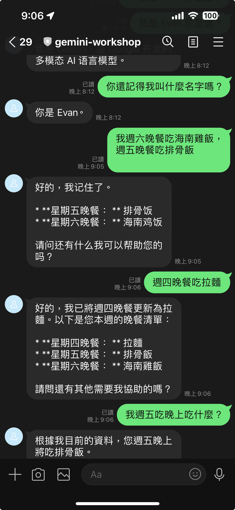
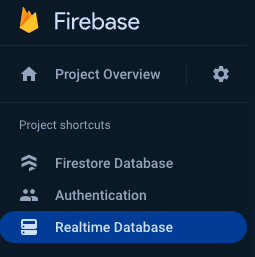
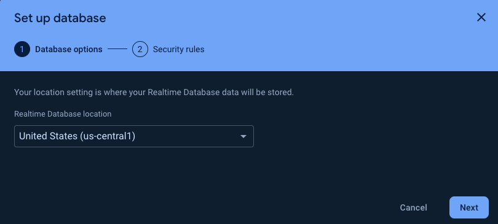
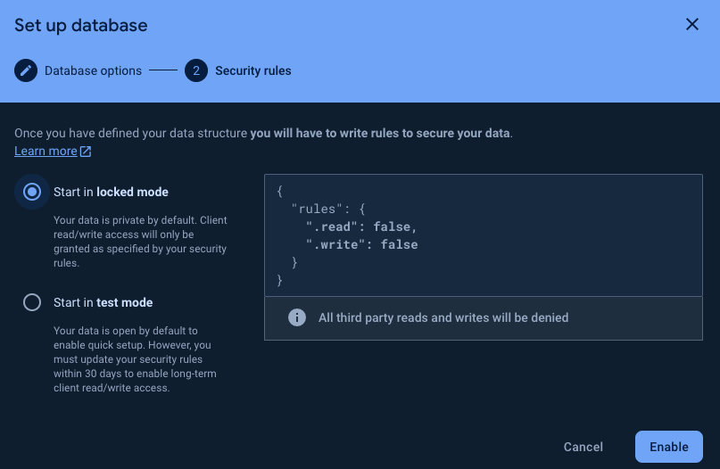
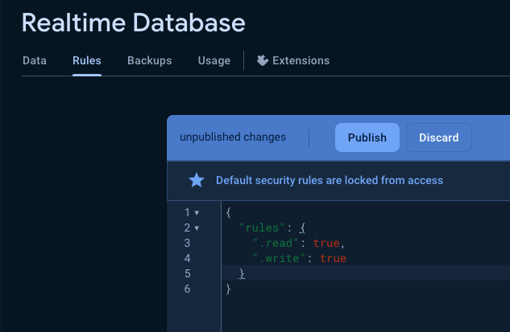
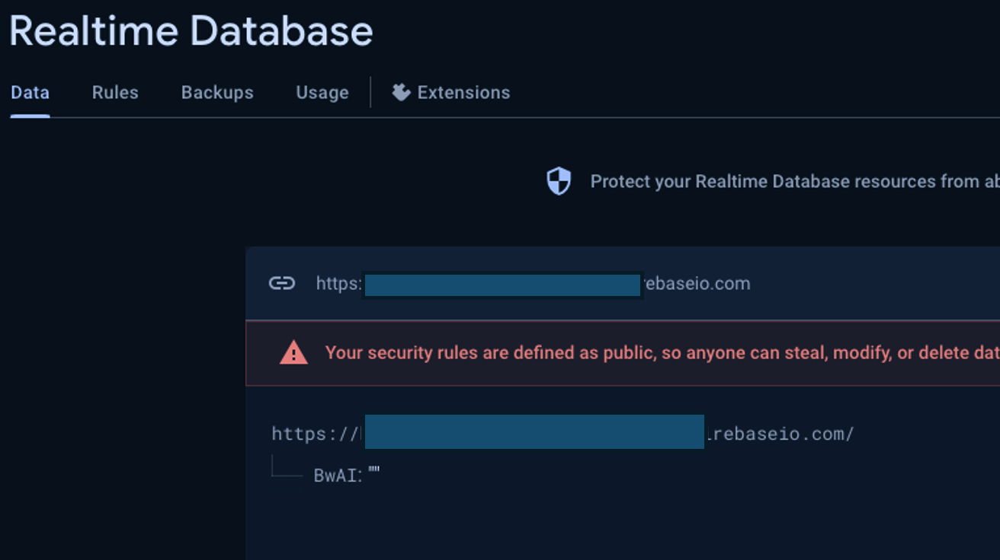

# 前言:

這是一篇為了 04/18 跟 Google Developer Group 合作的 BUILD WITH AI (BWAI) WORKSHOP 的第二篇系列文章（不知道還需要幾篇）。

本篇文章將專注在以下幾個部分：

- Firebase Database 設定
- 如何在 Cloud Function 上透過官方 Golang 存取 Firebase
- 透過 Firebase Database 來讓你的 Gemini 記住所有講過的事情，優化[上一次](https://www.evanlin.com/linebot-cloudfunc-firebase-gemini-workshop/)打造的 LINE Bot

# 文章列表：

-  [[BwAI workshop][Golang] LINE OA + CloudFunction + GeminiPro + Firebase = 旅行小幫手 LINE 聊天機器人(1)： 景色辨識小幫手](https://www.evanlin.com/linebot-cloudfunc-firebase-gemini-workshop/)
-  [[BwAI workshop][Golang] LINE OA + CloudFunction + GeminiPro + Firebase = 旅行小幫手 LINE 聊天機器人(2)： Firebase Database 讓 LINEBot 有個超長記憶]()

# 事前準備

- **[LINE Developer Account](https://developers.line.biz/en/)**: 你只需要有 LINE 帳號就可以申請開發者帳號。
- [**Google Cloud Functions**](https://cloud.google.com/functions?hl=zh_cn)： ＧGo 程式碼的**部署平台**，生成供 LINEBot 使用的 webhook address。
- [**Firebase**](https://firebase.google.com/)：建立**Realtime database**，LINE Bot 可以記得你之前的對話，甚至可以回答許多有趣的問題。
- **[Google AI Studio](https://aistudio.google.com/)**:可以透過這裡取得 Gemini Key 。

## 申請 Firebase Database 服務

- 記得到 [Firebase Console](https://console.firebase.google.com/)，並且建立一個專案 。

- 建立一個 Firebase Realtime Database 等等會用到

  

- 地區選美國

  

- Start in "lock mode"

  

- 為了開發方便，到 "Rules"設定成可以寫跟讀取，千萬注意：

  - 這是為了測試，請勿用在對外環境
  - 這是為了測試，請勿用在對外環境
  - 這是為了測試，請勿用在對外環境

- 記住哪個 URL (注意！**之後要正式上線，需要改回權限**)，並且加上一個項目: "**BwAI**"

## 申請 Services Account Credential 讓 Cloud Function 連接 Google 服務

這部分的教學，其實可以參考我另外一篇文章。[[學習文件] 如何在 Heroku 上面使用透過 Golang 來存取 Google Cloud 服務](https://www.evanlin.com/til-heroku-gcp-key/)，但是這邊還是快速走一次。

#  完整原始碼

你可以在這裡找到相關的開源程式碼: [https://github.com/kkdai/linebot-cf-firebase]( https://github.com/kkdai/linebot-cf-firebase)

