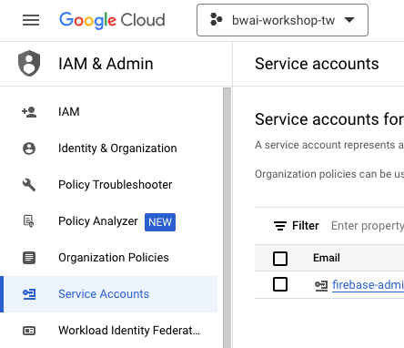
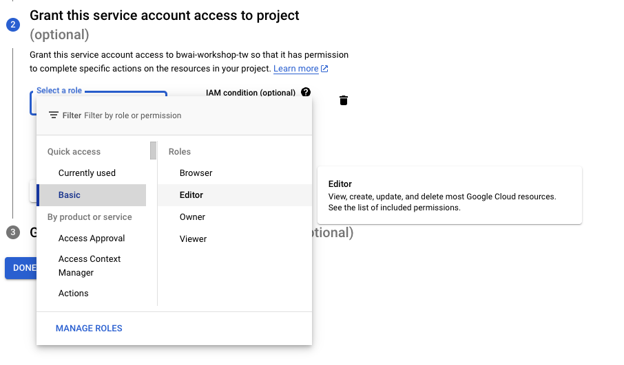
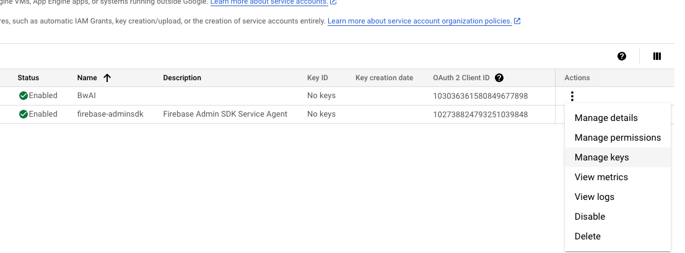
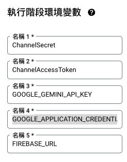
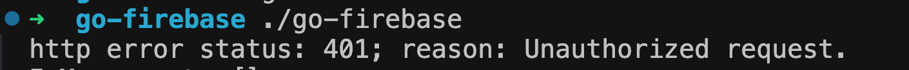

# 前言:

這是一篇為了 04/18 跟 Google Developer Group 合作的 BUILD WITH AI (BWAI) WORKSHOP 的第二篇系列文章（不知道還需要幾篇）。

本篇文章將專注在以下幾個部分：

- Firebase Database 設定
- 如何在 Cloud Function 上透過官方 Golang 存取 Firebase
- 透過 Firebase Database 來讓你的 Gemini 記住所有講過的事情，優化[上一次](https://www.evanlin.com/linebot-cloudfunc-firebase-gemini-workshop/)打造的 LINE Bot


# 文章列表：

-  [[BwAI workshop][Golang] LINE OA + CloudFunction + GeminiPro + Firebase = 旅行小幫手 LINE 聊天機器人(1)： 景色辨識小幫手](https://www.evanlin.com/linebot-cloudfunc-firebase-gemini-workshop/)
-  [[BwAI workshop][Golang] LINE OA + CloudFunction + GeminiPro + Firebase = 旅行小幫手 LINE 聊天機器人(2)： Firebase Database 讓 LINEBot 有個超長記憶](https://www.evanlin.com/linebot-cloudfunc-firebase-gemini-workshop2/)
-  [ [BwAI workshop][Golang] LINE OA + CloudFunction + GeminiPro + Firebase = 旅行小幫手 LINE 聊天機器人(3)： 導入名片小幫手跟收據小幫手](https://www.evanlin.com/linebot-cloudfunc-firebase-gemini-workshop3/)


# 事前準備

- **[LINE Developer Account](https://developers.line.biz/en/)**: 你只需要有 LINE 帳號就可以申請開發者帳號。
- [**Google Cloud Functions**](https://cloud.google.com/functions?hl=zh_cn)： ＧGo 程式碼的**部署平台**，生成供 LINEBot 使用的 webhook address。
- [**Firebase**](https://firebase.google.com/)：建立**Realtime database**，LINE Bot 可以記得你之前的對話，甚至可以回答許多有趣的問題。
- **[Google AI Studio](https://aistudio.google.com/)**:可以透過這裡取得 Gemini Key 。


## 申請 Firebase Database 服務

- 記得到 [Firebase Console](https://console.firebase.google.com/)，直接選取你現在有的專案。（可能叫做 My First Project?)

- 建立一個 Firebase Realtime Database 等等會用到

  

- 地區選美國

  

- Start in "lock mode"

  

- 為了開發方便，到 "Rules"設定成可以寫跟讀取，千萬注意：

  - 這是為了測試，請勿用在對外環境
  - 這是為了測試，請勿用在對外環境
  - 這是為了測試，請勿用在對外環境


- 記住哪個 URL (注意！**之後要正式上線，需要改回權限**)，並且加上一個項目: "**BwAI**"


## 申請 Services Account Credential 讓 Cloud Function 連接 Google 服務

這部分的教學，其實可以參考我另外一篇文章。[[學習文件] 如何在 Heroku 上面使用透過 Golang 來存取 Google Cloud 服務](https://www.evanlin.com/til-heroku-gcp-key/)，但是這邊還是快速走一次。

- 進入 Google Cloud Console ，到 IAM & Admin 選擇建立 Services Account



- Services Account Name 自己決定，要注意好 (上面專案跟 Firebase **專案名稱要一致**)


- Grant this service account access to project 在身份的時候，建議先用 Editor （比較大，需要小心使用）



- "Grant users access to this service account" 不需要特別設定
- 按下 "Manage Keys" 來準備下載 Credential 



- 選擇 Add Key -> Create new Key -> 下載 JSON 


## 如何在 Google Cloud Function 導入 Services Account Credential ?

接下來會來分享，要如何正確地能夠在 Cloud Function 內使用呢。 如果你想要直接使用 Cloud Function 去開啟 Credential JSON 檔案，你會一直得到無法正確拿到 credential 的錯誤訊息。

這時候需要先透過環境參數來加入:

- 將 JSON 檔案中所有內容複製起來。
- 為了要能夠正確啟動 Firebase 記得新增一個參數， `FIREBASE_URL` 並且把剛剛的 Firebase link 網址填上去。
- 設定 `GOOGLE_APPLICATION_CREDENTIALS` 參數，然後把所有內容貼上環境參數。



## 相關程式碼要如何修改

到了原始碼那邊，記得要更新兩個檔案： ([完整程式碼](https://github.com/kkdai/linebot-cf-firebase))

- function.go -> [function.go](https://github.com/kkdai/linebot-cf-firebase/blob/main/function.go) 
- go.mod -> [go.mod](https://github.com/kkdai/linebot-cf-firebase/blob/main/go.mod)

重新 Deploy 之後，就可以來看最新的狀況。


## 成果與使用 ChatSession 差異：


可以直接看到成果相當的好，並且這樣的記憶長度就會看 Gemini Model Token 的限制，算是相當的好用。

那這個又跟 Gemini Chat Session 有什麼差別呢？

- **Chat Session**: 適合使用在 Cloud Run 那種有固定一整台 server 的 LINE Bot 應用。
- **Firebase Database + Chat Session:** 就可以放在 Cloud Function 這種 Functional As A Services 上面。


## 使用 Golang Google Options 套件需要注意:

雖然已經將 Firebase Realtime Database 設定成每個人都可以讀寫，但是如果是透過 Golang 去存取的時候，你會出現 Unauthorized request 的錯誤訊息。 這時候就是因為你的 JSON 檔案的 Project 跟你的 Firebase Project 是不同的。 只要重新建立一個 Services Account 並且更新 JSON 內容即可。




## 關於修改程式碼的細節

- 接下來會跟大家講，如何修改相關程式碼？

```
	// Init firebase related variables
	ctx := context.Background()
	opt := option.WithCredentialsJSON([]byte(os.Getenv("GOOGLE_APPLICATION_CREDENTIALS")))
	config := &firebase.Config{DatabaseURL: os.Getenv("FIREBASE_URL")}
	app, err := firebase.NewApp(ctx, config, opt)
	if err != nil {
		log.Fatalf("error initializing app: %v", err)
	}
	client, err := app.Database(ctx)
	if err != nil {
		log.Fatalf("error initializing database: %v", err)
	}
```

- 首先`option.WithCredentialsJSON([]byte(os.Getenv("GOOGLE_APPLICATION_CREDENTIALS")))` 可以讓你從環境參數讀取到 credential 。
- 接下來 `&firebase.Config{DatabaseURL: os.Getenv("FIREBASE_URL")}` 則是將 FIREBASE_URL 內容設定好。
- 這樣就可以正確執行了，接下來要來看相關處理 Gemini 聊天記憶的部分了。


# Gemini Pro Chat History 要如何正確處理？

首先也要讓大家了解一下，跟 OpenAI 不同的是：  Gemini Chat History 的格式不太一樣（也不是很好了解）。根據[網頁資料](https://ai.google.dev/tutorials/python_quickstart)如下：

```
[parts {
   text: "In one sentence, explain how a computer works to a young child."
 }
 role: "user",
 parts {
   text: "A computer is like a very smart machine that can understand and follow our instructions, help us with our work, and even play games with us!"
 }
 role: "model"]
```

不是很確定為何 "parts" 會用集合， anyway 在 Python 中還不算難處理，但是在 [Golang 裡面的處理方式](https://github.com/google/generative-ai-go/blob/main/genai/example_test.go)如下：(參考自 Google Golang GAI Github https://github.com/google/generative-ai-go)

```
func ExampleChatSession_history() {
	ctx := context.Background()
	client, err := genai.NewClient(ctx, option.WithAPIKey(os.Getenv("GEMINI_API_KEY")))
	if err != nil {
		log.Fatal(err)
	}
	defer client.Close()
	model := client.GenerativeModel("gemini-1.0-pro")
	cs := model.StartChat()

	cs.History = []*genai.Content{
		&genai.Content{
			Parts: []genai.Part{
				genai.Text("Hello, I have 2 dogs in my house."),
			},
			Role: "user",
		},
		&genai.Content{
			Parts: []genai.Part{
				genai.Text("Great to meet you. What would you like to know?"),
			},
			Role: "model",
		},
	}

	res, err := cs.SendMessage(ctx, genai.Text("How many paws are in my house?"))
	if err != nil {
		log.Fatal(err)
	}
	printResponse(res)
}
```

問題來了， `cs.History` 竟然是對應到 `[]*genai.Content`。這並不是一個對於 JSON unmarshall 就能夠直接使用的資料格式。還需要有相關的轉換。

## 透過 Firebase Database 處理 Chat History 的流程：

這邊稍微讓大家知道一下，由於 Firebase Database 其實就是一大包的 JSON Database 。你可以直接存取一整包的 JSON Structure 進這個資料庫。 這樣來說讓整個資料庫處理上，還有寫小型 POC 應用來說相當的方便。（但是效率是可以討論的）

```
// Define your custom struct for Gemini ChatMemory
type GeminiChat struct {
	Parts []string `json:"parts"`
	Role  string   `json:"role"`
}

.....

	// Get chat history from Firebase
	var InMemory []GeminiChat
	err = fireDB.NewRef("BwAI").Get(ctx, &InMemory)
	if err != nil {
		fmt.Println("load memory failed, ", err)
	}

	fmt.Println("InMemory: %v", InMemory)

	// convert InMemory to Memory
	for _, c := range InMemory {
		parts := make([]genai.Part, len(c.Parts))
		for i, part := range c.Parts {
			parts[i] = genai.Text(part)
		}
		dst := &genai.Content{
			Parts: parts,
			Role:  c.Role,
		}

		Memory = append(Memory, dst)
	}

```

上面是從 Firebase Database 取出後需要轉換的程式碼，但是使用方式則是直接將 `Memory` 直接交給 `chat.History` 即可。需要記得的是，在處理完之後，要把這一次的對話也放進 `Memory`之中。部分程式碼如下：

```
				// Pass the text content to the gemini-pro model for text generation
				model := client.GenerativeModel("gemini-pro")
				cs := model.StartChat()
				cs.History = Memory

				res, err := cs.SendMessage(ctx, genai.Text(req))
				if err != nil {
					log.Fatal(err)
				}
				var ret string
				for _, cand := range res.Candidates {
					for _, part := range cand.Content.Parts {
						ret = ret + fmt.Sprintf("%v", part)
						log.Println(part)
					}
				}

				// Save the conversation to the memory
				Memory = append(Memory, &genai.Content{
					Parts: []genai.Part{
						genai.Text(req),
					},
					Role: "user",
				})

				// Save the response to the memory
				Memory = append(Memory, &genai.Content{
					Parts: []genai.Part{
						genai.Text(ret),
					},
					Role: "model",
				})

				// Save the conversation to the firebase
				err = fireDB.NewRef("BwAI").Set(ctx, Memory)
				if err != nil {
					fmt.Println(err)
					return
				}
```

重點就在:

- 要把之前講過的話，放入 History
- 把現在講過的，直接丟給 `cs.SendMessage()`
- 最後要記得把後來使用者輸入的文字，跟 Gemini 回覆的文字都加入 `Memory`。


## 錯誤處理

**Q: 如果從第一篇的文章做過來，改了 `FIREBASE_URL` 與 `GOOGLE_APPLICATION_CREDENTIALS` 之後，反而傳訊息都不會回覆了？**

A: 請幫我做以下檢查：

- 傳遞一個圖片訊息，看看有沒有回覆。
- 如果圖片有回覆，那麼就是你的 Services Account 設定權限跟 Firebase 不同。


## 接下來：

感謝各位的支持，接下來就是要透過 Gemini Vision 去識別並且翻譯收據。還要讓 Gemini 可以快速幫我們找出哪時候買的？ 什麼地方買的？ 當初花了多少錢的「收據小幫手」。


#  完整原始碼

你可以在這裡找到相關的開源程式碼: [https://github.com/kkdai/linebot-cf-firebase]( https://github.com/kkdai/linebot-cf-firebase)


