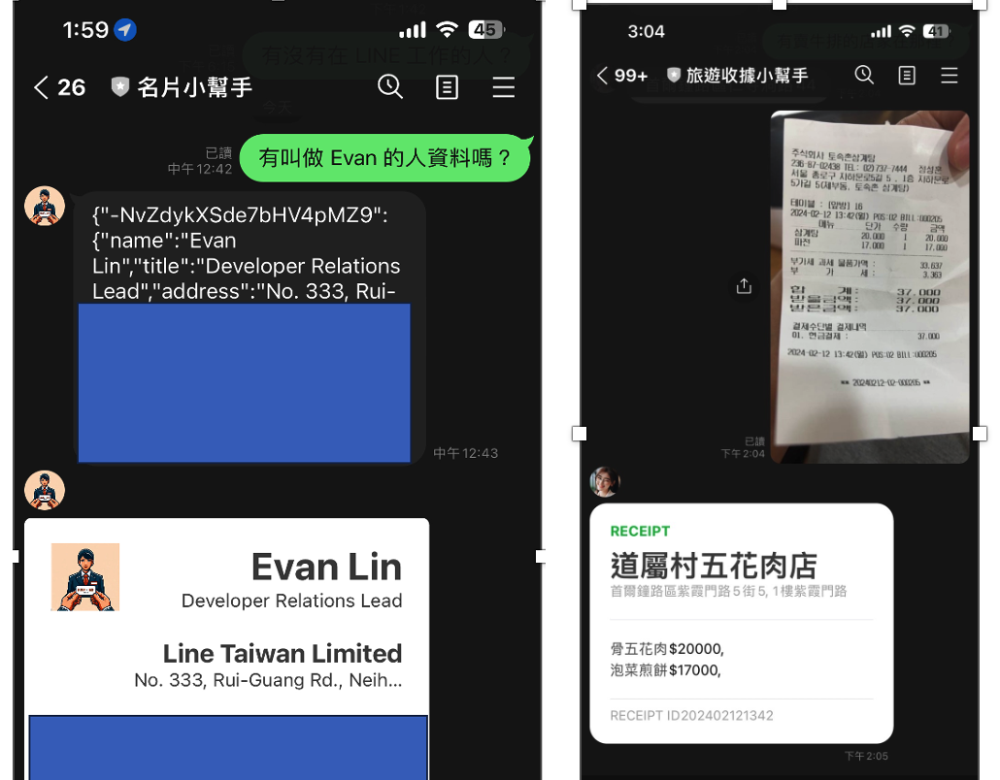
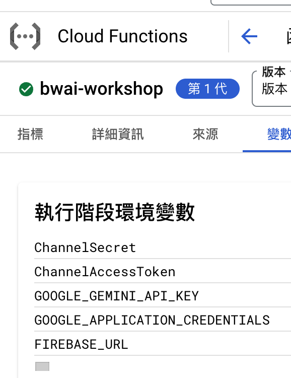
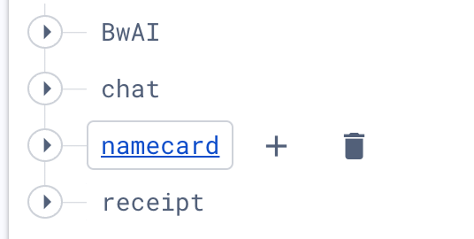
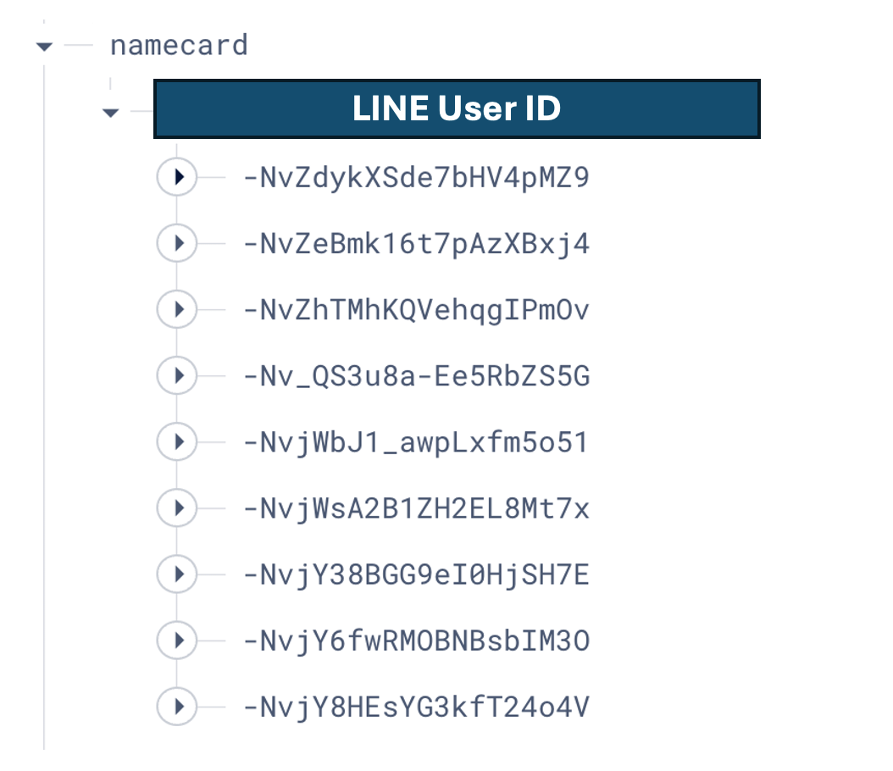
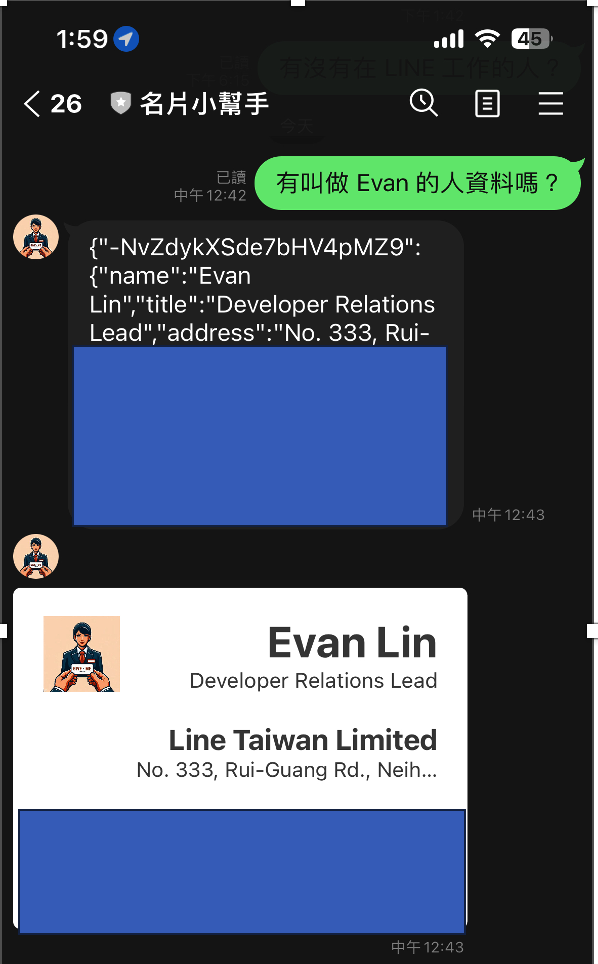
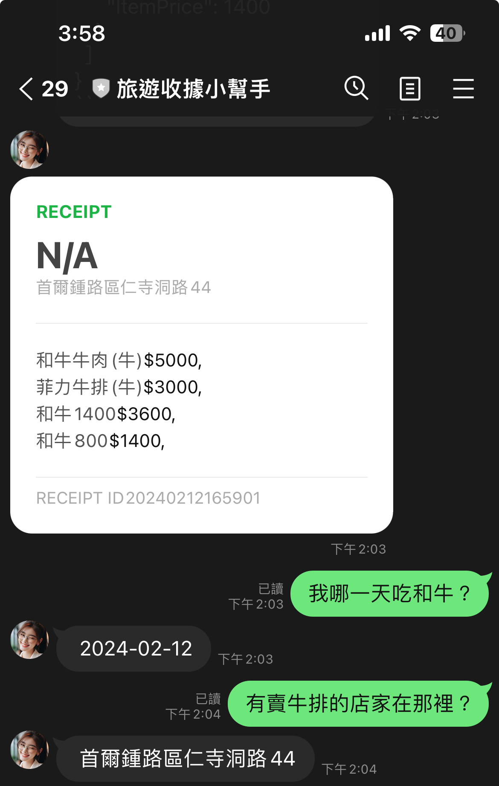
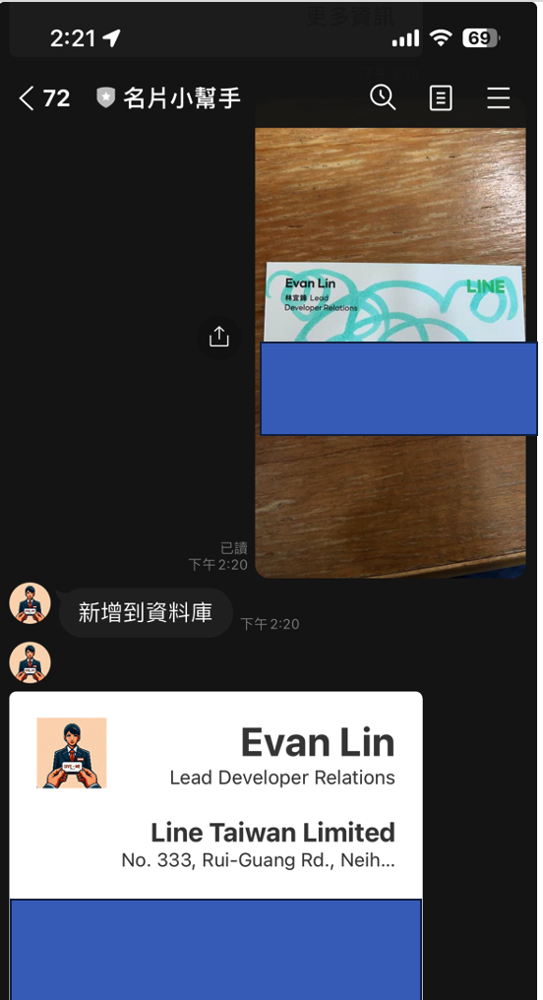
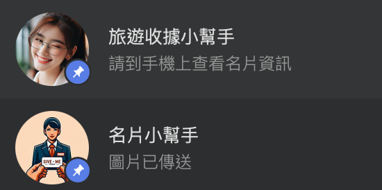

# 前言:

這是一篇為了 04/18 跟 Google Developer Group 合作的 BUILD WITH AI (BWAI) WORKSHOP 的最後一篇文章，畢竟晚上就要工作坊了（投影片可以當場弄，文章可來不及當場寫 XD ）。

請記得，如果你想知道以下相關知識：

- [如何申請 LINE Developer 帳戶，如何建立一個 LINE OA (ChatBot) Channel？](https://www.evanlin.com/linebot-cloudfunc-firebase-gemini-workshop/) （範例： [辨識圖片 LINEBot](https://github.com/kkdai/linebot-cloudfunc-gemini-go))
- [如何透過 Google Cloud Functions 使用 Google Credential 來操作 Firebase Realtime Database](https://www.evanlin.com/linebot-cloudfunc-firebase-gemini-workshop2/) (範例： [具有長記憶的聊天機器人](https://github.com/kkdai/linebot-cf-firebase))

本篇文章將專注在以下幾個部分：

- 將兩個範例程式 [名片小幫手（舊版用 notion）](https://github.com/kkdai/linebot-smart-namecard)與[收據小幫手（Python 舊版)](https://github.com/kkdai/linebot-receipt-gemini) ，改寫成 Golang 。
- 分享 Golang 在操作 Firebase Realtime Database 資料庫上幾個需要注意的地方。
- 最後分享做 Gemini-Vision 的一些心得與未來可以改善的空間。


# 文章列表：

-  [[BwAI workshop][Golang] LINE OA + CloudFunction + GeminiPro + Firebase = 旅行小幫手 LINE 聊天機器人(1)： 景色辨識小幫手](https://www.evanlin.com/linebot-cloudfunc-firebase-gemini-workshop/)
-  [[BwAI workshop][Golang] LINE OA + CloudFunction + GeminiPro + Firebase = 旅行小幫手 LINE 聊天機器人(2)： Firebase Database 讓 LINEBot 有個超長記憶](https://www.evanlin.com/linebot-cloudfunc-firebase-gemini-workshop2/)
-  [[BwAI workshop][Golang] LINE OA + CloudFunction + GeminiPro + Firebase = 旅行小幫手 LINE 聊天機器人(3)： 導入「名片小幫手」跟「收據小幫手」](https://www.evanlin.com/linebot-cloudfunc-firebase-gemini-workshop3/)

### 程式碼列表：

- [名片小幫手（舊版用 Golang + Notion）](https://github.com/kkdai/linebot-smart-namecard)
- [收據小幫手（Python 舊版)](https://github.com/kkdai/linebot-receipt-gemini) 
- [辨識圖片 LINEBot](https://github.com/kkdai/linebot-cloudfunc-gemini-go)
- [具有長記憶的聊天機器人](https://github.com/kkdai/linebot-cf-firebase)
- [名片小幫手（新版： Golang + Firebase RealtimeDB + Cloud Functions)](https://github.com/kkdai/linebot-cf-namecard)
- [收據小幫手（新版： Python -> Golang + Firebase DB + Cloud Functions)](https://github.com/kkdai/linebot-cf-receipt)


# 事前準備

- **[LINE Developer Account](https://developers.line.biz/en/)**: 你只需要有 LINE 帳號就可以申請開發者帳號。
- [**Google Cloud Functions**](https://cloud.google.com/functions?hl=zh_cn)： ＧGo 程式碼的**部署平台**，生成供 LINEBot 使用的 webhook address。
- [**Firebase**](https://firebase.google.com/)：建立**Realtime database**，LINE Bot 可以記得你之前的對話，甚至可以回答許多有趣的問題。
- **[Google AI Studio](https://aistudio.google.com/)**:可以透過這裡取得 Gemini Key 。

務必確定已經有前兩篇文章的環境，並且該 Cloud Functions 已經串接好 LINE Bot 。




# 名片小幫手的導入：

- 將程式碼: https://github.com/kkdai/linebot-cf-namecard 裡面的 `function.go` 打開。
- 複製到 Cloud Functions 中已經設置好的環境。
- 記得在 Firebase Realtime Database 建立一個新的 set - `namecard`



- **部署 (搭啦)**


## 名片小幫手程式碼修改部分

首先，將原本透過 Notion 作為 DB 改成 Firebase Realtime Database 之後。首先需要定義相關資料結構。

```
// Person 定義了 JSON 資料的結構體
type Person struct {
	Name    string `json:"name"`
	Title   string `json:"title"`
	Address string `json:"address"`
	Email   string `json:"email"`
	Phone   string `json:"phone"`
	Company string `json:"company"`
}
```

資料寫入的部分，這邊使用到 [Firebase Database 中的 Push](https://firebase.google.com/docs/database/admin/save-data#go) 。相關的官方說明如下：

```
Add to a list of data in the database. Every time you push a new node onto a list, your database generates a unique key, like messages/users/<unique-user-id>/<username>
```

也就是說，資料是用類似以下方式儲存：



儲存之前很簡單，不需要額外資料轉換。只需要直接 `Push` 進去，前面會加上一個唯一的 key 值。

```
				const DBCardPath = "namecard"
				.....
				
				// Insert the person data into firebase
				userPath := fmt.Sprintf("%s/%s", DBCardPath, uID)
				_, err = fireDB.NewRef(userPath).Push(ctx, person)
				if err != nil {
					log.Println("Error inserting data into firebase:", err)
				}
```

但是在前面取用的時候，就會比較複雜。因為要完整把整包 JSON 都抓下來後處理。需要以下變動。

```
				// Load all cards from firebase
				var People map[string]Person
				err = fireDB.NewRef(userPath).Get(ctx, &People)
				if err != nil {
					fmt.Println("load memory failed, ", err)
				}

				// Marshall data to JSON
				jsonData, err := json.Marshal(People)
				if err != nil {
					fmt.Println("Error marshalling data to JSON:", err)
				}

```

透過一個 string key map  `var People map[string]Person` 來處理這樣的資料格式，再來直接轉換成 JSON 。這樣又可以將資料完整抓下來變成 Gemini 可以閱讀的方式來處理。

## 名片小幫手改進後相關成果



#### 程式碼： **名片小幫手(Go Cloud Functions版本)**：[https://github.com/kkdai/linebot-cf-namecard](https://github.com/kkdai/linebot-cf-namecard)

這裡備註一些主要修改，跟優化的部分：

- 由於使用 Firebase Database ，整包 JSON 丟給 LLM 變得更加聰明。


# 旅遊收據小幫手導入

### 開發起因

首先快速講一下，旅遊收據小幫手的開發起因：

- 今年過年去了一趟韓國首爾遊玩，但是在路上會收到一堆的單據。
- 因為筆者是韓文苦手，無法讀懂韓文。但是又希望可以有效地查詢相關的資訊。
- 查詢方式可能想知道哪一天買了什麼，或是哪個商品是在哪一天？哪一個店家購買？

#### 導入方式

- 將程式碼: [https://github.com/kkdai/linebot-cf-receipt]( https://github.com/kkdai/linebot-cf-receipt ) 裡面的 `function.go` 打開。
- 複製到 Cloud Functions 中已經設置好的環境。
- 建立一個 Firebase Database set: `receipt` 
- **部署 (搭啦)**

## 旅遊收據小幫手修改部分

Python 轉換成 Golang ，這部分就不細講了。 我們來看看跟前一個部分主要修改部分：

```
const ImgagePrompt = `This is a receipt, and you are a secretary.  
Please organize the details from the receipt into JSON format for me. 
I only need the JSON representation of the receipt data. Eventually, 
I will need to input it into a database with the following structure:

 Receipt(ReceiptID, PurchaseStore, PurchaseDate, PurchaseAddress, TotalAmount) and 
 Items(ItemID, ReceiptID, ItemName, ItemPrice). 

Data format as follow:
- ReceiptID, using PurchaseDate, but Represent the year, month, day, hour, and minute without any separators.
- ItemID, using ReceiptID and sequel number in that receipt. 
Otherwise, if any information is unclear, fill in with "N/A". 
`
```

先來看收據辨識的 Prompt。首先:

- 先跟他說他要讀取的是哪一些資料，要如何去處理它。
  ```
  This is a receipt, and you are a secretary.  
  Please organize the details from the receipt into JSON format for me. 
  I only need the JSON representation of the receipt data. Eventually, 
  I will need to input it into a database with the following structure:
  ```

  

- 在資料格式定義上，將收據單跟裡面每個商品品項切開成兩個項目。但是因為會一整包處理，裡面的資訊會被整合再一起。
  ```
   Receipt(ReceiptID, PurchaseStore, PurchaseDate, PurchaseAddress, TotalAmount) and 
   Items(ItemID, ReceiptID, ItemName, ItemPrice). 
  ```

- 額外處理項目需要註解，主要是資料讀不到的時候先補個 N/A。因為 Flex Message 必須每個欄位都要有數值。
  ```
  Otherwise, if any information is unclear, fill in with "N/A". 
  ```

這邊有多做一次的處理，就是收據原文都是韓文。需要額外跑一次將韓文的 JSON 轉換成中文再來儲存。

```
				// Pass the text content to the gemini-pro model for receipt translation.
				model = client.GenerativeModel("gemini-pro")
				transJson := fmt.Sprintf("%s \n --- \n %s", TranslatePrompt, ret)
				res, err := model.GenerateContent(ctx, genai.Text(qry))
				if err != nil {
					log.Fatal(err)
				}
				var transRet string
				for _, cand := range res.Candidates {
					for _, part := range cand.Content.Parts {
						transRet = transRet + fmt.Sprintf("%v", part)
						log.Println(part)
					}
				}

```

這樣才能讓自己比較能了解，並且在前面使用中文詢問的時候，也能取得比較好的答案。 

#### 雷點分享

- 請不要一次直接將韓文收據翻譯成中文，這樣成果會非常的糟糕。
- 建議都先掃描讓他可以直接得知道韓文成果，你也比較方便來比對答案。

## 旅遊收據小幫手成果



- 收據的掃描上，可能需要清楚一點的收據效果會更好。
- 詢問的部分可以變得相當的口語化，各種想問的都可以。


# 相關開發心得總結：

這裡提供開發「名片小幫手」跟「旅遊收據小幫手」過程中的一些心得。

## GPT-Vision 可以讓以往 OCR 痛點被快速解決。

相關的應用開發過程中，筆者發現使用 GPT-Vision 可以讓掃描的成果比起 OCR 更容易接受。甚至可以接受更大的 range ，擺放歪了甚至是有被塗鴉過後，還是可以被識別。 而且以往使用 OCR 往往太複雜，需要對其邊界後，準備好相關套版最後才能掃瞄出答案。



## 透過優化 Prompt 與前處理可以讓成果更好。

在名片掃描過程中，筆者也發現使用英文名片的姓名辨識效果會比較好。可能的問題出在，因為中文名字就是沒有關連的三個文字，而英文名字在許多文章中都有出現過。 這邊建議可以透過簡單的 OCR 套件，將姓名或是公司名稱抓出來，來優化整體的處理效果。


## 試著透過 GPT-Vision 與 LINE Bot 來幫助你生活更輕鬆

在做 GPT-Vision 開發上，筆者發現 Prompt 的設定跟相關的前處理與後處理其實非常跟你的問題領域有關。如果用名片，就有名片相關的部分。反之，用收據的領域又大大不同。 如果要使用一些瀏覽器介面的時候，常常會有切換的問題。這時候建議直接開發一個 LINE Bot 讓你使用上相當的輕鬆又自在。



#  完整原始碼

你可以在這裡找到相關的開源程式碼: 

- **名片小幫手(Go Cloud Functions版本)**：[https://github.com/kkdai/linebot-cf-namecard](https://github.com/kkdai/linebot-cf-namecard)
- **收據小幫手(Go Cloud Functions版本)**：[https://github.com/kkdai/linebot-cf-receipt](https://github.com/kkdai/linebot-cf-receipt)


