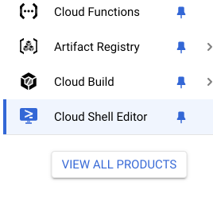
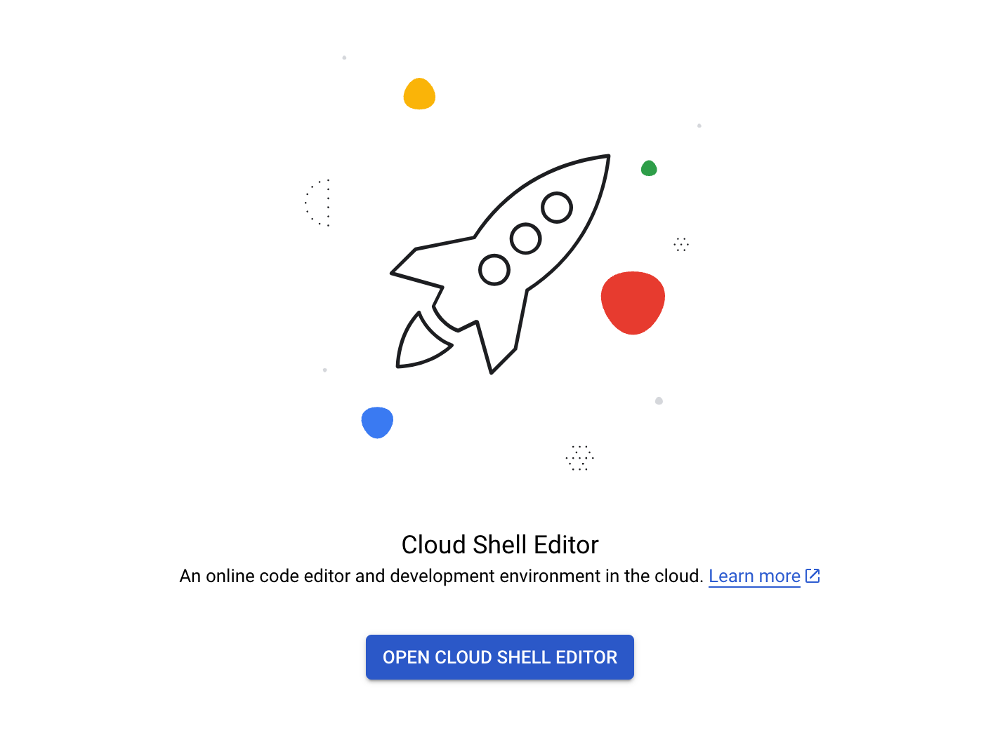
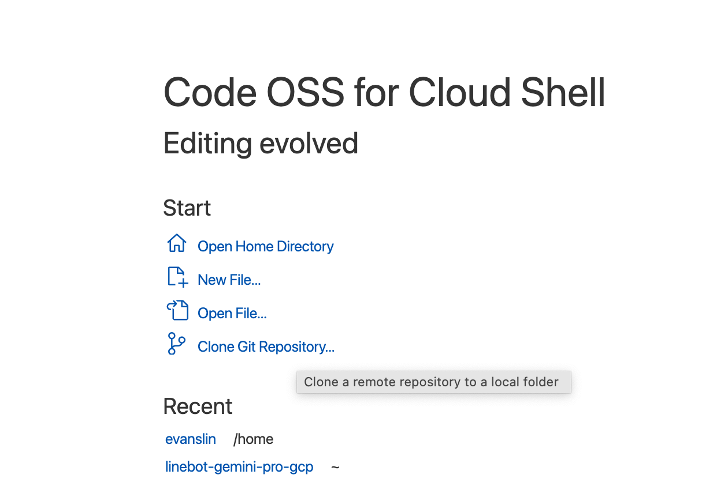
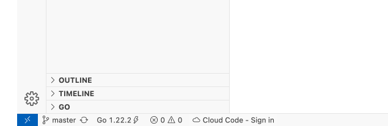
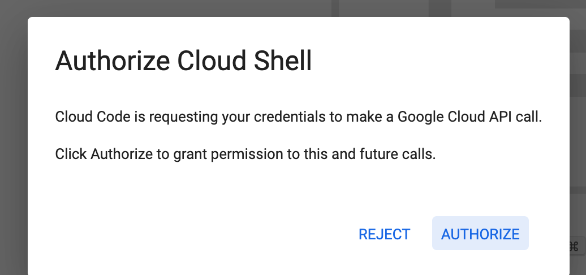
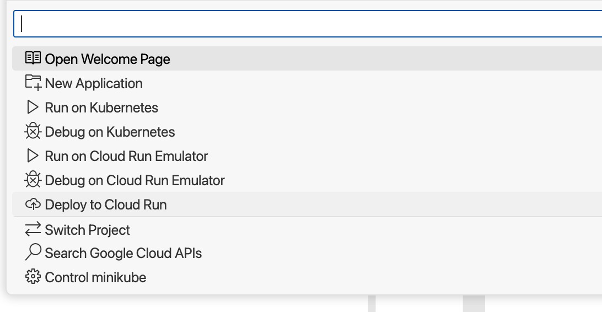

# 前提：

Cloud Run 其實很方便，可以很快速地將 Heroku 的專案搬移過來。但是

# 使用 cloud Shell Editor 來部署 Cloud Run 服務

- 到 [Cloud Shell Editor](https://console.cloud.google.com/cloudshelleditor?cloudshell=true) 服務來啟動

- 開啟專案方式選擇 Clone Git Repository ，連接到 github 之後選取你要部署的專案。 這裡用 [kkdai/linebot-arxiv](kkdai/linebot-arxiv) 作為範例。

- 點選左下角的 Cloud Code ，啟動認證。

- 這邊點選 Deploy to Cloud Run 

- 這ㄌㄧ

## 參考文章：

- [Heroku 取消免費方案？教你用 Cloud Functions 架設 LINEBOT！](https://github.com/GoogleCloudPlatform/gcr-cleaner)
- [GCP: 配置清理策略 (Apply cleanup policies)](https://cloud.google.com/artifact-registry/docs/repositories/cleanup-policy?hl=zh-cn#console_2)

