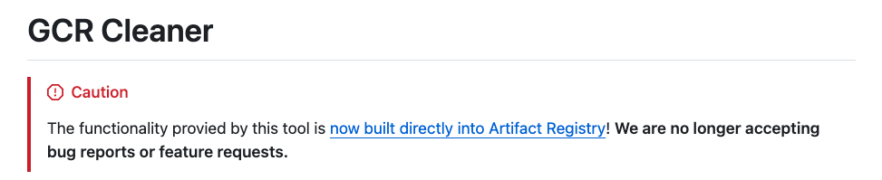

# 前提：

Cloud Run 其實很方便，可以很快速地將 Heroku 的專案搬移過來。在建置 Cloud Functions (第 2 代) 的過程中，會使用到 Cloud Build 跟 Artifact Registry，但建置成功後，舊版本的 Artifact Registry 卻不會自動刪除。

原本從「[Heroku 取消免費方案？教你用 Cloud Functions 架設 LINEBOT！](https://taichunmin.idv.tw/blog/2022-09-11-gcp-functions-hosting.html)」看到了 [GCR-Cleanner](https://github.com/GoogleCloudPlatform/gcr-cleaner) 。但是卻發現在 GCP 的介面上有更方便的方法可以使用。

# 透過 Artifact Registry 直接設定 House Keeping 策略

- 到 [Artifact Registry](https://console.cloud.google.com/artifacts/browse/) 

  

- 點選 size 最大的吧，然後選取上方 **Edit Repository**

- 在最下方，選曲 **Cleanup Policies**

- 選擇 "Keep most Recent versions"

- "Keep count" 選 1 (也可以是 2)

**如果怕刪除太多，可以用 Dry run 看看結果。**

## 參考文章：

- [Heroku 取消免費方案？教你用 Cloud Functions 架設 LINEBOT！](https://github.com/GoogleCloudPlatform/gcr-cleaner)
- [GCP: 配置清理策略 (Apply cleanup policies)](https://cloud.google.com/artifact-registry/docs/repositories/cleanup-policy?hl=zh-cn#console_2)

