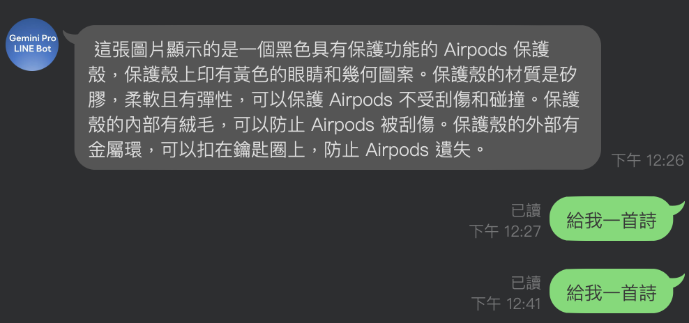
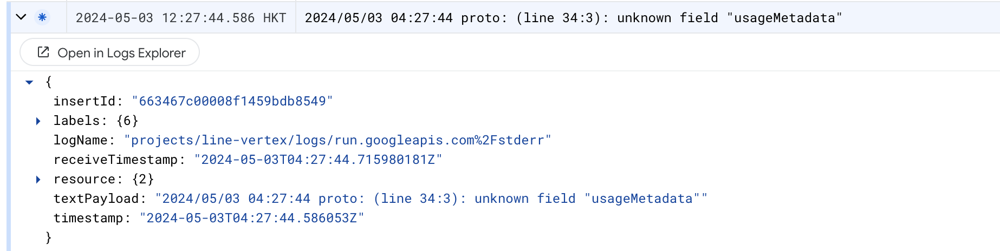

# 前言:

這是一篇為了 04/18 跟 Google Developer Group 合作的 BUILD WITH AI (BWAI) WORKSHOP 的最後一篇文章，畢竟晚上就要工作坊了（投影片可以當場弄，文章可來不及當場寫 XD ）。

請記得，如果你想知道以下相關知識：

- [如何申請 LINE Developer 帳戶，如何建立一個 LINE OA (ChatBot) Channel？](https://www.evanlin.com/linebot-cloudfunc-firebase-gemini-workshop/) （範例： [辨識圖片 LINEBot](https://github.com/kkdai/linebot-cloudfunc-gemini-go))
- [如何透過 Google Cloud Functions 使用 Google Credential 來操作 Firebase Realtime Database](https://www.evanlin.com/linebot-cloudfunc-firebase-gemini-workshop2/) (範例： [具有長記憶的聊天機器人](https://github.com/kkdai/linebot-cf-firebase))

本篇文章將專注在以下幾個部分：

- 將兩個範例程式 [名片小幫手（舊版用 notion）](https://github.com/kkdai/linebot-smart-namecard)與[收據小幫手（Python 舊版)](https://github.com/kkdai/linebot-receipt-gemini) ，改寫成 Golang 。
- 分享 Golang 在操作 Firebase Realtime Database 資料庫上幾個需要注意的地方。
- 最後分享做 Gemini-Vision 的一些心得與未來可以改善的空間。


# 文章列表：

-  [[BwAI workshop][Golang] LINE OA + CloudFunction + GeminiPro + Firebase = 旅行小幫手 LINE 聊天機器人(1)： 景色辨識小幫手](https://www.evanlin.com/linebot-cloudfunc-firebase-gemini-workshop/)
-  [[BwAI workshop][Golang] LINE OA + CloudFunction + GeminiPro + Firebase = 旅行小幫手 LINE 聊天機器人(2)： Firebase Database 讓 LINEBot 有個超長記憶](https://www.evanlin.com/linebot-cloudfunc-firebase-gemini-workshop2/)
-  [[BwAI workshop][Golang] LINE OA + CloudFunction + GeminiPro + Firebase = 旅行小幫手 LINE 聊天機器人(3)： 導入「名片小幫手」跟「收據小幫手」](https://www.evanlin.com/linebot-cloudfunc-firebase-gemini-workshop3/)
-  [[BwAI workshop][Golang] LINE OA + CloudFunction + GeminiPro + Firebase = 旅行小幫手 LINE 聊天機器人(4)： 關於 Gemini Pro 伺服器的相關修改導致 unknown field `usageMetadata` 的錯誤訊息](https://www.evanlin.com/linebot-cloudfunc-firebase-gemini-workshop4/)


# Bug： 原本的對話忽然都沒有回應



由於 Google Gemini 伺服器今天早上修改相關變動，但是 Golang 官方套件還無法來得及改動。 
(https://github.com/google/generative-ai-go/issues/97)

導致我在 BwAI workshop ，政大與台北大學的授課中相關 LINE Bot 範例可能會無法順利取得回覆。

### 狀況：

傳送文字問題，沒有回應。 但是發送照片卻是可以正確回覆，查看 log 會出現  unknown field `usageMetadata` 的錯誤訊息。




## 影響專案：

- [https://github.com/kkdai/linebot-cf-firebase](https://github.com/kkdai/linebot-cf-firebase)
- [https://github.com/kkdai/linebot-cf-receipt](https://github.com/kkdai/linebot-cf-receipt)
- [https://github.com/kkdai/linebot-cf-namecard](https://github.com/kkdai/linebot-cf-namecard)


## 相關文章:

-  [[BwAI workshop][Golang] LINE OA + CloudFunction + GeminiPro + Firebase = 旅行小幫手 LINE 聊天機器人(2)： Firebase Database 讓 LINEBot 有個超長記憶](https://www.evanlin.com/linebot-cloudfunc-firebase-gemini-workshop2/)
-  [[BwAI workshop][Golang] LINE OA + CloudFunction + GeminiPro + Firebase = 旅行小幫手 LINE 聊天機器人(3)： 導入「名片小幫手」跟「收據小幫手」](https://www.evanlin.com/linebot-cloudfunc-firebase-gemini-workshop3/)


## 解決方式：

請記得更新最新版本程式碼，到你的 cloud function 將 function.go 替換掉之後重新 deploy 就可以了。

- [https://github.com/kkdai/linebot-cf-firebase](https://github.com/kkdai/linebot-cf-firebase)
- [https://github.com/kkdai/linebot-cf-receipt](https://github.com/kkdai/linebot-cf-receipt)
- [https://github.com/kkdai/linebot-cf-namecard](https://github.com/kkdai/linebot-cf-namecard)


# 認真探討

根據 [issue 97](https://github.com/google/generative-ai-go/issues/97) 主要問題出在 SendMessage 回來的資訊處理部分。

```
func main() {
	ctx := context.Background()
	client, err := genai.NewClient(ctx, option.WithAPIKey(os.Getenv("GEMINI_API_KEY")))
	if err != nil {
		log.Fatal(err)
	}
	defer client.Close()
	model := client.GenerativeModel("gemini-1.0-pro")
	cs := model.StartChat()

	msg := "hello"
	fmt.Printf("== Me: %s\n== Model:\n", msg)
	_, err = cs.SendMessage(ctx, genai.Text(msg))
	if err != nil {
		log.Fatal(err)
	}
}
```

## Workaround

可以考慮將 `StartChat()` 換成原有的 `model.GenerateContent(ctx, genai.Text(text))`，但是會無法使用 `cs.History = Memory` 。 這時候可以透過

```
totalString := fmt.Sprintf("Memory:(%s), %s", string(jsonStr), req)
				res, err := model.GenerateContent(ctx, genai.Text(totalString))
				if err != nil {
					log.Fatal(err)
				}
```

將之前的討論資料，當成 `Memory` 放入 prompt 之內。作為處理的方式。後來發現成果也還不錯。

# 程式碼列表：

- [名片小幫手（舊版用 Golang + Notion）](https://github.com/kkdai/linebot-smart-namecard)
- [收據小幫手（Python 舊版)](https://github.com/kkdai/linebot-receipt-gemini) 
- [辨識圖片 LINEBot](https://github.com/kkdai/linebot-cloudfunc-gemini-go)
- [具有長記憶的聊天機器人](https://github.com/kkdai/linebot-cf-firebase)
- [名片小幫手（新版： Golang + Firebase RealtimeDB + Cloud Functions)](https://github.com/kkdai/linebot-cf-namecard)
- [收據小幫手（新版： Python -> Golang + Firebase DB + Cloud Functions)](https://github.com/kkdai/linebot-cf-receipt)

