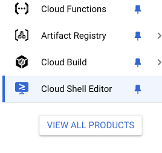
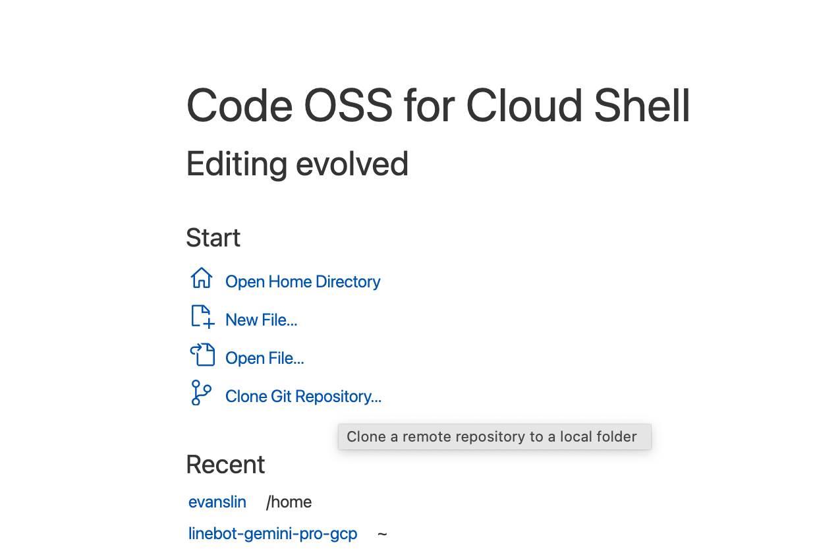
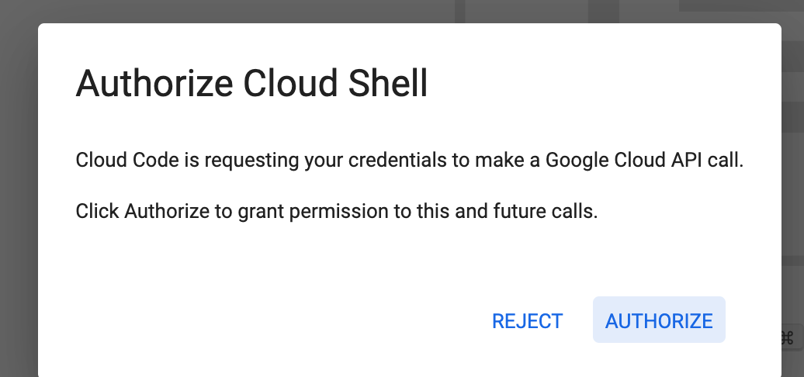

# 前提：

Cloud Run 其實很方便，可以很快速地將 Heroku 的專案搬移過來。可以透過 Create Services 的方式將 github 的專案直接建立一個 Coontinues Deployment 的流程在 Cloud 。 但是本篇文章會介紹另外一種方式，可以透過 Cloud Shell Editor 的方式也是可以部署你的 github 專案到 Google Cloud Run 的平台。

# 使用 Cloud Shell Editor 來部署 Cloud Run 服務

- 到 [Cloud Shell Editor](https://console.cloud.google.com/cloudshelleditor?cloudshell=true) 服務來啟動

- 開啟專案方式選擇 Clone Git Repository ，連接到 github 之後選取你要部署的專案。 這裡用 [https://github.com/kkdai/linebot-travel-gpt](https://github.com/kkdai/linebot-travel-gpt)作為範例。

- 點選左下角的 Cloud Code ，啟動認證。

- 這邊點選 Deploy to Cloud Run 

- 基本上變動都不用改，直接選預設的就可以。

- 然後回到 Cloud Run 設定，加入原本需要的環境變數。
- 這樣就可以了。

## 參考文章：

- [Cloud Shell Editor interface overview](https://cloud.google.com/shell/docs/editor-overview)
- [Heroku 取消免費方案？教你用 Cloud Functions 架設 LINEBOT！](https://github.com/GoogleCloudPlatform/gcr-cleaner)
- [GCP: 配置清理策略 (Apply cleanup policies)](https://cloud.google.com/artifact-registry/docs/repositories/cleanup-policy?hl=zh-cn#console_2)

