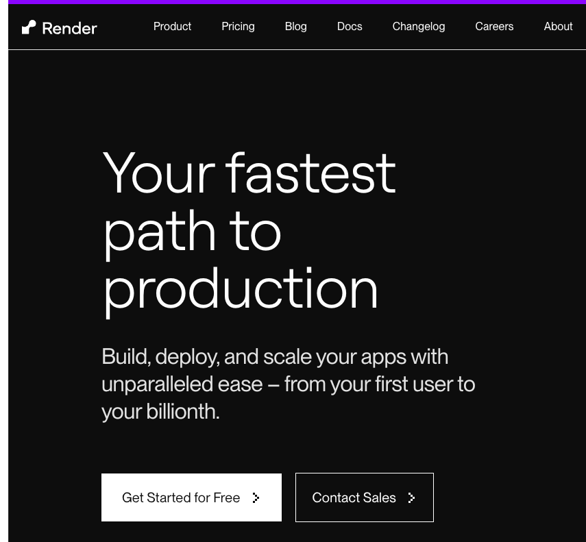
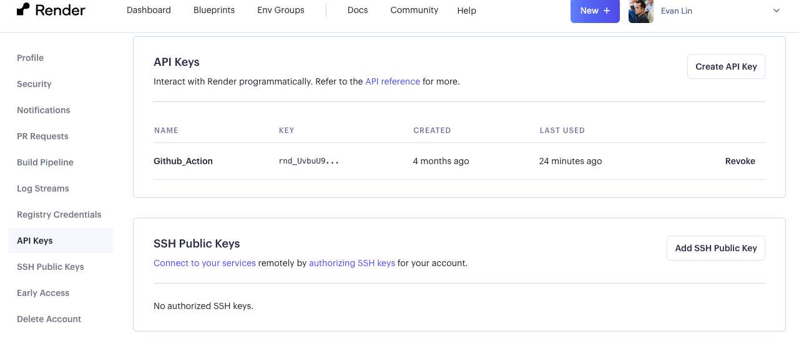
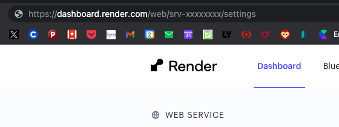
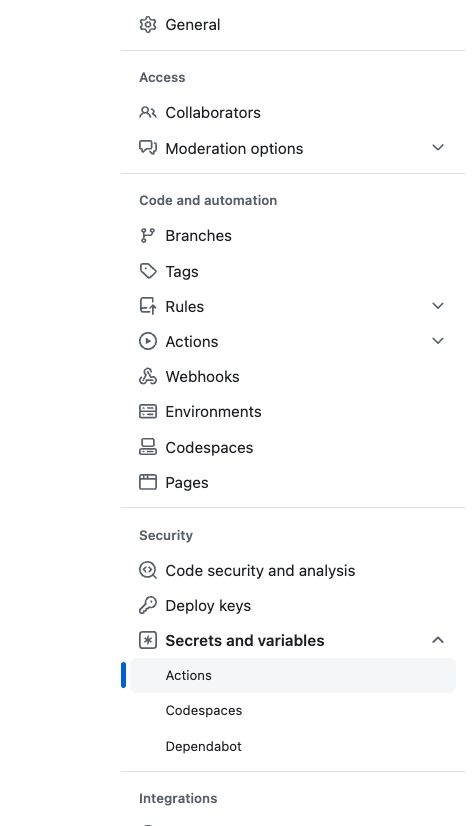
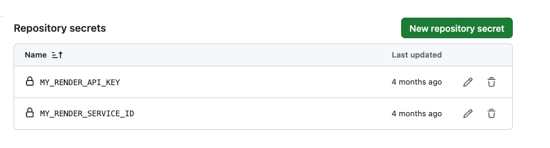
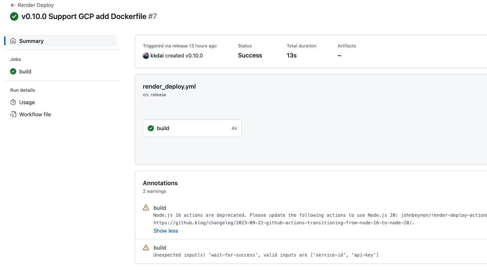
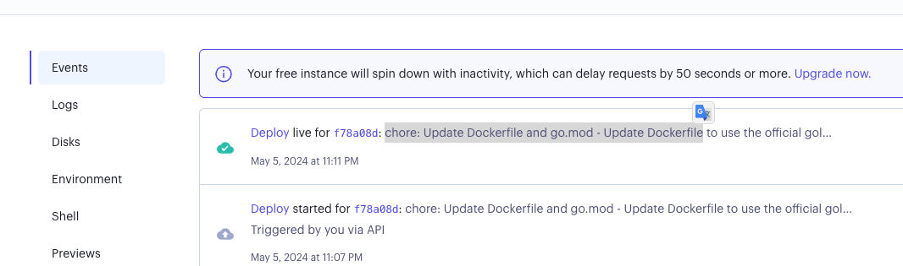

## 前情提要：

雖然我近期已經把所有服務都已經從 Heroku.com 搬遷到 GCP 上面，但是 Render.com 本來也是我教學的一個方案。畢竟它擁有不需要信用卡，有免費額度可以讓學生們快速上手。 這邊快速記錄一下該如何透過 Github Action 部署 Golang 服務到 [Render.com](https://Render.com) 的流程。

如果啟動部署，流程會是：

- 完成 PR Merged 之後
- Draft a Release 在 Github 上面
- 然後會啟動自動部署到 [Render.com](https://Render.com) 


## 範例程式碼：

可以參考這個 REPO [https://github.com/kkdai/linebot-food-enthusiast]( https://github.com/kkdai/linebot-food-enthusiast)


## 如何開始設定 Github Continuous Deployment

### 1. 取得 Render.com API Key

- 首先到以下位置 [https://dashboard.render.com/u/settings#api-keys](https://dashboard.render.com/u/settings#api-keys)
  

- 再來你需要取得你要部署的 Render Services ID，進入專案後，直接看網址就知道。 下面的 `srv-xxxxx` 就是你的專案 ID。

  

  

### 2. Render.com API Key 跟 Services ID 填寫到 Github 設定

你到你專案的設定 Secrets and Variables -> Actions 






### 3. render config file render.yaml

放在 github 根目錄

```
services:
- type: web
  name: linebot-food-enthusiast
  env: go
  buildCommand: go build -o app
  startCommand: ./app
  plan: free
  autoDeploy: false
  envVars:
  - key: ChannelAccessToken
    sync: false
  - key: ChannelSecret
    sync: false
  - key: GOOGLE_GEMINI_API_KEY
    sync: false
```


### 4. render.com Github Action 

放在 [https://github.com/kkdai/linebot-food-enthusiast/blob/main/.github/workflows/render_deploy.yml](https://github.com/kkdai/linebot-food-enthusiast/blob/main/.github/workflows/render_deploy.yml)

```
name: Render Deploy

on:
  release:
    types: [created]

jobs:
  build:
    runs-on: ubuntu-latest
    steps:
      - name: Deploy to production
        uses: johnbeynon/render-deploy-action@v0.0.8
        with:
          service-id: ${{ secrets.MY_RENDER_SERVICE_ID }}
          api-key: ${{ secrets.MY_RENDER_API_KEY }}
          wait-for-success: true
```


# 其他 Q&A



#### Q: 看到有一些錯誤顯示，那是否有問題？

A: 目前不會造成部署的錯誤，但是會有錯誤訊息發生。



- Refer 
  - [https://github.com/johnbeynon/render-deploy-action/issues/6](https://github.com/johnbeynon/render-deploy-action/issues/6)
  - [https://github.com/johnbeynon/render-deploy-action/issues/7](https://github.com/johnbeynon/render-deploy-action/issues/7)


## 參考文章：

- [Render Deploy Action - GitHub Marketplace](https://github.com/marketplace/actions/render-deploy-action)
- [Render GitHub Action · Actions · GitHub Marketplace](https://github.com/marketplace/actions/render-github-action)
- [或許你該懂一下CI/CD？用CD 部署到Render.com](https://israynotarray.com/other/20230520/2118016719/)

