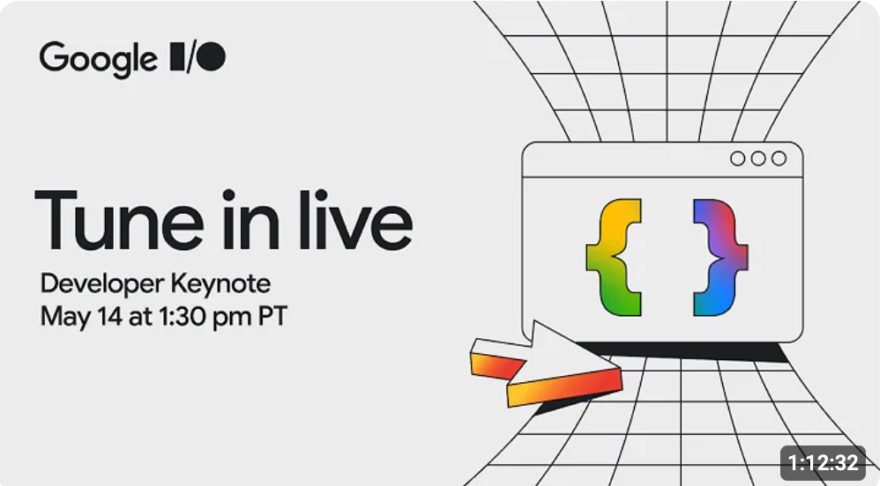
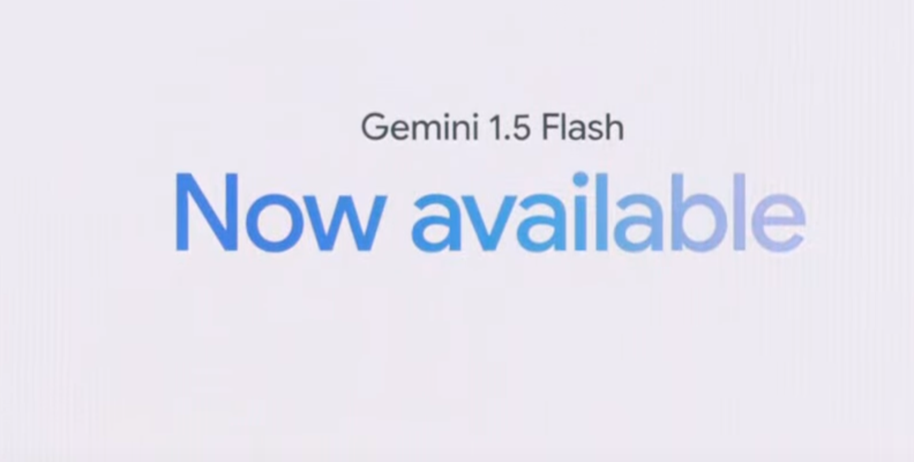
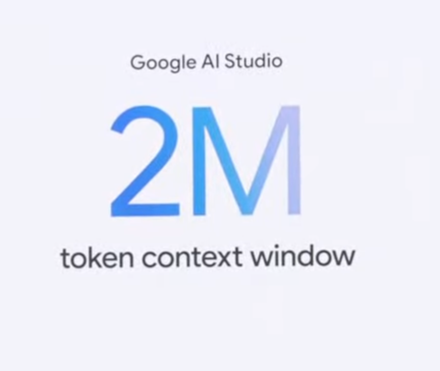
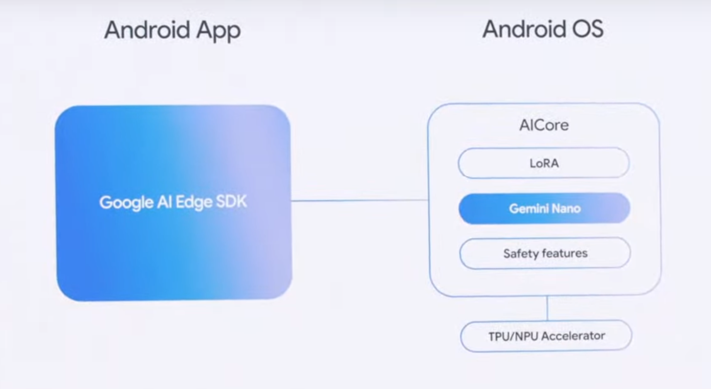
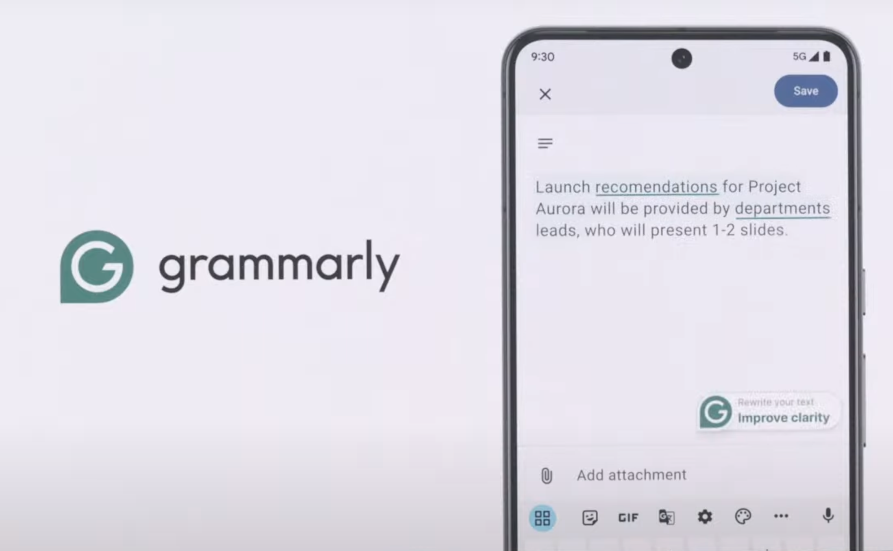

主要觀賞 link: [https://www.youtube.com/watch?v=ddcZnW1HKUY](https://www.youtube.com/watch?v=ddcZnW1HKUY)

## AI 摘要整理：

📚 整體摘要

- 此摘要涵蓋了在會議中如何使用 Gemini API 和 Google 的 AI 工具以及相關技術來強化應用程式開發的介紹。

🔖 重點概念

- Gemini API 可以整合至 Android Studio 和其他開發工具，增強開發效率。
- 透過使用 Google Cloud 和 Vertex AI，開發人員能夠接觸到更強大的 Gemini 功能。
- 提供多平台開發的一體化工具，如 Flutter 與 Firebase，用以支持快速開發。
- 開發者可以自定義 AI 模型，改善應用性能與用戶體驗。
- 強調隱私和安全，在開發過程中保護用戶數據與合規性。

💡 為什麼我們要學這個？

- 理解和運用現代 AI 和多平台整合工具是提升開發效率和應用創新性的關鍵。

❓ 延伸小問題

- 在你的下一個開發項目中，你可能如何利用 Gemini API 或其他 Google AI 工具來提升產品的性能或用戶體驗？

# 幾個重點

## Gemini 1.5 Flash

- 支援兩百個國家以上

### Google AI Sudio 支援 2M token context windows

- 原本 Gemini 1.5 Pro 是 1M token

### Google Gemini API Competition

- 

- [https://ai.google.dev/competition?hl=zh-tw](https://ai.google.dev/competition?hl=zh-tw)

- 
- Google AI Competition 贏得人可以拿到 DoLorean (回到未來那一台)
- 
- 甚至還找了「回到未來」的飾演博士的演員（真的也太老開發者才會知道的）

## Gemini on Android - Gemini Nano

- **OS 中似乎有個 AI Core**
  - Gemini Nano 和 LoRA 在 Android 的 AI Core 中主要是為了提升 Android 設備的本地 AI 能力。這種設定使得設備能夠在不依賴雲端服務的情況下有效地執行 AI 強化的任務，進而提升隱私、減少延遲和降低數據使用。 
  - Gemini Nano 是 Google 專為本地任務優化的 Gemini AI 模型。它設計用於直接在移動設備處理器上運行，能夠支援多種重要用例，如摘要、提問回答、實體抽取和校對。這使得應用程式能夠在裝置離線的情況下提供高品質的反應，並具有對話意識。 
  - LoRA（Low-Rank Adaptation）是一種允許在不大幅增加模型尺寸的情況下有效地微調大型語言模型的技術。在 Android 的 AI Core 中，LoRA 可以被用來將 Gemini Nano 模型適應特定任務或領域，使其更加高效和針對個別應用程式的需求。 
  - 通過在 Android 的 AI Core 中加入 Gemini Nano 和 LoRA，Google 旨在為開發者提供強大的工具，以便構建 AI 強化的功能和應用程式。這將為使用者在各種任務和領域提供更智能、更敏捷、更保護隱私的體驗。

(GPT4-Ｏ 本來以為 Grammarly 要死～結果 Andorid 內建)

## Kotlin/ Gemini on Android Studio (跳過) XD

## Firebase 相關（這些蠻有趣的)

- 🐘Data Connect, PostgreSQL backend-as-a-service
- 🌎App Hosting, web hosting for modern frameworks
- ✨Genkit, a GenAI framework for app developers

