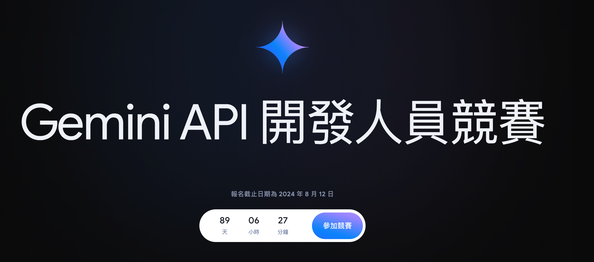
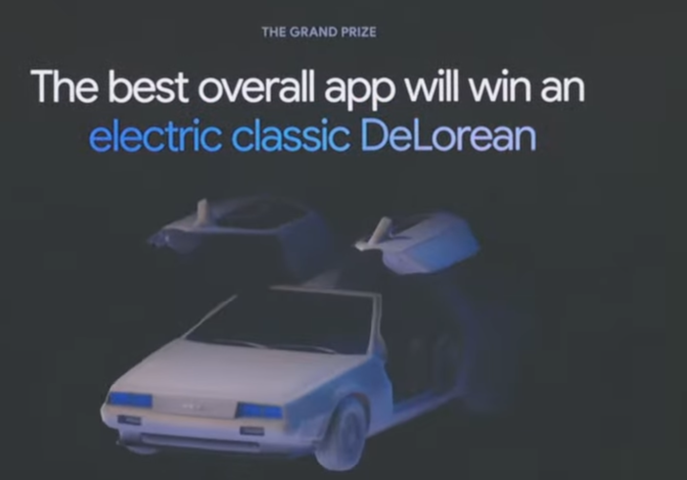

主要觀賞 link: [https://www.youtube.com/watch?v=ddcZnW1HKUY](https://www.youtube.com/watch?v=ddcZnW1HKUY)

## AI 摘要整理：

📚 整體摘要

- 此摘要涵蓋了在會議中如何使用 Gemini API 和 Google 的 AI 工具以及相關技術來強化應用程式開發的介紹。

🔖 重點概念

- Gemini API 可以整合至 Android Studio 和其他開發工具，增強開發效率。
- 透過使用 Google Cloud 和 Vertex AI，開發人員能夠接觸到更強大的 Gemini 功能。
- 提供多平台開發的一體化工具，如 Flutter 與 Firebase，用以支持快速開發。
- 開發者可以自定義 AI 模型，改善應用性能與用戶體驗。
- 強調隱私和安全，在開發過程中保護用戶數據與合規性。

💡 為什麼我們要學這個？

- 理解和運用現代 AI 和多平台整合工具是提升開發效率和應用創新性的關鍵。

❓ 延伸小問題

- 在你的下一個開發項目中，你可能如何利用 Gemini API 或其他 Google AI 工具來提升產品的性能或用戶體驗？

# 幾個重點

## Gemini 1.5 Flash

- 支援兩百個國家以上

### Google AI Sudio 支援 2M token context windows

- 原本 Gemini 1.5 Pro 是 1M token

### Google Gemini API Competition

- 

- [https://ai.google.dev/competition?hl=zh-tw](https://ai.google.dev/competition?hl=zh-tw)

- 
- Google AI Competition 贏得人可以拿到 DoLorean (回到未來那一台)
- 
- 甚至還找了「回到未來」的飾演博士的演員（真的也太老開發者才會知道的）

## Gemini on Android - Gemini Nano

- **OS 中似乎有個 AI Core**
  - 包括圖像生成的 LoRA
  - 負責文字的 Gemini Nano 

(GPT4-Ｏ 本來以為 Grammarly 要死～結果 Andorid 內建)

## Kotlin/ Gemini on Android Studio (跳過) XD

## Firebase 相關（這些蠻有趣的)

- 🐘Data Connect, PostgreSQL backend-as-a-service
- 🌎App Hosting, web hosting for modern frameworks
- ✨Genkit, a GenAI framework for app developers

