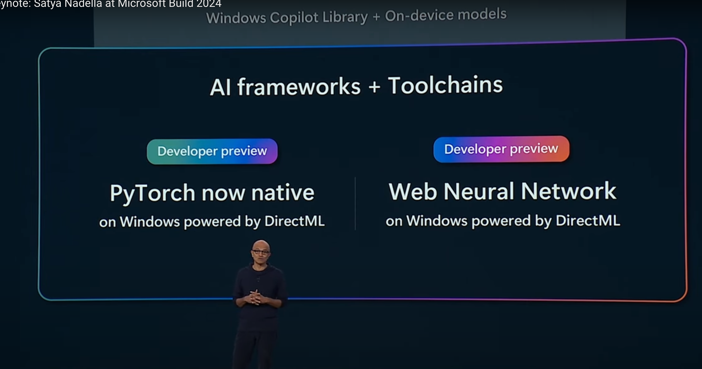

<iframe width="560" height="315" src="https://www.youtube.com/embed/8OviTSFqucI?si=RMorOVJHncLxiLKo" title="YouTube video player" frameborder="0" allow="accelerometer; autoplay; clipboard-write; encrypted-media; gyroscope; picture-in-picture; web-share" referrerpolicy="strict-origin-when-cross-origin" allowfullscreen></iframe>

主要觀賞 link: [https://www.youtube.com/watch?v=ddcZnW1HKUY](https://www.youtube.com/watch?v=ddcZnW1HKUY)

## AI 摘要整理：

## 📚 整體摘要

- 此文主要介紹了如何利用人工智慧（AI）技術，尤其是微軟公司的發展與應用，幫助提高農業生產力，改善教育系統，以及自動化軟體開發過程。文中提及了多個實際案例，強調AI技術在多個領域的應用潛力與效益。

## 🔖 重點概念

- **AI在農業的應用**：透過數據分析提升農業生產效率。
- **教育轉型**：AI作為個人化學習助手，改變傳統教學方式。
- **開發效率提升**：GitHub Copilot等工具協助開發者節省時間與提高代碼質量。
- **AI與辨識技術整合**：透過語音和視覺等多模態輸入，增強AI的應用場景及互動效率。
- **智慧型數據中心**：優化AI運算性能與環境配合，支援更大規模的AI訓練及應用。

## 💡 為什麼我們要學這個？

- AI技術的快速發展不僅改變了農業、教育等多個行業的運作方式，還在軟體開發領域中創造了新的可能性，了解這些技術如何運作並實際應用，對未來的職業發展及創新有莫大的幫助。

## ❓ 延伸小問題

- 在現實世界中，您認為AI技術將在哪些未被充分開發的領域中發揮重大影響力，並為什麼？

# 幾個重點

## PyTorch native support in Windows (thorough DirectML)

