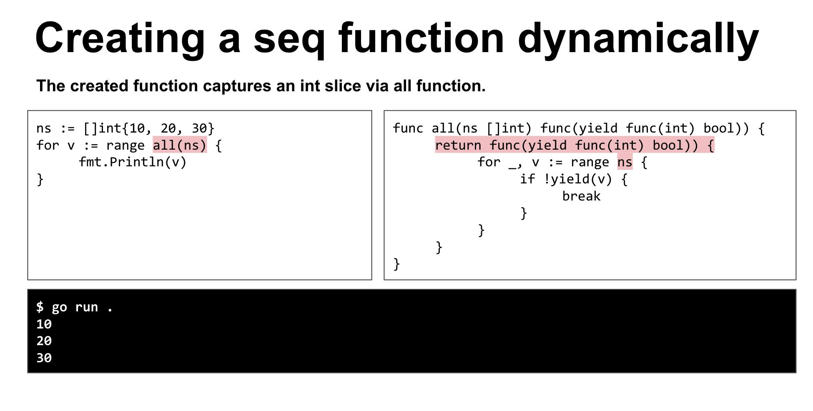

## What is the iterator and how does it build an ecosystem in Go?

[https://docs.google.com/presentation/d/1KBqbbxt2ASQv1g3VlQ8kQgnzlHAdncbkqBD5cYPdKo0/edit#slide=id.p](https://docs.google.com/presentation/d/1KBqbbxt2ASQv1g3VlQ8kQgnzlHAdncbkqBD5cYPdKo0/edit#slide=id.p)

### Range from integer

```
for n:= range 10 {
	fmt.Println("%d", n)
}

----
0
1
....
```

Zero-based.

###  Range func

```
for range seq {
	fmt.Println("in loop")
}

---
func seq(yield func(n int)) {
	yield(100)
}
----
"in loop"
```



## Mastering Large-Size HTTP Requests in the Modern Web - Cherie Hsieh

HackMD : [https://hackmd.io/4BdxdwAZTQiqLvg6EzcYng](https://hackmd.io/4BdxdwAZTQiqLvg6EzcYng)


## Reflect 用太多，都不好意思跟別人說 Go 靜態了 - 高宜誠 / YC Kao

HackMD: [https://hackmd.io/RB2_GBZFR7eO775PSb1n1A](https://hackmd.io/RB2_GBZFR7eO775PSb1n1A)

1. 用 Reflect.IndexOf 會比起 NameOf 快十倍，如果不需要重複尋找。儘量用 IndexOf

