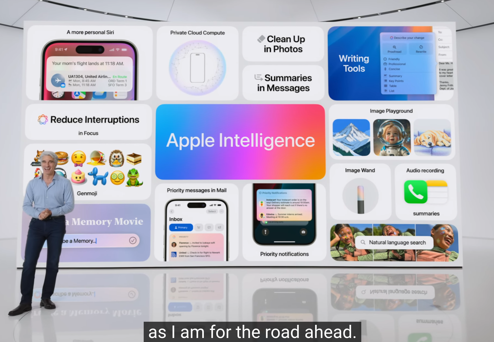

昨天 WWDC 2024 最令大家震驚的就是 Apple 重新定義 AI 的縮寫 - Apple Intelligence
可以參考一下這個短片 [5 mins in Apple Intelligence](https://www.youtube.com/watch?v=Q_EYoV1kZWk)

- 全部在本地端運算，主要有 GenMoji, 信件摘要，拼字語法重寫，資訊整合，相片分類等。
- 透過 MLX 技術，[加上據說是對標](https://machinelearning.apple.com/research/introducing-apple-foundation-models) MSFT Phi-3B 的模型（各種語言支援度待確認，Apple 也承認不一定上全語系） 
- [硬體需求](https://www.apple.com/apple-intelligence/) : iPhone 15 Pro 以上, iPad Pro (M1),  筆電都是 M1 以上

----
跟個人比較有關：

- 完美整合生態系（增加大家回用 Apple Apps)我自己應該會考慮把 Gmail -> Apple Email, Calendar 也是。
- 本地端 LLM model 加上 Embedding 加上其他內容，手機空間會使用更大。
- 剩下應該就是覺得很方便的，訂票資料輸入，各種 email 語氣跟文法校正(grammarly 應該死很久了)。

- 記得去買 iPhone 16 + iCloud  XD 

衍伸閱讀:  [蘋果軟體工程資深副總 Craig Federighi 親自解析 Apple Intelligence：蘋果的 AI 野心](https://www.inside.com.tw/feature/apple-wwdc-2024/35282-apple-ai-stategy-apple-intelligence)

---

最近一篇紅的討論是 APPLE  WWDC 2024 沒有嶄新的技術。 但是 WWDC 從來就不是從技術出發，而是從客戶體驗再來談技術。 在 30 年前的 WWDC 有個 RD 說他不懂技術，講的也沒有很嶄新的技術。 但是 Jobs 卻說，我過去七年唯一學到的是。你不能從技術來賣產品。你要先有好的客戶體驗才能討論技術。 這也是為什麼總是很多人說 WWDC 的 keynote 沒有讓人讚嘆的技術，而是很多事嶄新的使用者體驗。 真的要看技術，要去 Apple developer 每個議程去看。 不過這也是為什麼總是有人問說 WWDC 為什麼沒有新的產品。（黑人問號？？

影片： https://x.com/pirrer/status/1685529928442556416

----

On-Device 是 對比 Phi 的內部 model 。

GPT4-O 是有另外一個 chatGPT 模式

