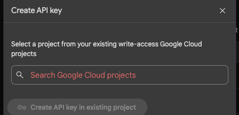
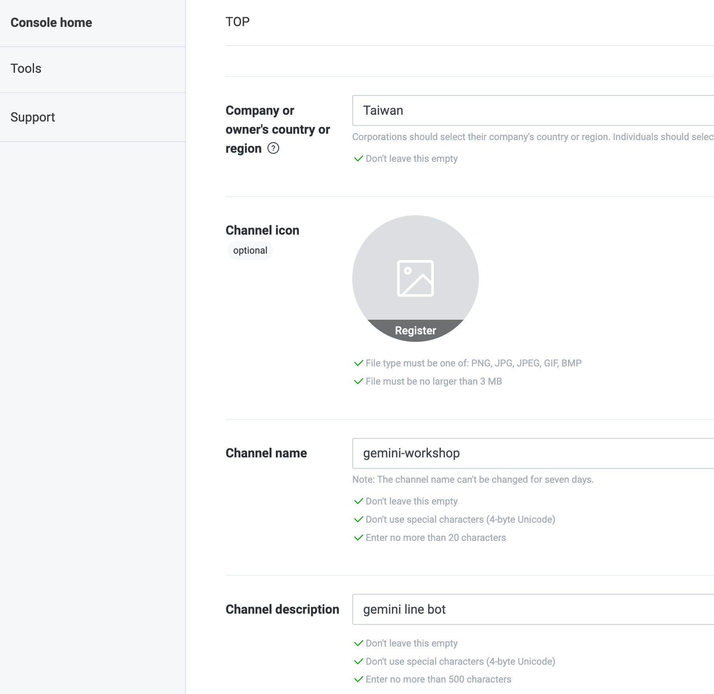
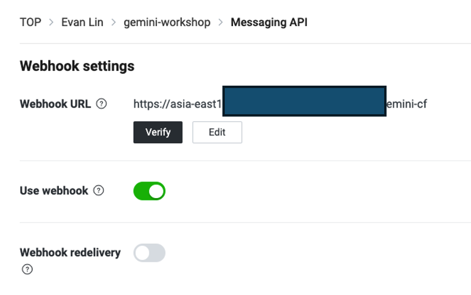

# 前言:

# 事前準備:

- **[LINE Developer Account](https://developers.line.biz/en/)**: 你只需要有 LINE 帳號就可以申請開發者帳號。
- [**Google Cloud Functions**](https://cloud.google.com/functions?hl=zh_cn)： Python 程式碼的**部署平台**，生成供 LINEBot 使用的 webhook address。
- [**Firebase**](https://firebase.google.com/)：建立**Realtime database**，LINE Bot 可以記得你之前的對話，甚至可以回答許多有趣的問題。
- **[Google AI Studio](https://aistudio.google.com/)**:可以透過這裡取得 Gemini Key 。

## 關於 Gemini API Price

根據官方網站： [https://ai.google.dev/pricing?hl=zh-tw]( https://ai.google.dev/pricing?hl=zh-tw)

## 申請 Gemini API Key

- 到 Google AI Studio [https://aistudio.google.com/](https://aistudio.google.com/ ) 
- Click "Get API Key"
- 選擇你已經有綁定信用卡的付費帳號，來取得 API Key

# 申請一個 LINE 聊天機器人 (Messaging API)

- 到 [LINE Developer Console](https://developers.line.biz/en/services/messaging-api/) )並且登入
  
- 在挑選 Channel 的時候，如果要申請 LINE Chatbot (官方帳號)，就要申請 Messaging API
  
- 相關資料填寫上：
  - **Cmpany or owner's country or region**: 
  - **Channel Name**: 也就是你的 LINE Bot 名稱。
  - **Channel description**: 相關敘述來描述你 LINE Bot 做什麼。
  - 其他都可以隨便填寫即可。
- 接下來要到 Messaging API Tab 執行以下設定:
  - **Auto-reply messages**: 關閉它
    
- 接下來要取得兩個重要的參數：
  - 在 **Basic Setting** Tab 下方的 `Channel secret`
    
  - 在 **Messaging API** Tab 下方的 `Channel access token (long-lived) `
    
- 目前先到這邊，稍後還會回來設定相關 Webhook 。

## 申請 Firebase Database 服務

- 記得到 [Firebase Console](https://console.firebase.google.com/)，直接選取你現在有的專案。（可能叫做 My First Project?)

- 建立一個 Firebase Realtime Database 等等會用到

  

- 地區選美國

  

- Start in “lock mode”

  

- 為了開發方便，到 “Rules”設定成可以寫跟讀取，千萬注意：

  - 這是為了測試，請勿用在對外環境
  - 這是為了測試，請勿用在對外環境
  - 這是為了測試，請勿用在對外環境

- 記住哪個 URL (注意！**之後要正式上線，需要改回權限**)，並且加上一個項目: “**BwAI**”

# 建立一個 Cloud Run 服務

- 首先將 [https://github.com/kkdai/linebot-receipt-gemini](https://github.com/kkdai/linebot-receipt-gemini) fork 到自己的 repo
- 自己建立一個新的 [Cloud Run 專案](https://console.cloud.google.com/run/create?hl=en) 

- 選擇好 Source Repository (應該是你自己的名字)

- 透過 Dockerfile 來啟動

- 機器設定可以挑選任何區域，但是 `Authentication` 要挑選 `Allow unauthenticated invocations`

- Container(s), Volumes, Networking, Security 相關設定，需要將環境參數寫進去。
  - `ChannelSecret`: Your LINE channel secret.
  - `ChannelAccessToken`: Your LINE channel access token.
  - `GEMINI_API_KEY`: Your Gemini API key for AI processing.
  - `FIREBASE_URL`: Your Firebase database URL.

# LINE Bot 完成最後設定

- 到 "Messaging API" Tab 
- 填入 "Webhook URL" 數值，將剛剛得「觸發網址填上去」
- 更新(update)後，使用 "Verify" 看看有沒有設定錯誤。
- 如果沒有問題，可以打開**「Use webhook」**

# 需要注意事項：

### 1. 要注意一下 Cloud Function / Cloud Run Instance 開的伺服器夠不夠大

- 如果 Firebase 資料放太多，要小心記憶體可能會不夠。記得 Cloud Function (Cloud Run) 記憶體要開得夠大。

### 2. 記得定期清理 Artifact Registry 空間 -  透過 Artifact Registry 直接設定 House Keeping 策略

- 到 [Artifact Registry](https://console.cloud.google.com/artifacts/browse/)

  

- 點選 size 最大的吧，然後選取上方 **Edit Repository**

- 在最下方，選曲 **Cleanup Policies**

- 選擇 “Keep most Recent versions”

- “Keep count” 選 1 (也可以是 2)

**如果怕刪除太多，可以用 Dry run 看看結果。**

#  完整原始碼

你可以在這裡找到相關的開源程式碼: [https://github.com/kkdai/linebot-receipt-gemini](https://github.com/kkdai/linebot-receipt-gemini)

# 衍伸應用

透過 Cloud Run / Cloud Function 可以很快速部署服務到 Google Cloud 並且很快的讓你的 LINE Bot 可以上線。以下有相關應用可以去參考一下：

- [名片小幫手](https://github.com/kkdai/linebot-namecard-firebase)
  

- [美食小幫手](https://github.com/kkdai/linebot-food-enthusiast)
  

  
