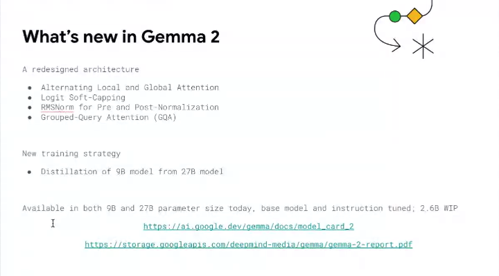
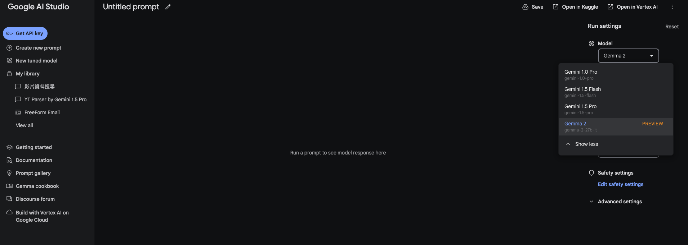
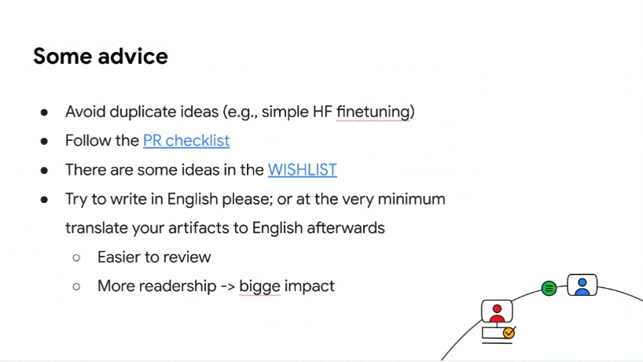

# 前言:

# 相關內容

## 概論

- [Gemma2 Model Card](https://ai.google.dev/gemma/docs/model_card_2)

### Gemma Cookbook 資料分享

- [Gemma Cookbook Github](https://github.com/google-gemini/gemma-cookbook)
  - 可以貢獻，但是不要重複。
  - 可以看一下 wishlist
  - 中文翻譯（by 保哥) [https://github.com/doggy8088/gemma-cookbook](https://github.com/doggy8088/gemma-cookbook)

## 在 AI Studio 試試看 Gemma2

## Model Card

- [Gemma1.1(2B, 7B)](https://ai.google.dev/gemma/docs/model_card)
- [Gemma2 (27B, 9B) ，小模型 2.7B 還在訓練中。](https://ai.google.dev/gemma/docs/model_card_2)

#### 新增： Gemma2 on Groq （沒有很好顯卡，可以用這個範例)

- [Gemma2_on_Groq.ipynb](https://github.com/google-gemini/gemma-cookbook/blob/main/Gemma/Gemma2_on_Groq.ipynb)

#### 新增： Gemma2 相關中文模型

- [https://huggingface.co/cloudyu/google-gemma-7b-chinese-sft-v1](https://huggingface.co/cloudyu/google-gemma-7b-chinese-sft-v1) (大陸清華大學學生做的，非官方)

### Ｑ＆Ａ

- Q: Gemma2 - Fine-Tunning 經驗?
  - HuggingFace 上面有註解，如果要 Fine-Tune 需要把 Attention 改成 Egar 
- Q: Gemma2 是否有 Embedding Model?
  - 目前還沒有。
- Q: 有方式透過雲端方式直接使用 Gemma 嗎？不需要本地端部署 GPU?
  - [目前有 Vertex AI 對上 Gemma 的 cookbook](https://github.com/google-gemini/gemma-cookbook/blob/main/Gemma/Deploy_Gemma_in_Vertex_AI.ipynb)
