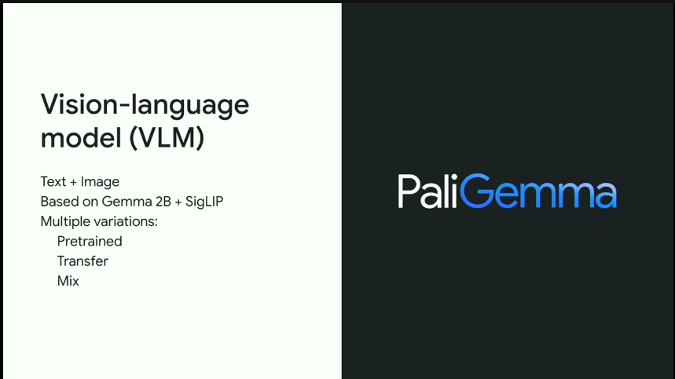

## Google AI Dev - Gemma2 && PaliGemma


這張圖稍微解釋了 Gemma 家族的兩個主要產品：

- Gemma 2：也就是第二代的 Gemma
- PaliGemma：是第一代的 VLM (視覺語言模型)

### PaliGemma 相關資源：

- [這邊有 paligemma 的 demo code](https://huggingface.co/spaces/big-vision/paligemma-hf) (在 HuggingFace 上面)

  

  

  

  可以看出來，由於是  Gemma 2B 加上 SigLIP 他對於語言的處理比較簡單。 可以做一些簡單的資訊處理，但是複雜問題就不行，比如說：

  - 產生 JSON 回覆 (X)
  - 一次回答兩個問題以上 (X)

  但是可以達到：

  - 用中文問問題（但是只會回答英文）
  - 可以做簡單的 OCR ，或是 Object Detection 。

  根據以下討論 PaliGemma 的影片， Google 團隊建議直接使用 Mix 版本的模型。他可以 Vision + Object Detection 。

  <iframe width="560" height="315" src="https://www.youtube.com/embed/WJqdeSYuUkI?si=jZP1lW-hlx82mjdV&amp;start=541" title="YouTube video player" frameborder="0" allow="accelerometer; autoplay; clipboard-write; encrypted-media; gyroscope; picture-in-picture; web-share" referrerpolicy="strict-origin-when-cross-origin" allowfullscreen></iframe>

  


以上是 PaliGemma model 的相關 Benchmark ，可以看出來。

對比的相關測試數據跟方法，都可以得到不錯的準確率。

### 在 GCP 上面直接部署 PaliGemma

[https://console.cloud.google.com/vertex-ai/publishers/google/model-garden/paligemma](https://console.cloud.google.com/vertex-ai/publishers/google/model-garden/paligemma)


另外一方面 Gemma 2 也可以: [https://console.cloud.google.com/vertex-ai/publishers/google/model-garden/gemma2]( https://console.cloud.google.com/vertex-ai/publishers/google/model-garden/gemma2)


# Gemma 可以適用的相關內容

透過 Gemma 可以讓 token 數字有大幅度的減少，有以下幾種方向可以考慮：

## 個人隱私的偵測

讓一些可能有個人隱私的部分可以獲得比較有效的篩選。

### 以前做法：

個人資料的偵測跟去除一直是一個很難的技術，需要有許多 regular expression 來做控管。即便是如此，還是有可能會有遺漏的地方。針對個人資料偵測這一段，其實在 LLM 是可以使用的。 但是在資安法規上，直接將用戶的個人資料傳到第三方，這樣是不符合規範的。所以這一段可以透過 Gemma 來施行。

### 如何用 Gemma (on-device LLM) 處理

```
查看以下內容是否包含個人資料，地址，身份字號，銀行帳號，回覆我 是 或是 否
------
我想找台北的房子
```

### 如何用 PaliGemma 處理？

```
Check if the image content contains personal information, address, identity number, or bank account number, and reply with Yes or No.
```


### 實地測試 - Gemma2 / PaliGemma

#### 文字測試 Gemma2-9B


改成 「某人」跟 「配偶」，並且可以有效地去除身份字號跟銀行帳號。 


#### 圖片測試 PaliGemma


## 判定是否需要 「大型」LLM 的介入

將聊天機器人放入群組之中，最害怕的就是怕「 Token」爆掉。因為每一句話都需要判斷是否需要 LLM 的介入。這時候就可以透過 Gemma 可以有效的處理。

### 以前做法

有看過一些人做法是： `設定前綴字 "@" "!" 才會呼叫 LLM`

這些做法沒有錯誤，只是這樣往往讓聊天室裡面的文字不好理解。

### 如何用 Gemma (on-device LLM) 處理
可以透過簡單的判斷 Prompt 讓

```
查看以下文字是否需要客服人員的協助。回答 yes/no
------
我今天早上吃了蛋餅
```

### 實體測試 Gemma


## 未來展望

所謂的「小模型」或者是「Open Model」 不僅僅是在 on-device 的應用才有用。 放眼在 Cloud Services 的概念上，其實也是可以透過 on-devices LLM model 來做相關應用。 未來的相關應用應該會更多，也相信未來
