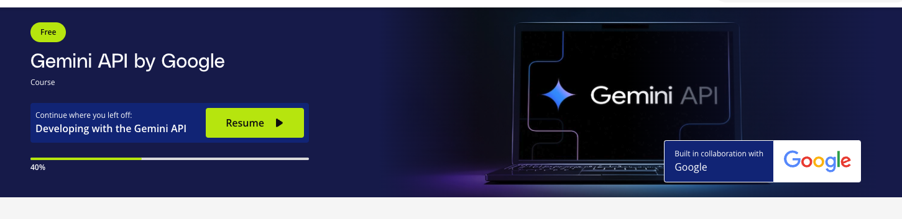
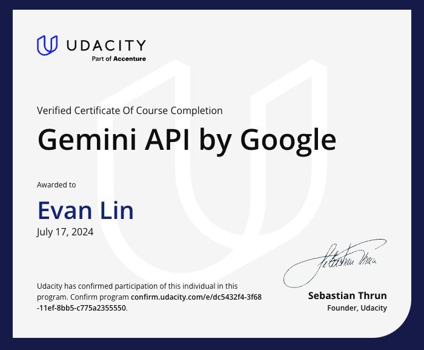

(課程連結： https://www.udacity.com/enrollment/cd13416)




## 前言

Google 跟 Udacity 合作開的這一個課程，蠻建議大家可以看一下。除了是免費之外，更加許多文件裡面沒有提供的詳細資訊跟用法講得很清楚。 想要更了解每一個 API 該如何使用，可以考慮看看。

這邊快速講一下課程大綱，然後帶幾個我覺得很重要的概念：

## 課程大綱

- Introduction to LLMs and Gemini
  - 基本概念補充。
- Introduction to prompting in Google AI Studio
  - 主要都是 AI Studio 的操作說明。
- Developing with the Gemini API
  - 建議開發者都要看這個，大多是 API 使用細節。
- Advanced Applications
  - 課程整理，還有相關小專案給學員練習。

## 幾個重點整理：

### 如何算產出 token

```
token_n_model = genai.GenerativeModel(model_name, generation_config={"temperature": 0.0})
poem_prompt = "Write me a poem about Berkeley's campus"

prompt_token_count = token_n_model.count_tokens(poem_prompt)
output_token_count = token_n_model.count_tokens(response.text)
print(f'Tokens in prompt: {prompt_token_count} \n Estimated tokens in output {output_token_count}')
```

透過 

- prompt_token_count: 輸入的 token 數字。
- output_token_count: 產出的 token 數字。

### Safty Setting

由於 Gemini 有著嚴格的管控，許多時候一些資料會被以安全因素而拒絕回覆。這時候你需要做一些處理：

在進行此演示之前，請記住要負責任地處理 AI 並遵循道德準則。

安全性是 Gemini 的一個重要內建功能。讓我們來了解更多它的功能：

### 如何檢查您的提示是否被安全過濾器阻擋
- 哪些安全過濾器導致了阻擋
- 如何調整設置以解除阻擋

### 檢查提示是否被阻擋
假設我們選擇了以下提示，在當前的安全設置下，您可以預期您的回應會被阻擋：

```python
model = genai.GenerativeModel("gemini-1.5-flash", generation_config={"temperature": 0})

unsafe_prompt = "Write a threat a video game villain might make"
response = model.generate_content(unsafe_prompt)
print(response.text)
```

輸出：ValueError: 無效操作：`response.text` 快速訪問器需要回應包含有效的 `Part`，但沒有返回任何內容。請檢查 `candidate.safety_ratings` 以確定回應是否被阻擋。

現在，您可以印出 `response.candidates[0].finish_reason` 以進一步調查。

- 如果 `finish_reason` 是 `FinishReason.STOP`，則表示您的生成請求成功運行。
- 如果 `finish_reason` 是 `FinishReason.SAFETY`，則表示您的生成請求因安全原因被阻擋，因此 `response.text` 結構將為空。

### 檢查安全過濾器
印出 `response.candidates[0].safety_ratings` 將顯示評級結構。我們可能會看到如下內容：

```
[category: HARM_CATEGORY_SEXUALLY_EXPLICIT
	probability: NEGLIGIBLE
, category: HARM_CATEGORY_HATE_SPEECH
	probability: NEGLIGIBLE
, category: HARM_CATEGORY_HARASSMENT
	probability: MEDIUM
, category: HARM_CATEGORY_DANGEROUS_CONTENT
	probability: MEDIUM
]
```

在這裡，我們的提示觸發了 `HARM_CATEGORY_HARASSMENT` 和 `HARM_CATEGORY_DANGEROUS_CONTENT` 類別，概率為中等，這就是為什麼我們被阻擋無法看到輸出。

### 如何移除過濾器

```
response = model.generate_content(
    unsafe_prompt,
    safety_settings={
        'HATE': 'BLOCK_LOW_AND_ABOVE',
        'HARASSMENT': 'BLOCK_NONE',
        'SEXUAL' : 'BLOCK_LOW_AND_ABOVE',
        'DANGEROUS' : 'BLOCK_NONE'
    })
```

這樣即便要產生一些具有髒話或是攻擊性文字也是被允許的。


### 透過 code execution 可以讓幻覺更少

可以讓 Gemini 幫你產生 Python code 並且實際執行它 ([範例](https://ai.google.dev/gemini-api/docs/code-execution?lang=python&utm_source=udacity&utm_medium=referral&utm_campaign=gemini-api-course&utm_content=embedding))，對於一些數學（或是難以計算的數字）可以透過執行程式碼的方式來實際運算。 主要原因，因為如果你直接問 Gemini 可能因為幻覺造成計算出錯誤的數學結果，這時候務必要使用 code execution 來計算。

```
import os
import google.generativeai as genai

genai.configure(api_key=os.environ['API_KEY'])

model = genai.GenerativeModel(
    model_name='gemini-1.5-pro',
    tools='code_execution')

response = model.generate_content((
    'What is the sum of the first 50 prime numbers? '
    'Generate and run code for the calculation, and make sure you get all 50.'))

print(response.text)
```


## 透過 response_mime_type 強制回覆 JSON

雖然使用 prompting 可以要求 Gemini 回覆 JSON，但是為了確保回覆的資料格式，可以使用 `response_mime_type` 來強至指定回覆格式。

- 此功能限制在 Gemini 1.5 [參考官方文件](https://ai.google.dev/gemini-api/docs/api-overview#json)

```
model = genai.GenerativeModel('gemini-1.5-flash',
                              generation_config={"response_mime_type": "application/json"})

prompt = """
  List 5 popular cookie recipes.

  Using this JSON schema:

    Recipe = {"recipe_name": str}

  Return a `list[Recipe]`
  """

response = model.generate_content(prompt)
print(response.text)
```

`response_schema`更可以限制回傳的資料格式，可以是 list or map 。

```
result = model.generate_content(
  "List 5 popular cookie recipes",
  generation_config=genai.GenerationConfig(response_mime_type="application/json",
                                           response_schema = list[Recipe]))

print(result.text)
```


