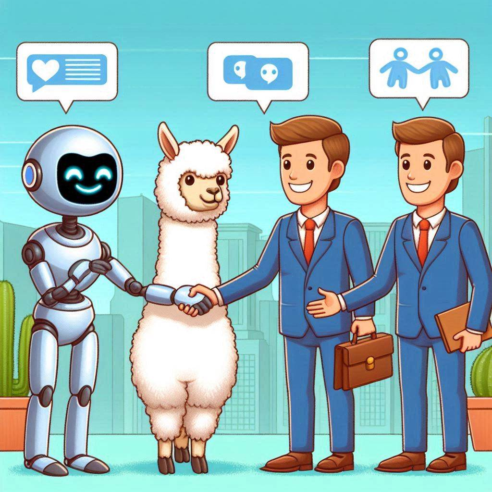
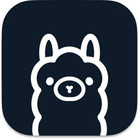
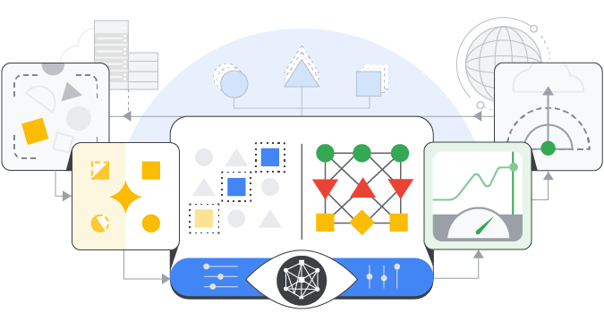
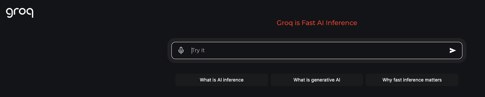
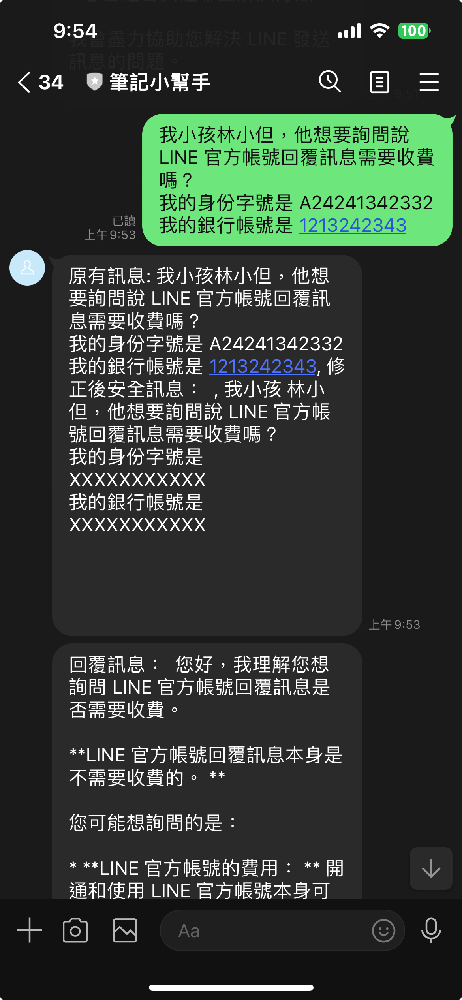
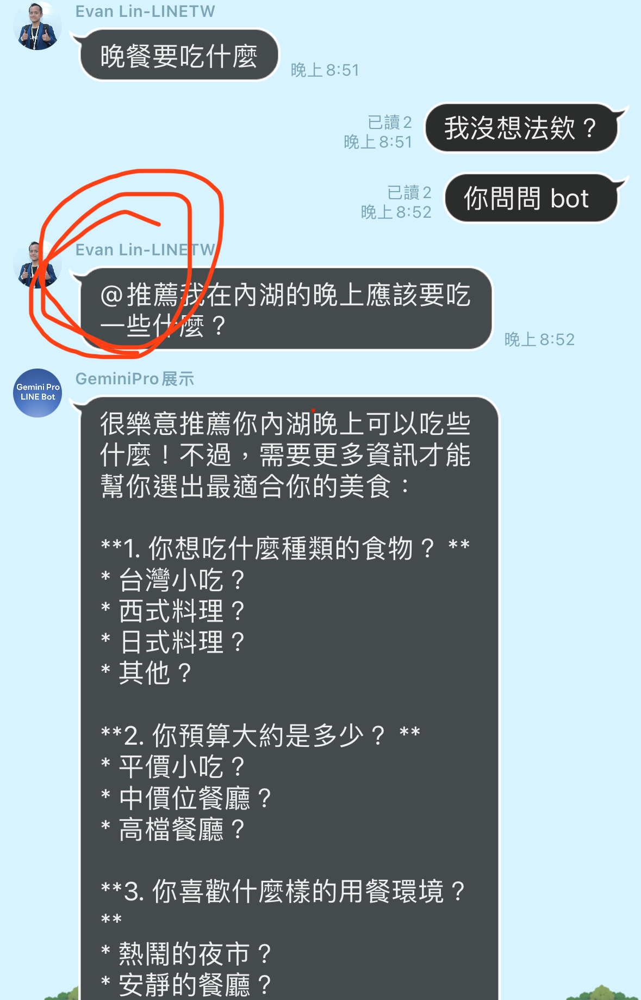
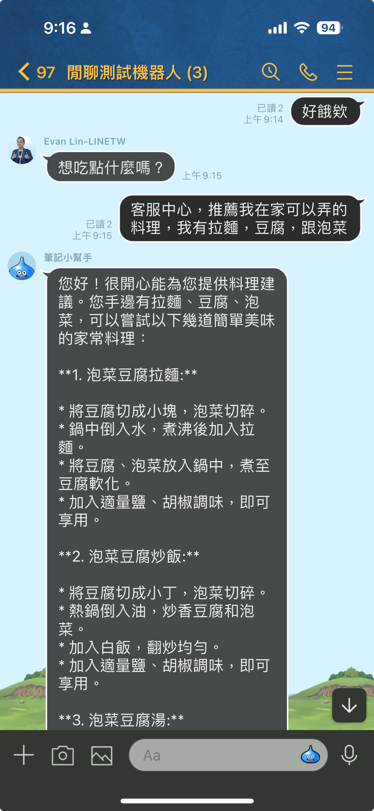
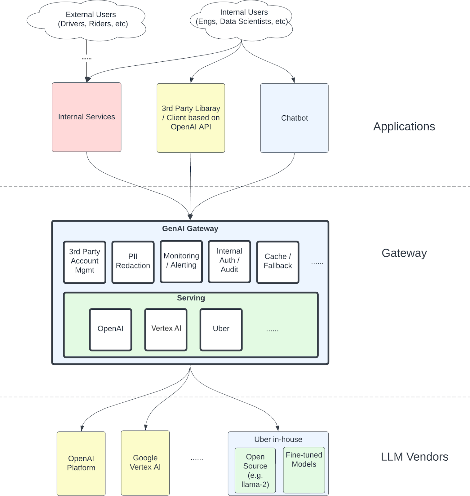

## 前言

LLM 的盛行之後，我們可以看到許多開發者將 LLM 整入到自己的聊天機器人 (LINE ChatBot) 之中。但是隨著而來也有不同的考量開始出現。讓許多開發者感到困擾，該如何更有經濟效益，並且更安全合法規的方式來使用 LINE Chatbot。

自從 LLAMA 等開源模型發展後，我們可以看到市面上有許多相關的開源模型。 LLAMA, Gemma, Phi3 等等，甚至有許多模型是可以在自己本地端的電腦中使用的。本篇文章將介紹這一類型的 Local Model 究竟能如何跟 LINE Bot 去整合，，並且提供一些範例程式碼作為 LINE Bot 的範例。


## 相關程式碼

關於 LINE Bot 相關程式碼，可以參考這一段。這邊使用 Groq 的 API 服務

[https://github.com/kkdai/linebot-gemma](https://github.com/kkdai/linebot-gemma)

## Gemma/LLAMA 這一類的模型該如何部署

不論是 Gemma 還是 LLAMA 這一類可以部署在本地電腦（或是自己的雲端伺服器裡面的），在本文中都先暫且稱為 Local Model 。 他的基本 Prediction 的精準度，在於你提供的本地機器的算力。

### 筆電使用上 可以考慮使用 Ollama



Ollama 是一個跨平台很好使用 LLM 的本地端工具，可以在本地端的電腦去使用 Llama3, Phi 3, Mistral, Gemma2 等等本地端的模型。使用跟安裝也相當簡單，基本上現在只要是 M1 或是 M2 的 Mac Book 就可以很輕鬆地跑起相關的服務。


### GCP / Vertex AI 上面要部署這些模型



可以透過 Vertex AI 的服務來部署

- [Gemma](https://console.cloud.google.com/vertex-ai/publishers/google/model-garden/335)
- [Gemma2](https://console.cloud.google.com/vertex-ai/publishers/google/model-garden/gemma2)
- [PaliGemma](https://console.cloud.google.com/vertex-ai/publishers/google/model-garden/paligemma)

但是需要申請伺服器單位如列表 

| Gemma / Gemma2                                               | PaliGemma                                                    |
| ------------------------------------------------------------ | ------------------------------------------------------------ |
| Machine type: ct5lp-hightpu-4t Accelerator <br />type: TPU_V5_LITEPOD <br />Accelerator count: 4 | - Machine type: g2-standard-16<br/>- Accelerator type: NVIDIA_L4<br/>- Accelerator count: 1 |


不過要注意這些單位需要申請，因為筆者還沒有申請下來本文將使用 Groq 來示範。 （2024/07/19)


## 透過 LPU API Services - Groq 來使用 Gemma2



不得不說 [Groq](https://groq.com/) 真的很快，而且目前也都還有免費額度可以使用 API 來呼叫。這邊也放上最簡的程式碼來呼叫 `Gemma2-9B` 

``` python
# Default
import os

from groq import Groq

client = Groq(
    # This is the default and can be omitted
    api_key=os.environ.get("GROQ_API_KEY"),
)

chat_completion = client.chat.completions.create(
    messages=[
        {
            "role": "system",
            "content": "you are a helpful assistant."
        },
        {
            "role": "user",
            "content": "Explain the importance of fast language models",
        }
    ],
    model="gemma2-9b-it",
)

print(chat_completion.choices[0].message.content)
```


# 如何跟 LINE Chatbot 可以有完美的結合？

Gemma 與 LLAMA 這種本地端模型有哪些優勢？


### 個人隱私的去除

雖然說， OpenAI， Azure  甚至是 GCP 都有明令說 API Level 的資料是不可以拿來訓練的。但是根據許多個人資料保護法來說，最重要的就是**不能隨便地將客戶的個人資料直接交給第三方的服務**。 通常這一類型的服務被稱為 Personal Identifiable Information  (PII) Redactor (PIID)。當然市面上有許多根據 REGEX 打造出來的 Redactor ，但是使用 LLM 可以很有效地去除。也能避免掉許多各種逃逸字元造成 REGEX 失敗的案例。

這時候就可以透過這一類的 local model 來將個人資料做拔除， 以下做一些簡單的 Code  Sample

```
remove_personal_prompt = '''
Replace personal information, name with someone, address, ID number, bank account, etc. 
Just give me the modified original text, don't reply to me.
------\n
'''
```

這一段是移除個人資料的 prompt ，透過 LLM 可以很輕鬆的移除掉個人資料。 但是以往這件事情，如果是透過 Gemini 或是 OpenAI 的 API 來實作的話。那麼相關的資料流程會需要經過相關單位的資料審核，但是如果這個模型是透過本地端模型，就沒有這樣的困擾。

```
    msg = event.message.text
    
    # 透過本地端 LLM 來處理可能含有個人隱私的資訊。
    safe_ret = generate_local_llm_result(f'{remove_personal_prompt}, {msg}')
    
    # 比較安全的內容在傳遞到遠端的 LLM 來生成內容
    ret = generate_gemini_text_complete(f'{safe_ret}, reply in zh-TW:')
    reply_msg = TextSendMessage(text=ret.text)
    await line_bot_api.reply_message(
        event.reply_token,
        reply_msg
    )
```

 這時候使用者雖然在不經意的狀況下，輸入資料到聊天視窗。但是因為透過了 `generate_local_llm_result()` ，會將裡面有個人資料的文字在本地端的模型(Gemma or LLAMA) 去除後，就可以將需求傳到外部的大型語言模型去進行接下來的相關處理。

#### 測試結果範例(示意圖)：



根據這個範例，你可以看到使用者可能在無意間將自己的個人資訊（包括了信用卡帳號，銀行帳號）加入他詢問的問題中。這時候如果直接將使用者文字傳遞給第三方的 LLM ，在許多國家的資安控管上都是不合規訂的。 這時候要透過 local LLM 將原本資料去修改，將個人資料修改或是遮蓋後才能傳遞給第三方 LLM 。

相關程式碼： https://github.com/kkdai/linebot-gemma


### 判別是否需要 LLM 的協助


聊天機器人搭配著 LLM 是一個強大的應用。但是如果每一句每一個訊息都傳遞到 LLM 那麼也太沒有效率了， 許多聊天機器人的開發人員都會了這個方法苦惱中。以往的方式可能用一些特殊的 prefix 來處理，但是這樣的處理方式相當的不友善也讓人好像回到 LLM 時代之前。



就像是客服也不需要參與所有的對話，有些時候一些聊天的對話其實也不需要傳遞給 LLM 。這時候可以透過本地端的模型來幫助你。由於本地端的模型，可以透過比較小的模型，來讓成本整個降低。（並且小成本可以做出簡單的判斷）。

```
need_bot_prompt = '''
Check the following text to see if it requires customer service assistance. 
Just answer YES/NO
------\n
'''
```

以上是讓本地端的小模型，讓他來幫你判斷的 prompt。主要是判斷是否需要客服的協助（如果你打造的是客服聊天機器人）。這時候即便是小模型，也可以很快速的回覆 YES / NO 。 以下提供整段的判斷程式碼。

```
# 處理在群組內的訊息，有時候可能訊息不是對 LINE Bot。
if event.source.type == "group":
    msg = event.message.text
    
    # 使用本地端模型來判斷是否需要 LLM 
    determine_ret = generate_local_llm_result(f'{need_bot_prompt}, {msg}')

    # 檢查判斷的結果，如果是 YES 就直接將原文送到 LLM 。
    if "YES" in determine_ret:
        # Pass to LLM to process original request.
        ret = generate_gemini_text_complete(f'{msg}, reply in zh-TW:')
        reply_msg = TextSendMessage(text=ret.text)
        await line_bot_api.reply_message(
            event.reply_token,
            reply_msg
        )
    else:
        # 如果不需要，就 skip 這段訊息。
        continue

```

### 判斷是否需要 LLM 協助的範例




根據這個範例，你可以看得出來。 除非你有特定想要詢問客服中心，不然都不會將訊息傳遞給 LLM 。這樣除了可以更節省經費之外，還可以不需要任何特殊字元來判斷是否需要 LLM 的幫助。 

相關程式碼： https://github.com/kkdai/linebot-gemma


# 未來展望



近期 (07/11) Uber 分享了他們的 [GenAI Gateway 的創新 (Navigating the LLM Landscape: Uber’s Innovation with GenAI Gateway)](https://www.uber.com/en-TW/blog/genai-gateway/)（尤其是針對 LLM 的部分），裡面有提到通常來說訊息可能從許多地方進來

- ChatBot 
- 3rd Party Library 
- Internal Services

但是這一類的訊息與請求在經過 GenAI Gateway 蛇後，會請過許多的處理。

- PII Redaction (去除掉個人資訊)
- 相關的資訊認證
- 訊息與流量控管

最後才會分配到不同的 LLM 來處理相關的資訊。 


在 LINE Bot 的開發上也是如此，雖然他的需求與功能會是單一且明確的。但是如果可以透過本地端的模型來讓使用者的體驗可以更好，卻也能讓成本取得一定程度的平衡。 這時候 LLM 不再是浪費錢的事情，而是一個完美的助手。


我們也期待著每一位開發者趕緊來試試看，並且跟我們分享相關的心得。
