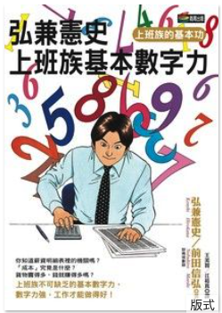

```
弘兼憲史上班族基本數字力
```

#### 買書推薦網址：

- Readmoo: 下架了

# 前言:

這是 2024 年第 6 本讀完的書。 當初看到作者就買了，本來想說可以補充相關知識的。


# 內容摘要：

```
你知道薪資明細表裡的機關嗎？

　　「成本」究竟是什麼？

　　貨物賣得多，錢就賺得多嗎？

　　上班族不可缺乏的基本數字力，數字力強，工作才能做得好。

◆只要數字概念強，你就能成為工作能力佳的上班族！

　　不論職場菜鳥或老鳥，不管是什麼樣的工作，多少都會接觸到和數字相關的業務內容。舉凡產品成本估算、定價；個人薪資所得；產業景氣循環；企業經營分析、償債能力等，都是身為優秀上班族，不可不知的超基本常識。

　　像是新聞報導常見的「景氣動向指標」，它是根據對景氣的變動敏感的幾項指標組合而成，其中指標可分為「領先指標」、「同步指標」、「落後指標」三種。由於組合了多項指標，可對景氣的狀況做出綜合性的判斷與預測，得知目前景氣好或壞，決定公司因應的各項策略。

　　另外，經營分析經常用在調查企業的往來對象上，但除此之外也有其他用途。例如，要投資股票時，必須先得知投資標的那家公司的狀況。因此，經營分析相當有用。如果先學會經營分析，也會變成能夠更深入理解新聞媒體報導關於企業的事。

　　諸如此類，上班族必備的基本數字力，包含面對個人、產品、市場、企業、商業等各領域的業務。本書提出各類數字的計算由來，運用的方法，讓你輕鬆掌握關鍵數字，解決問題無往不利。
```


# 心得:

弘兼憲史一直是我很喜歡的漫畫家，他最有名的就是「課長-島耕作 」。裡面除了有日本上班族的心路歷程外，最重要的就是針對日本企業各種文化的考究與整理。 這一本也是，整理了很多相關的基本知識。 但是隨著有在投資股票，許多的基本相關財務報表的基本概念也就出現了。 因為有一些財報的分析，能夠了解裡面的基本原因，經常聽著財經號角跟股癌也讓我基本知識有一些些的進步。（當然賠錢賠得多，學得最多）。

不過這一本比較基本，如果有基本企業概論或是經濟學概念的人，或許就不需要閱讀了。
