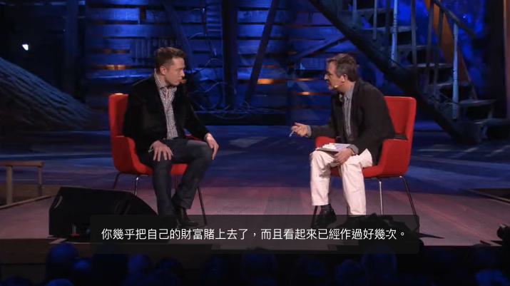

<div><a href="https://moo.im/a/4cmzGQ" title="馬斯克傳"></a></div>


```
馬斯克傳:唯一不設限、全公開傳記
Elon Musk
 共 138 人評分
作者： 華特．艾薩克森  原文作者： Walter Isaacson  譯者： 吳凱琳  出版社：天下雜誌出版 
```

#### 買書推薦網址：

- Readmoo: [由此去購買](https://moo.im/a/4cmzGQ)。

# 前言:

這是 2024 年第 9 本讀完的書。這本在當初要出刊的時候就相當的轟動，但是實際看到實體書之後，應該也會不少人會被勸退。 但是其實書籍本身還是蠻有趣的，蠻推薦大家可以看一下。


# 內容摘要：

```
馬斯克唯一不設限、全公開傳記
權威傳記作家艾薩克森重磅力作

兩年深度跟訪，解密全世界最令人好奇，也最具爭議性的創新者——
是狂人還是造勢天才？是破壞者還是創新者？是混蛋還是英雄？
想要了解最真實的馬斯克，只能透過這本書！

★第一視角觀察馬斯克獨有的英雄模式與惡魔模式
★深入解讀馬斯克旗下六大事業的商業與創新策略
★揭露AI、自動駕駛、太空探險三大尖端科技趨勢

「不管你喜歡與否，我們都生活在馬斯克創造的世界裡。」—《時代》

馬斯克引領世界進入電動車時代、開發私人太空探險、嚴肅想像人工智慧，他改變了三大關鍵產業，也改變了我們的未來。喔，他還買下了推特。

他是打破常規的夢想家，沒有開不出的路徑，沒有打不破的框架，沒有丟不掉的包袱。對風險，不但冷靜計算，更熱情擁抱，冒險不設限。當其他企業家在發展世界觀時，馬斯克已在構建他的宇宙觀。

比任何科幻小說都更精采的傳奇人生，他旗下的每一個事業：特斯拉、SpaceX 與星鏈、X（原為推特）、鑽孔公司、Neuralink、xAI，都在改寫歷史。未來，他會如何進一步改變科技世界﹖

《賈伯斯傳》作者、最能捕捉天才腦中靈光的艾薩克森，跟隨馬斯克長達兩年，跟他一起開會、走訪工廠，採訪馬斯克本人、他的家人、朋友、同事和對手，寫出這部考證詳實、藏著驚人內幕的人生故事。寫作過程中，馬斯克從不掌控內容走向，也不要求在出版前先看過，甚至鼓勵他的對手、前員工跟作者談一談。

艾薩克森精闢描述馬斯克的成功與風暴，也探討了一個問題：驅動馬斯克的惡魔，是否也是創新和進步的推手？

馬斯克的成功無法複製，沒人能像他那樣。但他在成長、創新、創業歷程中的有效方法，值得你一讀。
```

### 投影片

[https://gamma.app/docs/-4rx3tbi4xovhgkk](https://gamma.app/docs/-4rx3tbi4xovhgkk)


# 心得:

當初看這本書，原本就是一個很欣賞 Musk 在許多層面的成就。但是對他的過往與相關成就又沒有那麼的熟悉，於是買了這本書來看。本來想說這一本書可能會看很久（因為真的很厚一本，就算用電子書來看，也是覺得看了很久）。但是其實整本書及說明了許多階段的馬斯克的過往，讓人很容易沈浸其中。 

我覺得他的個性跟他得成長環境有相當大的關係，當然也跟他天生下來個性也有關。


雖然大家都說馬斯克是暴君，是一個喜怒無常的人。（類似的形容詞好像也有出現在 Jobs 身上）但是比起 Jobs 是一個超級的產品經理加上銷售人員。 Musk 就像是超級工程師加上極度會節省成本的老闆。


當然講到作為一個老闆，大家都對於馬斯克頗受爭議的一些作為跟思維有關，以下也整理一些。


這本當然有提到 Tesla, SpaceX 甚至到了近期的 Twitter 購併跟 Neuralink 。這邊稍微提一下 Neuralink 的目標。


為什麼馬斯克那麼的獨特？ 而且為什麼他願意做這樣的事情，我們不知道，但是能夠像他這樣每次都把自己手上所有身家都壓下去，並且全心下去做的企業家，至今真的很少。 在 [TED 的主持人](https://www.ted.com/talks/elon_musk_the_mind_behind_tesla_spacex_solarcity/transcript?language=zh-tw&subtitle=zh-tw)就有問他這樣的問題，為什麼你願意把自己身家都放在一個全新的領域。是否有一些比較好的訣竅？




馬斯克則拿出他的思考邏輯，試著去思考基礎的真理。不要去想著人家告訴你們怎麼做，或是原有的規範與流程。透過相關的思考，可以將許多重大事情的成本加以大幅度地降低，或是將許多困難的事情重新的去思考與測試。


這件事情相當的重要，我想也是這本書籍一個很推薦大家去了解的點。

```在許多專案的近
許多事情的作法上，永遠存在兩種以上的方向。一個是最輕鬆的，另外一個需要不斷地思考與測試才能看到的正確道路。
當你選擇最輕鬆的那一條路，往往那是得不到成功（或許是拒絕或是放棄）。
試著再思考一次，從物理邏輯上去重新思考。
```

真的很推薦大家去看這本書。

### 相關資料：

- [TED : Elon Musk: 關於Tesla, SpaceX, SolarCity 的構思與計劃](https://www.ted.com/talks/elon_musk_the_mind_behind_tesla_spacex_solarcity/transcript?language=zh-tw&subtitle=zh-tw)
