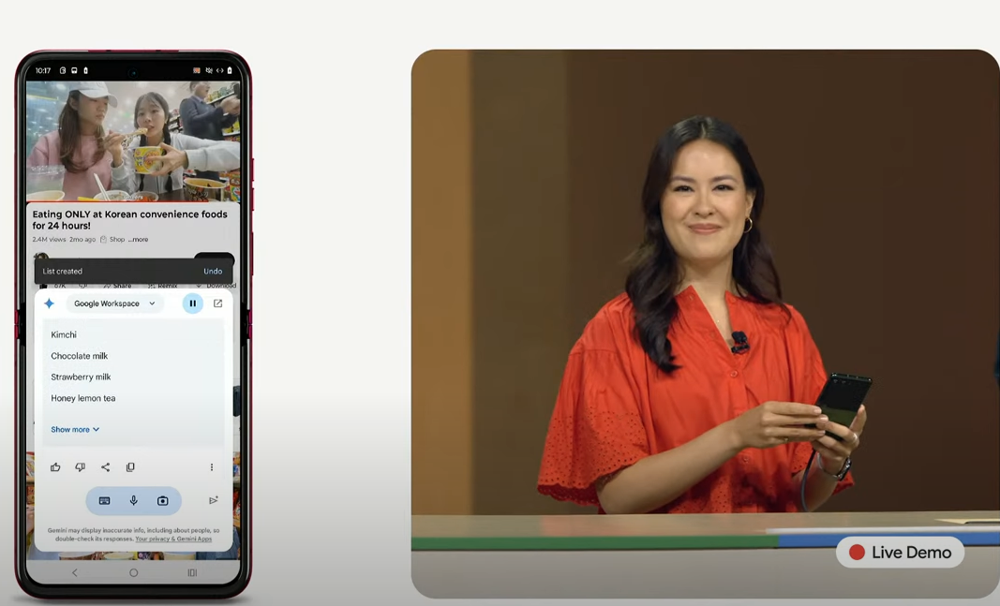

<iframe width="560" height="315" src="https://www.youtube.com/embed/N_y2tP9of8A?si=b5HlzKafdg3I_1CS" title="YouTube video player" frameborder="0" allow="accelerometer; autoplay; clipboard-write; encrypted-media; gyroscope; picture-in-picture; web-share" referrerpolicy="strict-origin-when-cross-origin" allowfullscreen></iframe>

在 20240814 凌晨有 [Made by Google](https://www.youtube.com/watch?v=N_y2tP9of8A) 的線上發表會，這裡快速記錄一些資訊。

## 手機相關功能

### 連接 YouTube 的 RAG 

直接問說影片裡面主角吃了什麼食物？後來就全部列下來。

### 預設電話筆記

- 全程語音 STT 記錄下來
- 資料放手機端
- 不過應該還是會有隱私的問題。

# 相關資料:
