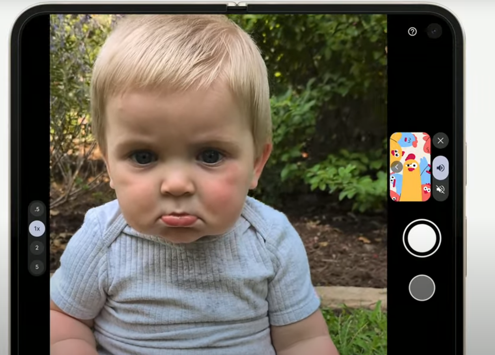

<iframe width="560" height="315" src="https://www.youtube.com/embed/N_y2tP9of8A?si=b5HlzKafdg3I_1CS" title="YouTube video player" frameborder="0" allow="accelerometer; autoplay; clipboard-write; encrypted-media; gyroscope; picture-in-picture; web-share" referrerpolicy="strict-origin-when-cross-origin" allowfullscreen></iframe>

在 20240814 凌晨有 [Made by Google](https://www.youtube.com/watch?v=N_y2tP9of8A) 的線上發表會，這裡快速記錄一些資訊。

## 手機相關功能

### 連接 YouTube 的 RAG 

直接問說影片裡面主角吃了什麼食物？後來就全部列下來。

### 預設電話筆記

- 全程語音 STT 記錄下來
- 資料放手機端
- 不過應該還是會有隱私的問題。

### Make you look

拍小朋友照片，總是難以抓到小孩注意力。

這個小功能很聰明誒～我很喜歡。

## 一些心得

Google 也在自己手機加上了 on-device LLM ，首先看到幾個不錯的應用。 

- 電話筆記本真的很實用，不過會不會有隱私問題，我也很好奇就是。
- 連接 YT 的 RAG 詢問，感覺會是需要付費的功能。（Gemini Advance) 

期待著九月 iPhone 發表會會有什麼應對？

## 相關資料:

- [Google 發表會懶人包：Gemini Live 語音對話新上線，Pixel 9 Pro Fold 首度登台](https://ccc.technews.tw/2024/08/14/made-by-google-2024-summary/)

Google 舉辦了年度 Made By Google 發表會，推出了 Pixel 9 系列手機、Pixel Watch 3 手錶和 Pixel Buds Pro 2 耳機，並整合了 Gemini AI 技術。

**重點：**

* **Gemini Live 語音對話功能上線：** 允許用戶與 Gemini AI 進行自然語音對話，並選擇回應的聲音。目前僅支援英語，提供給 Gemini Advanced 訂閱用戶。
* **Pixel 9 系列手機：** 搭載 Tensor G4 晶片，支援多項 AI 功能，包括 Pixel Weather、Call Notes、Pixel Screenshots、Pixel Studio 等。攝錄功能也升級，新增 Add Me、Made You Look 和 Magic Editor 等 AI 功能。
* **Pixel 9 Pro Fold：** 首次推出摺疊螢幕手機，搭載 16GB 記憶體，具備 Pixel Pro Camera。
* **Pixel Watch 3：** 延續經典圓弧造型，新增 Lost of Pulse Detection 功能，可偵測用戶脈搏並緊急通報。
* **Pixel Buds Pro 2：** 搭載 Tensor A1 晶片，體積更小、重量更輕，ANC 降噪功能更強，並支援 Gemini 語音助理。

總體而言，Google 在這次發表會上展示了其在 AI 和硬體方面的最新進展，並強調了 Gemini AI 在各項產品中的