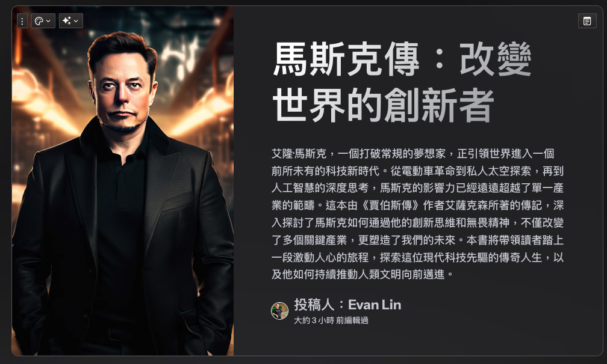

<div><a href="https://moo.im/a/4cmzGQ" title="馬斯克傳"></a></div>


```
馬斯克傳:唯一不設限、全公開傳記
Elon Musk
 共 138 人評分
作者： 華特．艾薩克森  原文作者： Walter Isaacson  譯者： 吳凱琳  出版社：天下雜誌出版 
```

#### 買書推薦網址：

- Readmoo: [由此去購買](https://moo.im/a/4cmzGQ)。

# 前言:

這是 2024 年第 9 本讀完的書。這本在當初要出刊的時候就相當的轟動，但是實際看到實體書之後，應該也會不少人會被勸退。 但是其實書籍本身還是蠻有趣的，蠻推薦大家可以看一下。


# 內容摘要：

```
馬斯克唯一不設限、全公開傳記
權威傳記作家艾薩克森重磅力作

兩年深度跟訪，解密全世界最令人好奇，也最具爭議性的創新者——
是狂人還是造勢天才？是破壞者還是創新者？是混蛋還是英雄？
想要了解最真實的馬斯克，只能透過這本書！

★第一視角觀察馬斯克獨有的英雄模式與惡魔模式
★深入解讀馬斯克旗下六大事業的商業與創新策略
★揭露AI、自動駕駛、太空探險三大尖端科技趨勢

「不管你喜歡與否，我們都生活在馬斯克創造的世界裡。」—《時代》

馬斯克引領世界進入電動車時代、開發私人太空探險、嚴肅想像人工智慧，他改變了三大關鍵產業，也改變了我們的未來。喔，他還買下了推特。

他是打破常規的夢想家，沒有開不出的路徑，沒有打不破的框架，沒有丟不掉的包袱。對風險，不但冷靜計算，更熱情擁抱，冒險不設限。當其他企業家在發展世界觀時，馬斯克已在構建他的宇宙觀。

比任何科幻小說都更精采的傳奇人生，他旗下的每一個事業：特斯拉、SpaceX 與星鏈、X（原為推特）、鑽孔公司、Neuralink、xAI，都在改寫歷史。未來，他會如何進一步改變科技世界﹖

《賈伯斯傳》作者、最能捕捉天才腦中靈光的艾薩克森，跟隨馬斯克長達兩年，跟他一起開會、走訪工廠，採訪馬斯克本人、他的家人、朋友、同事和對手，寫出這部考證詳實、藏著驚人內幕的人生故事。寫作過程中，馬斯克從不掌控內容走向，也不要求在出版前先看過，甚至鼓勵他的對手、前員工跟作者談一談。

艾薩克森精闢描述馬斯克的成功與風暴，也探討了一個問題：驅動馬斯克的惡魔，是否也是創新和進步的推手？

馬斯克的成功無法複製，沒人能像他那樣。但他在成長、創新、創業歷程中的有效方法，值得你一讀。
```

### 投影片

[https://gamma.app/docs/-4rx3tbi4xovhgkk](https://gamma.app/docs/-4rx3tbi4xovhgkk)



# 心得:

當初看這本書，原本就是一個很欣賞 Musk 在許多層面的成就。但是對他的過往與相關成就又沒有那麼的熟悉，於是買了這本書來看。本來想說這一本書可能會看很久（因為真的很厚一本，就算用電子書來看，也是覺得看了很久）。但是其實整本書及說明了許多階段的馬斯克的過往，讓人很容易沈浸其中。 

雖然大家都說馬斯克是暴君，是一個喜怒無常的人。（類似的形容詞好像也有出現在
