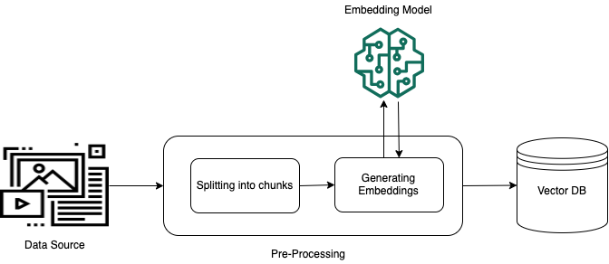
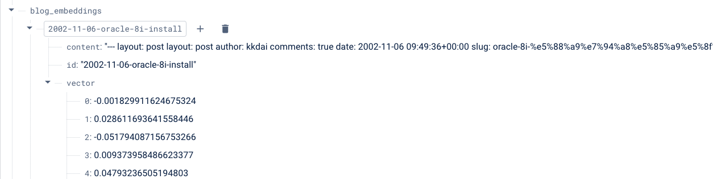
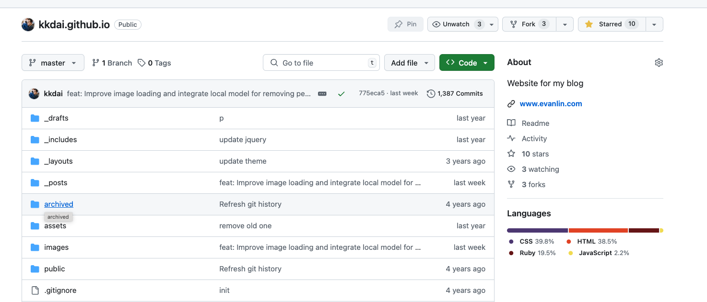

## 前提

我是一個很喜歡寫作的人，經常學習到東西都會記錄在這一個網站裡面。陸陸續續從 2002 年也寫了 20 多年的部落格。但是經常自己也是會忘記我曾經寫過什麼樣的內容。 

之前我也曾經說明會，經常會將我會的東西整理成部落格，主要不是為了幫助其他人，最重要是可以幫助到未來的自己。總有一天你會遇到類似的問題，而你的文章的思緒跟脈絡就跟你想的一樣。只要透過類似的關鍵字，馬上就可以找到你的回憶。

伴隨著 LLM 生成式 AI 的爆發性成長，其實再也不需要透過 Google Search 來搜尋自己寫過的內容。 其實你可以透過 RAG 的方式來直接去詢問一個聊天機器人來達到類似的工作。

相關的內容其實有很多，透過 LangChain 要來做一個 RAG 的功能更是相當的簡潔。 但是本篇文章將反樸歸真，透過 Python 與 Firebase DB 直接告訴你如何打造 Embedding DB ，做成一個可以簡易的查詢功能的 RAG 。


### 完整相關程式碼：

[https://github.com/kkdai/jekyll-rag-firebase](https://github.com/kkdai/jekyll-rag-firebase)


## 透過 Firebase Realtime DB 來當成 Vector DB

程式碼： [https://github.com/kkdai/jekyll-rag-firebase/blob/main/embedding.py](https://github.com/kkdai/jekyll-rag-firebase/blob/main/embedding.py)



之前就一直在思考，究竟有沒有方式可以透過 Firebase 來做 Vector DB。其實是可以的，方式如下：

```python
def generate_embedding(text):
    result = genai.embed_content(
        model="models/text-embedding-004",
        content=text,
        task_type="retrieval_document",
        title="Embedding of single string"
    )
    embedding = result['embedding']
    return embedding
```

這是一個透過 tex-embedding-004 的 gemini model ，可以幫助你直接將一串文字直接產生 Embedding 的 Vector Value 。

如果要將資料儲存在 Firebase 的資料庫內，其實也沒有那麼複雜。以下程式碼可以很快速了解。

```python
def store_embedding(embedding_data):
    ref = db.reference('embeddings')
    ref.child(embedding_data['id']).set(embedding_data)
    print(f"Embedding data for {embedding_data['id']} stored successfully.")
```

完整範例大概如下：

```
# 範例文字
text_1 = "What is the meaning of life?"
text_2 = "How to learn Python programming?"
text_3 = "The quick brown fox jumps over the lazy dog."

# Embedding Vector Value
embedding_vector_1 = generate_embedding(text_1)
embedding_vector_2 = generate_embedding(text_2)
embedding_vector_3 = generate_embedding(text_3)

# 產生 DB data
embedding_data_1 = {
    'id': 'embedding_1',
    'vector': embedding_vector_1
}

embedding_data_2 = {
    'id': 'embedding_2',
    'vector': embedding_vector_2
}

embedding_data_3 = {
    'id': 'embedding_3',
    'vector': embedding_vector_3
}

# 儲存資料
store_embedding(embedding_data_1)
store_embedding(embedding_data_2)
store_embedding(embedding_data_3)
```


## 如何解析 Github Page 的 Blog 資料？ (以 Jekyll 打造的 Blog 為例子)

範例部落格資料： [https://github.com/kkdai/kkdai.github.io](https://github.com/kkdai/kkdai.github.io)

程式碼： 



裡面會看到，公開的文章會放在 `_posts` 資料夾下面。 雖然裡面是 Markdown 的內容，但是這樣的內容往往更適合給 LLM 作為總結與 Embedding 使用。 接下來來看一下程式碼。

### 取得 Github Token 

請參考[這篇文章](https://www.evanlin.com/go-github-issue/)，有完整教學該如何取的 Github Token 作為 Github 操作之用。


### 讀取 Github 上面的檔案資料

```python
def git_article(github_token, repo_owner, repo_name, directory_path):
    g = Github(github_token)
    repo = g.get_repo(f"{repo_owner}/{repo_name}")
    contents = repo.get_contents(directory_path)
    
    files_data = []
    
    while contents:
        file_content = contents.pop(0)
        if file_content.type == "dir":
            contents.extend(repo.get_contents(file_content.path))
        else:
            files_data.append({
                'file_name': file_content.name,
                'content': file_content.decoded_content.decode('utf-8')
            })
            print(f"Downloaded {file_content.name}")
    
    result = {
        'files': files_data,
        'total_count': len(files_data)
    }
    return result
```

這段程式碼，可以指定給他 `token` 與 `repo_owner`, `repo_name` 與 `directory_path` 之後。他會將裡面的檔案一個個存取出來。


## 整個打包 - 讀取 Github Page 然後製作 Embedding Vector 在 Firebase 上

程式碼：  [https://github.com/kkdai/jekyll-rag-firebase/blob/main/blog_embedding.py](https://github.com/kkdai/jekyll-rag-firebase/blob/main/blog_embedding.py)

直接單獨執行這個程式碼即可。但是整個資料夾時間會比較久，也會花費相當程度的費用。

這部分程式碼中，請記得要將以下資料改成你的資料夾資料。

- REPO_OWNER = 'kkdai'
- REPO_NAME = 'kkdai.github.io'
- DIRECTORY_PATH = '_posts'

```python
def git_article(github_token, repo_owner, repo_name, directory_path):
    g = Github(github_token)
    repo = g.get_repo(f"{repo_owner}/{repo_name}")
    contents = repo.get_contents(directory_path)
    
    files_data = []

    while contents:
        file_content = contents.pop(0)
        if file_content.type == "dir":
            contents.extend(repo.get_contents(file_content.path))
        else:
            file_id = file_content.name.split('.')[0]
            if check_if_exists(file_id):
                print(f"File {file_id} already exists in the database. Skipping.")
                continue
            
            file_content_decoded = file_content.decoded_content.decode('utf-8')
            cleaned_content = remove_html_tags(file_content_decoded)
            embedding = generate_embedding(cleaned_content)
            
            embedding_data = {
                'id': file_id,
                'vector': embedding.tolist(),  # 将 numpy 数组转换为列表
                'content': cleaned_content
            }
            store_embedding(embedding_data)
            
            files_data.append({
                'file_name': file_id,
                'content': cleaned_content
            })
            print(f"Downloaded and processed {file_id}")
    
    result = {
        'files': files_data,
        'total_count': len(files_data)
    }
    return result
```

這邊稍微解釋一下，整個邏輯：

- 讀取 jekyll 目錄底下 `_posts`
- 取出檔案名稱，比如 `2024-08-10-reading-elon-musk` 作為 firebase 的 I
- 先檢查是否已經在 Firebase Realtime DB 中有存在的物件
  - 如果有，就 skip 到下一個檔案
- 取出裡面 utf-8 編碼的內容 `file_content.decoded_content.decode('utf-8')`
- 並且去除掉所有 HTML tags `remove_html_tags`
- 透過 `generate_embedding` 來產生整篇文章的 embedding vector value
- 存入資料庫


## 透過 Firebase Realtime  DB詢問資料

程式碼： [https://github.com/kkdai/jekyll-rag-firebase/blob/main/blog_query.py](https://github.com/kkdai/jekyll-rag-firebase/blob/main/blog_query.py)

直接單獨執行這個程式碼即可。

```
# 示例调用
if __name__ == "__main__":    
    # 示例查询和生成响应
    question = "我哪一天架設 oracle8i 的?"
    response = query_and_generate_response(question, top_k=1)
    for res in response:
        print(f"File ID: {res['file_id']}, Similarity: {res['similarity']}")
        # print(f"Content: {res['content']}")
        content_str = res['content']
        # print(f'content_str: {content_str}')
        prompt = f"""
        use the following CONTEXT to answer the QUESTION at the end.
        If you don't know the answer, just say that you don't know, don't try to make up an answer.

        CONTEXT: {content_str}
        QUESTION: {question}

        reply in zh_tw
        """

        # print(f'prompt: {prompt}')
        completion = generate_gemini_text_complete(prompt)
        print(completion.text)
```


- 先產生問句 `question` 的 Embedding 

- `query_and_generate_response(question, top_k=1)` 其中 k=1 只要最接近的一個答案。

  - ```
    def query_embedding(question, top_k=1):
        # 生成问句的嵌入
        question_embedding = generate_embedding(question)
        
        # 从数据库中获取所有存储的嵌入
        ref = db.reference('blog_embeddings')
        all_embeddings = ref.get()
        
        if not all_embeddings:
            return "No embeddings found in the database."
        
        # 计算问句嵌入与存储嵌入之间的相似度
        similarities = []
        for file_id, embedding_data in all_embeddings.items():
            stored_embedding = np.array(embedding_data['vector'])
            similarity = 1 - cosine(question_embedding, stored_embedding)
            similarities.append((file_id, similarity))
        
        # 按相似度排序并返回最相关的结果
        similarities.sort(key=lambda x: x[1], reverse=True)
        top_results = similarities[:top_k]
        
        results = []
        for file_id, similarity in top_results:
            file_content = ref.child(file_id).get()
            results.append({
                'file_id': file_id,
                'similarity': similarity,
                'content': file_content
            })
        
        return results
    ```

  - 講問題與每一個資料的比對結果存入  `similarities`

  - 透過排序之後，挑選最相似的答案

    - ```
      similarities.sort(key=lambda x: x[1], reverse=True)
      top_results = similarities[:top_k]
      ```

- 取出資料之後，將問句跟參考資料放入 prompt 之中來詢問。

  - ```
    prompt = f"""
    use the following CONTEXT to answer the QUESTION at the end.
    If you don't know the answer, just say that you don't know, don't try to make up an answer.
    
    CONTEXT: {content_str}
    QUESTION: {question}
    
    reply in zh_tw
    """
    ```

- 回覆答案。


## 未來發展

本篇文章透過一些簡單的程式碼，來了解如何透過 Gemini 與 Firebase Realtime DB 來打造一個 RAG 的應用。程式碼儘可能使用原生的一些套件，儘量不使用比較複雜的 LangChain 或是 LlamaIndex 。

雖然使用 LangChain 或是 LlamaIndex 打造出來的 RAG 會更加的效果好甚至程式碼更少。但是我們還是需要知道 RAG 的原理是什麼，這樣才能針對相關的細節來優化與改善。
