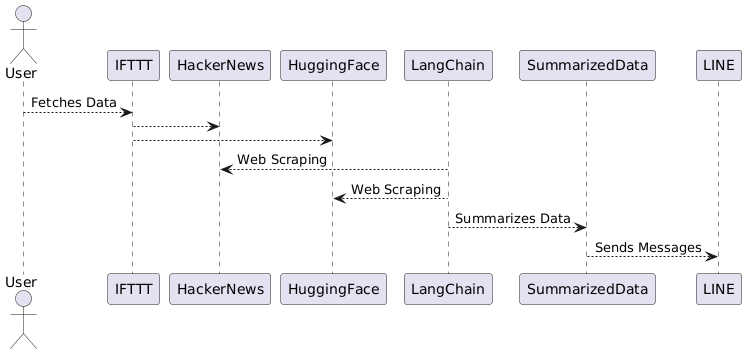
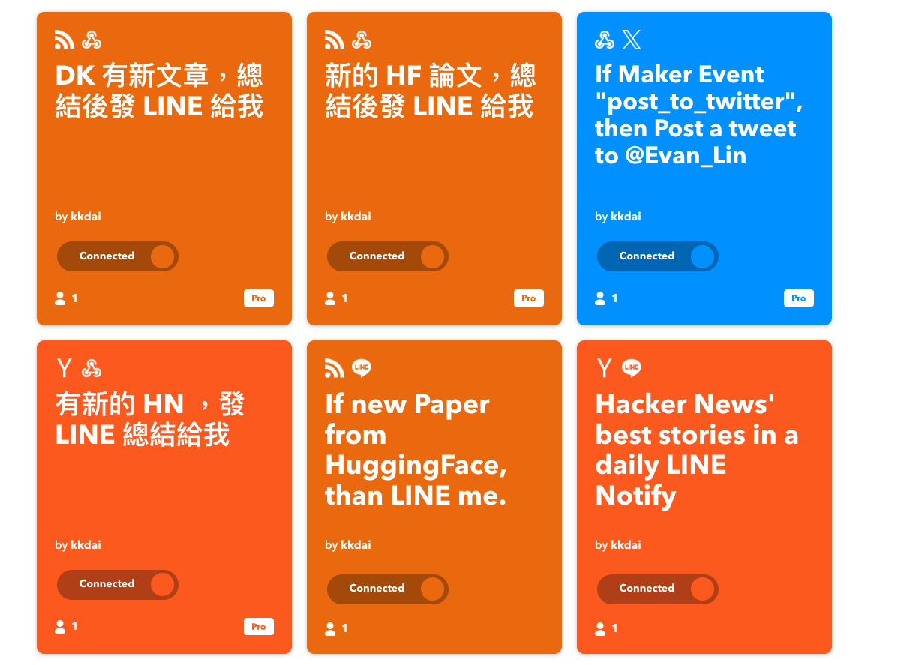
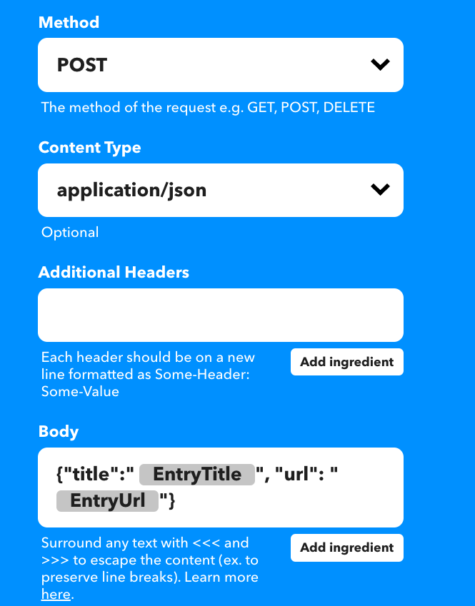
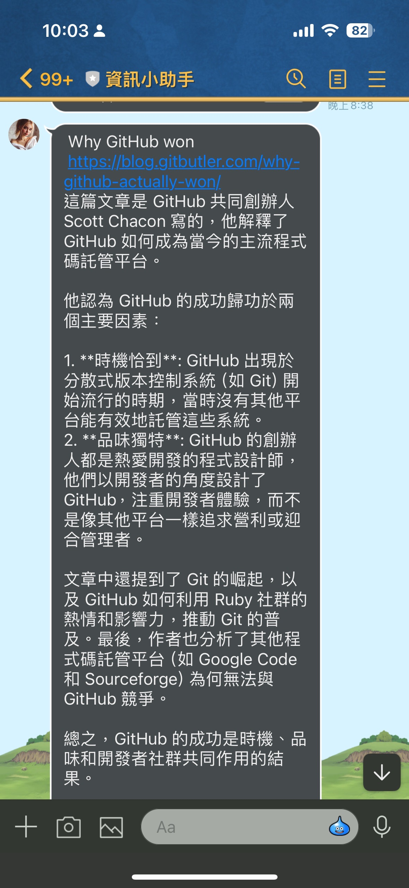

# 近期

最近弄了一個資訊流，我覺得很有趣：- IFTTT 抓取 HN, HuggingFace 熱門文章

- 發到 Webhook 裡面有 LangChain 抓爬蟲 + LangChain Summary
- 發 LINE Bot 給自己看
- 挑選自己喜歡的，直接貼到 Twitter （目前沒有付費 API 沒辦法發長文

程式碼： [https://github.com/kkdai/gh-summarized-scheduler](https://github.com/kkdai/gh-summarized-scheduler)

# IFTTT 設定

# 成果

- 有詳細的文章連結跟文章摘要。
- 可以快速決定要不要進去看。
- 整個格式也改成可以直接複製貼到 Twitter (我有付費發長文)

# 未來發展：

- 照理說應該要可以一鍵發文到 twitter ，但是 X API 好貴（一百美）
- 有想過用 IFTTT 來發文 Twitter 但是有長度限制 (128) ，不能用。
- 不過 Threads API 似乎可以發長文。
