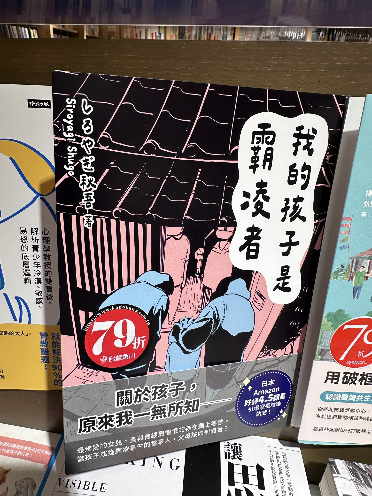

```
作者： しろやぎ秋吾  譯者： 葉門  出版社：台灣角川 
出版日期： 2024/08/23 語言：繁體中文 
```

#### 買書推薦網址：

- Readmoo: [由此去購買](https://moo.im/a/gkwKQT)。

# 前言:

這是 2024 年第 10 本讀完的書。週末的時候，我經常與小孩在誠品書局閱讀，有時候我會看一些雜誌與月刊，這一本書忽然在書架上吸引我的目光，內容不長但是影響很深遠。


# 內容摘要：

```
★當知道自己的孩子是「加害者」，父母該如何面對？
★留下的傷口絕無法輕易消逝。被道歉了，難道就一定要選擇原諒嗎？

「我可不記得有把妳教成這種孩子！」

最疼愛的女兒，竟與自己最憎恨的存在劃上等號。
不可原諒的霸凌事件，女兒居然是「加害者」。

關於孩子，原來我一無所知──

▍本書內容
新聞內容播報著「校園霸凌事件」的惡行。

『我的孩子絕不會這樣。』
──赤木加奈子認為那只是與自己無關的社會事件。
然而某天，她竟得知自己的女兒．愛，
在班上對同班同學．馬場小春有霸凌行為。
國中時曾遭受同儕霸凌的加奈子，對此難以忍受。
對自己孩子的厭惡、憤怒，不斷湧上心頭。

另一方面，接受了赤木家道歉後的小春卻開始拒絕上學。
對孩子的不捨、獨自承受外界的壓力，
小春的母親．千春，選擇向第三者傾訴煩惱。

此時網路上的一則匿名貼文成了導火線，
將這件事推向無法預測的方向──

對孩子的不信任感、夫妻間意見的相左、社群媒體上的批判…
被各式問題折磨的雙方家庭。
同時描寫「加害者」與「受害者」雙視角，以不同的視角探討校園霸凌！
```


# 心得:

如果你的小孩霸凌別人怎麼辦？ 身為爸媽，或許第一句都會是「怎麼可能？ 我才不會教導出這樣的小孩」。 

小春跟小愛是從小的好朋友，忽然有一天小愛開始欺負小春，甚至在班上鼓勵與霸凌他。 

小春後來不敢上課，他的媽媽打給小愛的爸媽報價道歉也沒有改善。小春完全不敢上課，小愛的媽媽雖然是霸凌者的爸媽，但是她小時候也是被霸凌的人。讓小愛的媽媽無地自容。 


這本書深入從霸凌事件的兩個家庭去深入描繪。後來霸凌的影片被張貼出來，整件事情更是爆鍋。

小愛在路上被其他人霸凌，他的爸媽上了學校檢討會。 但是小春還是沒有辦法去上學。 或許這個時候、如果是電影，我們會說霸凌者活該。但是這是一個真實是一事件取材。霸凌者被揭開後，他有說要生活的。後來他們也是被逼迫離開學校。小愛同樣也受到不可抹滅的傷害。
