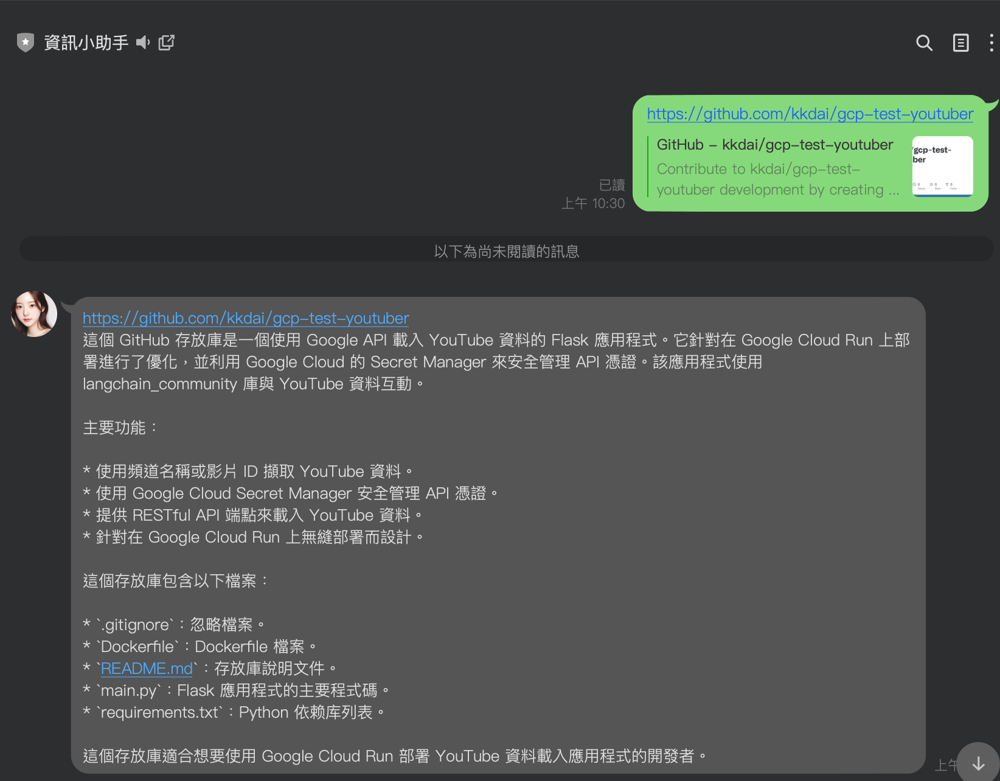
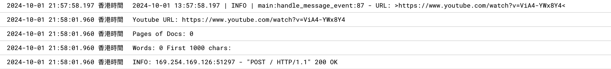
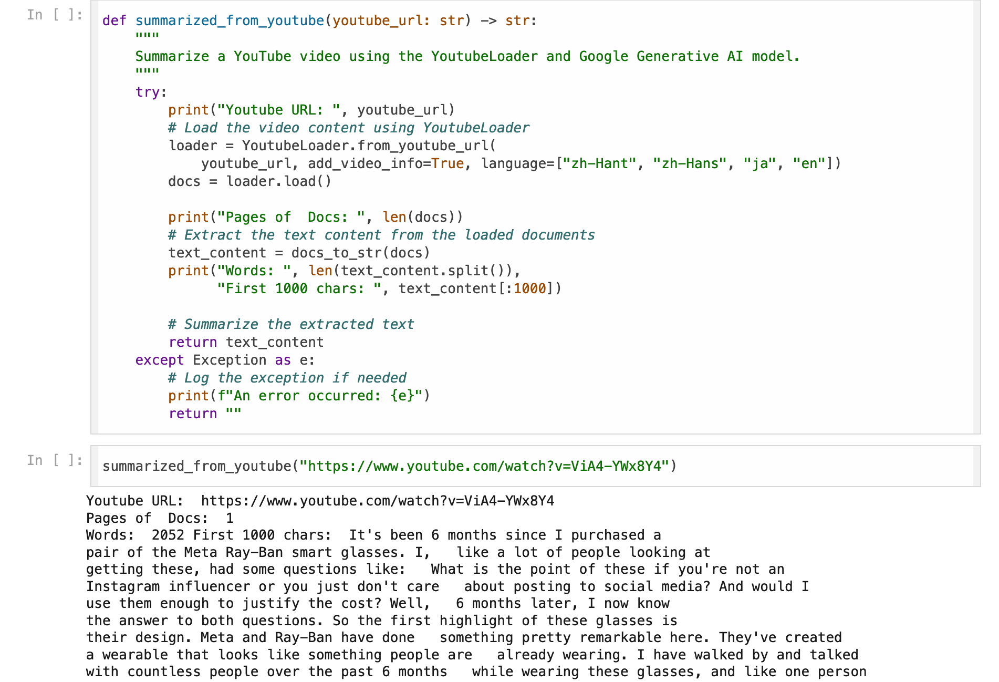
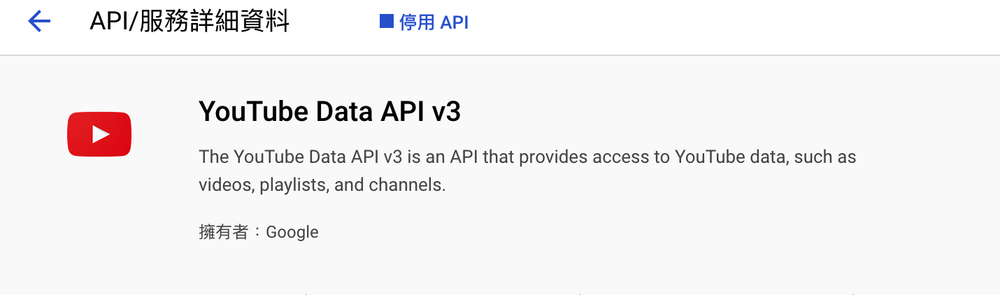
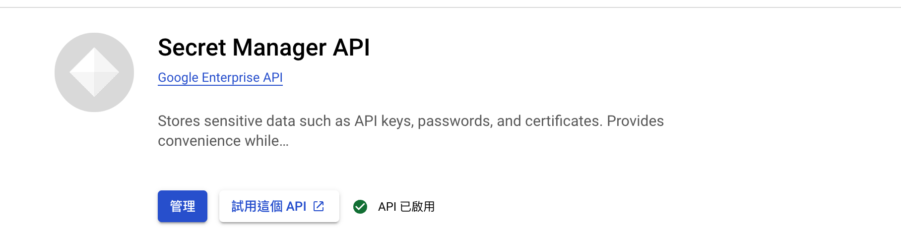
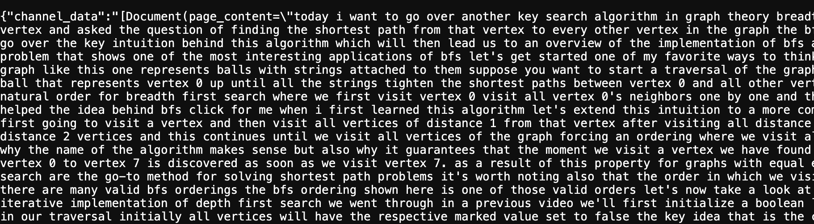

# 前言

[之前提到過](https://www.evanlin.com/personal-km-flow-1/)，我開發了一個「透過 IFTTT 與 LangChain 打造的科技時事 LINE Bot」，這個 Bot 可以幫助我獲取所需的資訊。然而，最近我發現許多 YouTube 影片中包含了豐富的技術資訊，這促使我思考如何有效地獲取 YouTube 字幕資訊以便整理和分析。

雖然 [LangChain YouTube Transcripts Loader](https://python.langchain.com/docs/integrations/document_loaders/youtube_transcript/) 可以快速獲取字幕資訊，但在部署到 Google CloudRun 時卻遇到了一些問題。本文將分享我遇到的問題及解決過程，希望能對大家有所幫助。

# 使用 LangChain YouTube Transcripts Loader 獲取影片字幕

根據 LangChain 的教學文件 ([YouTube transcripts](https://python.langchain.com/docs/integrations/document_loaders/youtube_transcript/))，我們可以使用這個套件來獲取帶有字幕的 YouTube 影片，並通過分析快速了解影片內容。以下是一些範例程式碼：

```python
%pip install --upgrade --quiet pytube
```

```python
loader = YoutubeLoader.from_youtube_url(
    "https://www.youtube.com/watch?v=QsYGlZkevEg", add_video_info=True
)
loader.load()
```

# 在 GCP CloudRun 上無法獲取資料

當我嘗試將程式碼部署到 Google CloudRun 時，使用以下程式碼：

```python
def summarized_from_youtube(youtube_url: str) -> str:
    """
    Summarize a YouTube video using the YoutubeLoader and Google Generative AI model.
    """
    try:
        print("Youtube URL: ", youtube_url)
        # Load the video content using YoutubeLoader
        loader = YoutubeLoader.from_youtube_url(
            youtube_url, add_video_info=True, language=["zh-Hant", "zh-Hans", "ja", "en"])
        docs = loader.load()

        print("Pages of Docs: ", len(docs))
        # Extract the text content from the loaded documents
        text_content = docs_to_str(docs)
        print("Words: ", len(text_content.split()),
              "First 1000 chars: ", text_content[:1000])

        # Summarize the extracted text
        summary = summarize_text(text_content)

        return summary
    except Exception as e:
        # Log the exception if needed
        print(f"An error occurred: {e}")
        return ""
```

結果卻完全無法獲取任何資料，沒有錯誤訊息，但結果是空的。



# Debug 1: 在 Colab 上測試相同程式碼

可以參考以下的 [gist 程式碼](https://gist.github.com/kkdai/4d613dcdc86bad995477be4d22a7f907)。



起初我以為是程式碼的問題，但在 Colab 上卻能正常執行。看來需要使用 [GoogleApiYoutubeLoader](https://python.langchain.com/api_reference/community/document_loaders/langchain_community.document_loaders.youtube.GoogleApiYoutubeLoader.html)。

# 在 Google CloudRun 上使用 LangChain Youtube Loader

要在 CloudRun 上使用 [GoogleApiYoutubeLoader](https://python.langchain.com/api_reference/community/document_loaders/langchain_community.document_loaders.youtube.GoogleApiYoutubeLoader.html)，需要遵循以下步驟：

- 取得系統帳戶的 JSON 檔案。（參考[這篇文章](https://www.evanlin.com/til-heroku-gcp-key/))
  - 將 JSON 內容存放在 [Secret Manager](https://cloud.google.com/security/products/secret-manager?hl=zh-TW)。
  - 在程式碼中透過 [Secret Manager](https://cloud.google.com/security/products/secret-manager?hl=zh-TW) 獲取資料。
  - 呼叫 YouTube API。
- 在 [Google Cloud 啟動 YouTube API](https://console.developers.google.com/apis/api/youtube.googleapis.com/overview?project=660825558664)。



- [啟動 Secret Manager API](https://console.cloud.google.com/apis/library/secretmanager.googleapis.com) 來管理系統帳戶金鑰 JSON 檔案。



## 使用 Secret Manager 獲取資料

- 首先需要在環境變數中設定 Project ID `PROJECT_ID`。
- 然後將資料預先存放在 `youtube_api_credentials` 中。

```python
def get_secret(secret_id):
    logging.debug(f"Fetching secret for: {secret_id}")
    client = secretmanager.SecretManagerServiceClient()
    name = f"projects/{os.environ['PROJECT_ID']}/secrets/{secret_id}/versions/latest"
    response = client.access_secret_version(request={"name": name})
    secret_data = response.payload.data.decode("UTF-8")
    logging.debug(f"Secret fetched successfully for: {secret_id}, {secret_data[:50]}")
    return secret_data
```

這樣就可以安全地透過 [Secret Manager](https://cloud.google.com/security/products/secret-manager?hl=zh-TW) 獲取資料。

## 在 GCP CloudRun 上部署範例程式碼

程式碼： [https://github.com/kkdai/gcp-test-youtuber](https://github.com/kkdai/gcp-test-youtuber)

```python
def load_youtube_data():
    try:
        logging.debug("Loading YouTube data")
        google_api_client = init_google_api_client()

        # Use a Channel
        youtube_loader_channel = GoogleApiYoutubeLoader(
            google_api_client=google_api_client,
            channel_name="Reducible",
            captions_language="en",
        )

        # Use Youtube Ids
        youtube_loader_ids = GoogleApiYoutubeLoader(
            google_api_client=google_api_client,
            video_ids=["TrdevFK_am4"],
            add_video_info=True,
        )

        # Load data
        logging.debug("Loading data from channel")
        channel_data = youtube_loader_channel.load()
        logging.debug("Loading data from video IDs")
        ids_data = youtube_loader_ids.load()

        logging.debug("Data loaded successfully")
        return jsonify({"channel_data": str(channel_data), "ids_data": str(ids_data)})
    except Exception as e:
        logging.error(f"An error occurred: {str(e)}", exc_info=True)
        return jsonify({"error": str(e)}), 500
```

### 成果

影片來源：[https://www.youtube.com/watch?v=TrdevFK_am4](https://www.youtube.com/watch?v=TrdevFK_am4)


