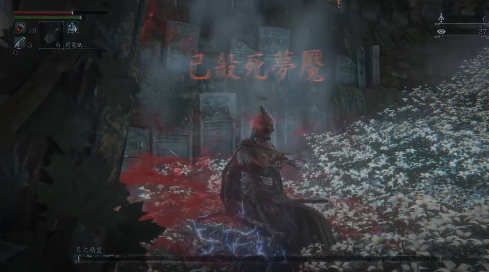

# 前言

一年前自從買了 PlayStation Portal 之後，其實就逐漸有在打「血源詛咒」，但是老實說血源詛咒難度真的不小。就算我「隻狼」也全破了，還是很不習慣血源詛咒的拼血模式。

因為血源詛咒比較難找人一起打（我是都沒招過啦），所以打起來卡關的時候真的很絕望的勒。

必須得說，血源詛咒真的光線太暗。由於用 HDR 電視，根本都看不到怪。一定要拿火把，不然都沒有的看。

# 攻略重點

記得「鋸矛」是最好用的武器，攻速快（沒有之一），傷害又相當嚇人。 還是記得要刷金杯去把「血岩」刷滿。

<iframe width="560" height="315" src="https://www.youtube.com/embed/PfFbf6igOuA?si=mLAXidEusr5530Tu" title="YouTube video player" frameborder="0" allow="accelerometer; autoplay; clipboard-write; encrypted-media; gyroscope; picture-in-picture; web-share" referrerpolicy="strict-origin-when-cross-origin" allowfullscreen></iframe>

# 比較難打魔王 - 愚笨蜘蛛羅姆

<iframe width="560" height="315" src="https://www.youtube.com/embed/9OjC21VNSNE?si=aFXsrGAYowjfWgb4" title="YouTube video player" frameborder="0" allow="accelerometer; autoplay; clipboard-write; encrypted-media; gyroscope; picture-in-picture; web-share" referrerpolicy="strict-origin-when-cross-origin" allowfullscreen></iframe>

真的覺得很難打，因為每次都抓不到訣竅。 正常來說，如果你可以在第一階段變身的時候，把他打斷。他就會讓你打到死。 但是「鋸矛」唯一的缺點就是失衡值不夠高，所以每次都讓他的小蜘蛛一湧而上。

第一階段要清完小蜘蛛，然後想辦法打斷。如果沒有......

第二階段開始就打完就跑，然後鏡頭要對著。避免遠程魔法。

## 受詛咒的路德維希 - 月光大劍我來啦

<iframe width="560" height="315" src="https://www.youtube.com/embed/gYtJou35tPk?si=hMEwfWmxl_pTo5M0" title="YouTube video player" frameborder="0" allow="accelerometer; autoplay; clipboard-write; encrypted-media; gyroscope; picture-in-picture; web-share" referrerpolicy="strict-origin-when-cross-origin" allowfullscreen></iframe>

真的不好打，撕咬攻擊真的很麻煩。傷害又很大。記得繞在腳後面去打。第一下一定要躲掉，儘量往你的右前方躲，然後在後面刷他。 要小心連環技，這是比較麻煩的部分。 第二階段很好打，直接上去應剛。重擊馬上就可以處決，我遇到的第二階段是初見殺。

## 比尾王更難打的 - 星辰鐘塔的瑪麗亞女士

<iframe width="560" height="315" src="https://www.youtube.com/embed/0hi9hW3PcZ8?si=9KCm-TUtT5Uc2_V5" title="YouTube video player" frameborder="0" allow="accelerometer; autoplay; clipboard-write; encrypted-media; gyroscope; picture-in-picture; web-share" referrerpolicy="strict-origin-when-cross-origin" allowfullscreen></iframe>

槍反是唯一解方 + 鋸矛10 

- 爪印 兩個 15% + 10% 
- 內臟爆擊 恢復 HP

第一階段: 往你的右前方閃 第二階段之後： 往你的左前方閃 一個重點： 第二階段轉變的時候可以打兩三刀，血噴完之後可以衝上去再給兩三刀

