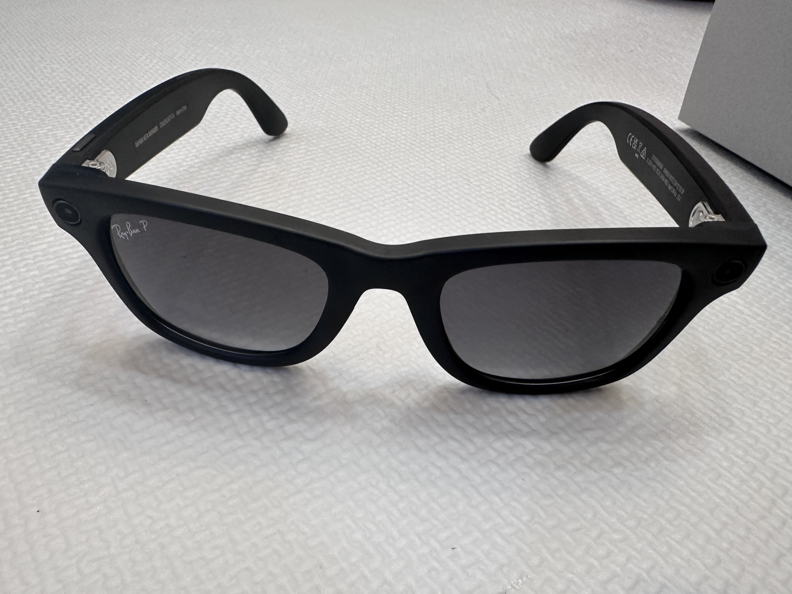
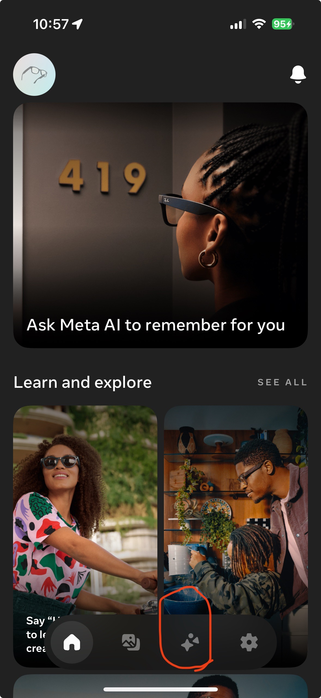

# 前言

其實我一直都蠻喜歡 Rayban 的太陽眼鏡，之前也有買一副。 這次的 Meta AI 太陽眼鏡之前就蠻想買的，但是想說不知道會不會有新的。還好看到近期沒有出新的太陽眼鏡後，就下手買了。 這一篇會稍微紀錄相關的購買方式跟如何在台灣啟動 Meta AI 在太陽眼鏡上。

# 怎麼有效購買： (透過托運)

Amazon: [Ray-Ban | Meta Smart Glasses, Wayfarer](https://www.amazon.com/dp/B0CGXYNWBH)

用代購買的，兩週可以到台灣。用這個邀請連結，可以用 Amazon Prime 價格，還有 150 運費可以折抵 https://www.buyandship.com.tw/invite/7510252302 用我邀請鏈結，可以各拿 150 免運，從美國運回來只需要 170 台幣，等於 20 就可以運回 Rayban Meta 眼鏡。

購買相關流程：

- 先開立 [BuyAndShip](https://www.buyandship.com.tw/invite/7510252302) 帳戶
- 選取 Portland 倉庫位址： 
  - 13822 NE AIRPORT WAY
  - PORTLAND, OR 97251-9614
  - United States
- 在 Amazon 設定下填寫倉庫（因為 Portland 不用收稅)
- 等 Amazon 發貨之後，會到  [BuyAndShip](https://www.buyandship.com.tw/invite/7510252302) 網頁上看到入庫。
-  [BuyAndShip](https://www.buyandship.com.tw/invite/7510252302) 會自動轉貼到 香港倉庫
- 在  [BuyAndShip](https://www.buyandship.com.tw/invite/7510252302) 設定平台合併貨物寄到台灣地址（跟付運費）

# 基本功能:

雷朋智能眼鏡 Rayban Smart Glasses 購買開箱心得:

\- 聽音樂很不錯

\- 拍照跟影片效果很不錯

\- AI 功能台灣還不能用（修正： 可以用 VPN 啟動

接下來就等著出去玩可以拍風景   

# 如何在台灣啟動 MetaAI  功能

1. 砍掉 Meta View App 
2. 裝 NordVPN or SrufShak (免費的我弄不出來) 切美國
3. 上 App Store 重新下載 
4. 看到 圈起來部分就成功了。

之後更新也不用 VPN ，第一次就可以。 快開通來玩!
