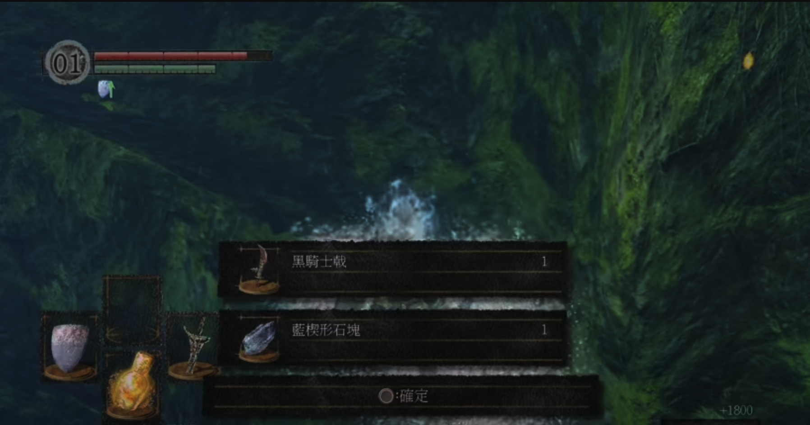

# 前言

其實之前已經有全破過了，[[電玩\][NS] 黑暗靈魂 - 重製版： 手殘黨全破心得](https://www.evanlin.com/dark-soul-remake/) 但是因為網路上看到這個影片 「[【黑魂重制版】完美开局攻略，半小时拿到满强化武器&全套毕业装备，横扫罗德兰](https://www.youtube.com/watch?v=ZugCvPyv4Fc)」 就想說玩玩看能不能刷到關刀，畢竟之前在 NS 全破的時候就沒拿到關刀（黑騎士鉞）。想說換到 PS5 試試看（因為有錄影～～～～）

結果...... 不小心刷到關刀了，也把他升到滿級。就想說再來全破一次。

<iframe width="560" height="315" src="https://www.youtube.com/embed/MRGX9zhQcrk?si=K4_n97sXn5RalX4I" title="YouTube video player" frameborder="0" allow="accelerometer; autoplay; clipboard-write; encrypted-media; gyroscope; picture-in-picture; web-share" referrerpolicy="strict-origin-when-cross-origin" allowfullscreen></iframe>

# 攻略重點

先拿關刀，先拿關刀，先拿關刀

- 然後依照攻略 「[【黑魂重制版】完美开局攻略，半小时拿到满强化武器&全套毕业装备，横扫罗德兰](https://www.youtube.com/watch?v=ZugCvPyv4Fc)」 把全部的「光輝楔形石」
  - **北方不死院的小鳥巢：** 在北方不死院，您可以與小鳥巢進行物品交換。提供以下物品可獲得光輝楔形石：
    - 血紅苔蘚球（Bloodred Moss Clump）
    - 解毒苔蘚球（Purple Moss Clump）
    - 毒紫苔蘚球（Blooming Purple Moss Clump） 將上述物品放入小鳥巢，重新載入遊戲後即可獲得光輝楔形石。 
- 然後就開始把以前很痛苦的地方打一次試試看。

# 黑暗靈魂的關刀，快速通關紀錄

- 山羊頭惡魔（也就是俗成的狗王），因為狗的工速很快又痛。讓這個地方是新手卡觀點。想不到用關刀一下就過啦~~~~

<iframe width="560" height="315" src="https://www.youtube.com/embed/doZSR_n__oc?si=uvvdAaQCuz4QgJm9" title="YouTube video player" frameborder="0" allow="accelerometer; autoplay; clipboard-write; encrypted-media; gyroscope; picture-in-picture; web-share" referrerpolicy="strict-origin-when-cross-origin" allowfullscreen></iframe>

- 貪食惡龍第一個可以斷尾的怪，有關刀超好斷尾的。

<iframe width="560" height="315" src="https://www.youtube.com/embed/Ym_n0otnZJs?si=5IP-mY9iFb4YRejP" title="YouTube video player" frameborder="0" allow="accelerometer; autoplay; clipboard-write; encrypted-media; gyroscope; picture-in-picture; web-share" referrerpolicy="strict-origin-when-cross-origin" allowfullscreen></iframe>

- 渾沌魔女 - 滿級關刀一周目遊

<iframe width="560" height="315" src="https://www.youtube.com/embed/7exTMOChxxE?si=-JnqySDqernNZrVR" title="YouTube video player" frameborder="0" allow="accelerometer; autoplay; clipboard-write; encrypted-media; gyroscope; picture-in-picture; web-share" referrerpolicy="strict-origin-when-cross-origin" allowfullscreen></iframe>

- 病村是我最喜歡的地方（因為超難），但是真的很難走。也錄影一下怎麼快速到王。

<iframe width="560" height="315" src="https://www.youtube.com/embed/8ZzyHoqfyyo?si=6ujLrm-868caWpur" title="YouTube video player" frameborder="0" allow="accelerometer; autoplay; clipboard-write; encrypted-media; gyroscope; picture-in-picture; web-share" referrerpolicy="strict-origin-when-cross-origin" allowfullscreen></iframe>

- 會隱身的半龍普利希拉不難打，但是難的是斷尾。（沒斷尾)

<iframe width="560" height="315" src="https://www.youtube.com/embed/MgDRBD_Vs28?si=nV0gOYaazJVnovqu" title="YouTube video player" frameborder="0" allow="accelerometer; autoplay; clipboard-write; encrypted-media; gyroscope; picture-in-picture; web-share" referrerpolicy="strict-origin-when-cross-origin" allowfullscreen></iframe>

- 接續我的好運，想不到連「貪欲者的烙印」也是第一次打就有。 XDDDD

<iframe width="560" height="315" src="https://www.youtube.com/embed/KPXs6BTMbyw?si=PbhQm6Dt-5J5QKRn" title="YouTube video player" frameborder="0" allow="accelerometer; autoplay; clipboard-write; encrypted-media; gyroscope; picture-in-picture; web-share" referrerpolicy="strict-origin-when-cross-origin" allowfullscreen></iframe>

- 被三個人圍毆，有關刀也是很快。 幫防火女報仇 - 女神的騎士- 羅特雷克

<iframe width="560" height="315" src="https://www.youtube.com/embed/iWHJKn-_sY8?si=32bqZoyoFnMu9H3R" title="YouTube video player" frameborder="0" allow="accelerometer; autoplay; clipboard-write; encrypted-media; gyroscope; picture-in-picture; web-share" referrerpolicy="strict-origin-when-cross-origin" allowfullscreen></iframe>

- 以前最難的關卡設計，王城雙劍（是因為射弓箭的人位子太好）又太硬，卡超久。這是一次就過。如何正確地打「王城雙箭」
  - 1. 先打右邊 
    2. 站在窗戶周圍，不會被後面的射 
    3. 吸引他過來掉下去。 
    4. 另外一個一樣。

<iframe width="560" height="315" src="https://www.youtube.com/embed/g1-j9R4dm0A?si=hU8qGWLbjvLUg6A-" title="YouTube video player" frameborder="0" allow="accelerometer; autoplay; clipboard-write; encrypted-media; gyroscope; picture-in-picture; web-share" referrerpolicy="strict-origin-when-cross-origin" allowfullscreen></iframe>

- 灰色大狼希夫 (超捨不得打他)，但是會卡劇情。 Q___Q

<iframe width="560" height="315" src="https://www.youtube.com/embed/XTjPeE2nhDw?si=Kwy-JDiAbvK491JS" title="YouTube video player" frameborder="0" allow="accelerometer; autoplay; clipboard-write; encrypted-media; gyroscope; picture-in-picture; web-share" referrerpolicy="strict-origin-when-cross-origin" allowfullscreen></iframe>

- 小隆德四王(用關刀砍就是快)
  - 跑快一點
  - 儘量近身打，傷害比較小

<iframe width="560" height="315" src="https://www.youtube.com/embed/FWnKs1v_xhc?si=tBYUZ1DD5nKv4jvY" title="YouTube video player" frameborder="0" allow="accelerometer; autoplay; clipboard-write; encrypted-media; gyroscope; picture-in-picture; web-share" referrerpolicy="strict-origin-when-cross-origin" allowfullscreen></iframe>

- 白龍希斯 - 斷尾 - 月光大劍

<iframe width="560" height="315" src="https://www.youtube.com/embed/1OeI-5I0U0k?si=xz4Ui9ZUPkoQpJEl" title="YouTube video player" frameborder="0" allow="accelerometer; autoplay; clipboard-write; encrypted-media; gyroscope; picture-in-picture; web-share" referrerpolicy="strict-origin-when-cross-origin" allowfullscreen></iframe>

- 騎士亞爾特留斯
  - 離遠一點比較好躲
  - 三連砍要躲掉

<iframe width="560" height="315" src="https://www.youtube.com/embed/djQJhKtCB5U?si=AxbieOj0jCVaP6zC" title="YouTube video player" frameborder="0" allow="accelerometer; autoplay; clipboard-write; encrypted-media; gyroscope; picture-in-picture; web-share" referrerpolicy="strict-origin-when-cross-origin" allowfullscreen></iframe>

- 烏薪王葛溫
  - 不難打，拿了關刀兩次就過。 XDDDDd

<iframe width="560" height="315" src="https://www.youtube.com/embed/dzTRvodSXn4?si=d6ttzx7qMVN-komy" title="YouTube video player" frameborder="0" allow="accelerometer; autoplay; clipboard-write; encrypted-media; gyroscope; picture-in-picture; web-share" referrerpolicy="strict-origin-when-cross-origin" allowfullscreen></iframe>

