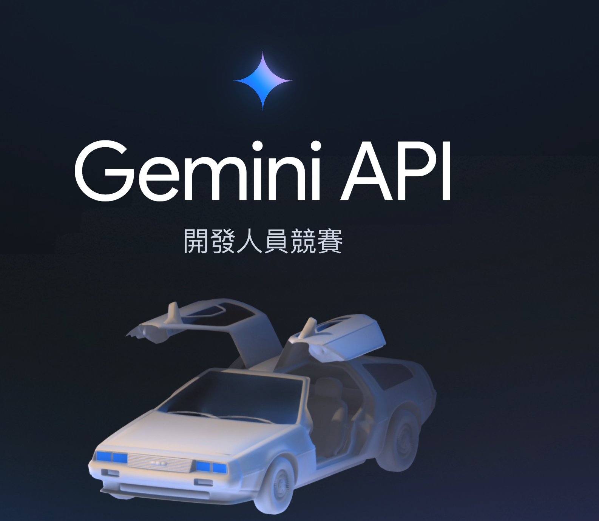

當初[回到未來的博士來協助代言的黑客松活動](https://www.youtube.com/watch?v=yeAu6ZQC0zc)現在總算公開了冠軍了，這裡分享幾個有趣的應用跟心得。

網站： [https://ai.google.dev/competition?hl=zh-tw](https://ai.google.dev/competition?hl=zh-tw)
## Jayu 個人助理獲選最佳整體應用程式。

<iframe width="560" height="315" src="https://www.youtube.com/embed/shnW3VerkiM?si=tbv8uscyXHsnVOox" title="YouTube video player" frameborder="0" allow="accelerometer; autoplay; clipboard-write; encrypted-media; gyroscope; picture-in-picture; web-share" referrerpolicy="strict-origin-when-cross-origin" allowfullscreen></iframe>

https://ai.google.dev/competition/projects/jayu?hl=zh-tw
- Jayu 是一款個人助理應用程式，整合 Gemini API。
- 能夠與螢幕互動，並以畫面為上下文回答問題。
- 支援語音轉文字、文字轉語音及手勢辨識。
- 透過 Flash 模型和 Pro 模型協同運作，執行不同任務。
- 注重使用者隱私，不會存取未顯示的資料或檔案。

- VITE VERE 獲選影響力最大及最受歡迎應用程式，幫助認知障礙者。
- Prospera 數位副駕駛獲選最實用及最佳 Flutter 應用程式，協助銷售。
- Outdraw AI 獲選最有創意應用程式，是一款人類對AI的遊戲。
- 凝視連結幫助 ALS 患者溝通，獲選最佳 Android 應用程式。
- Everies、Trippy、ViddyScribe 和 PenApple 分別獲得 ARCore 最佳運用、Firebase 最佳運用、最佳網頁應用程式及最佳遊戲應用程式。
  #GoogleGemini #AIcompetition #DeveloperAwards
