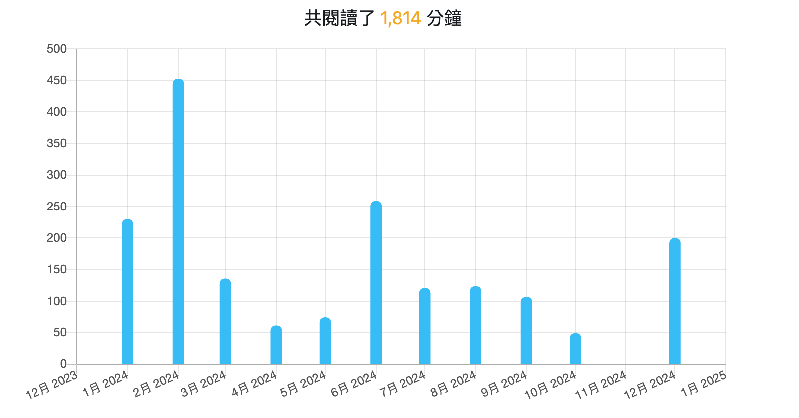
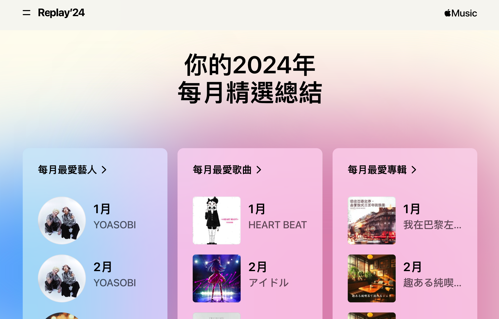
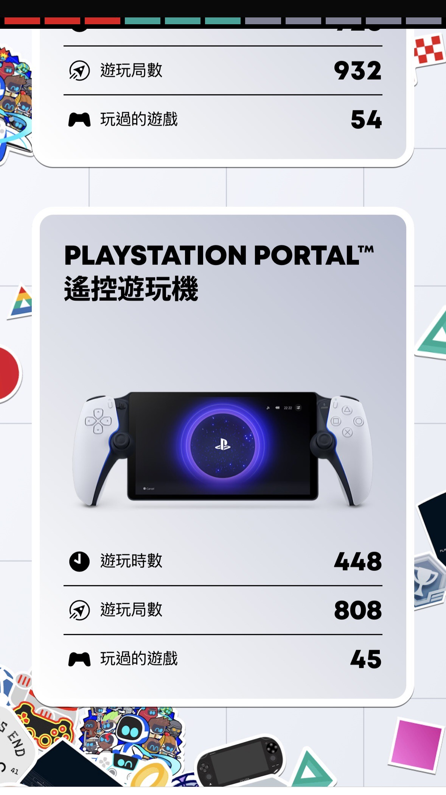

# 2024 年度回顧 

今年比較重大的事情有幾項：

- 六月回到長灘島（第四次），想受陽光，沙灘跟海洋。
- 七月幫女兒轉學到台北的國小，開始了一大早的通勤日子。
- 九月總算回到日本出差，參與了 LY Tech Week 。遇到許多日本好久不見得同事們。
- 十月開始跑健身房，現在每天早上會去內湖運動中心運動後再到公司上班。

對於健康也開始越來越在意，今年的健檢有檢查出胃食道逆流。目前開始長期吃藥來抑制，經常會有因為胃食道逆流而無法睡好的狀況。

# 2025 的展望

- 希望可以保持健身的習慣（當然能瘦個幾公斤會更好）
- 希望家人可以健健康康的快樂出遊，家人真的是最重要的。

# 旅遊紀錄：

- 20250620 ~ 0625: 疫情後總算去長灘島感受陽光，沙灘跟海洋。
- 20240726 ~ 0728: 到澎湖去追逐夏天的尾巴，也有去看看好幾年沒去過的吉貝島。
- 20240901 ~ 0905: 總算有機會重回日本出差了，去參加了 LY Tech Week

## 數據總結

- 共閱讀了 1,814 分鐘, 16 本書 (有兩本是漫畫 :p )

  - 2023: 14 本書
  - 2022: 24 本書。 

- 部落格文章撰寫上：

  - 2024: 53 篇文章
  - 2023: 59 篇文章
  - 2022: 53 篇文章

- 健身運動：
  - 2024: 7806 mins (YoY 120%)
  - 2023: 6207 mins
  - 2022: 6749 mins

- Github Contribution 上面:
  - 2024: 1668
  - 2023: 1062 
  - 2022: 828

- 因為 LLM 今年有許多專案： (共有 [21 個 new Repositories](https://github.com/search?q=owner%3Akkdai++created%3A2024-01-01..2024-12-31&type=repositories&p=1))

  - [kkdai/linebot-accounting](https://github.com/kkdai/linebot-accounting) Use a LINE Bot with Gemini Pro to help you manage your finances through Function Calling in Go.
  - [kkdai/linebot-receipt-gemini](https://github.com/kkdai/linebot-receipt-gemini) A handy tool for travelers who struggle with understanding the content of receipts in foreign languages. This tool was created out of the…
  - [kkdai/linebot-smart-namecard](https://github.com/kkdai/linebot-smart-namecard) LINE Bot Gemini Pro Vision 名片機器人，透過 Notion 當你的 Database (Golang)
  - [kkdai/linebot-gemma](https://github.com/kkdai/linebot-gemma) A LINE Bot demo showcasing how to use a local LLM (Gemma) via Groq to modify personal information and detect the need for LLM assistance.
  - [kkdai/BwAI-2024](https://github.com/kkdai/BwAI-2024) About Google Build with AI workshop 2024 Taiwan links
  - [kkdai/gh-summarized-scheduler](https://github.com/kkdai/gh-summarized-scheduler) 這是一個使用 Google Cloud Platform (GCP) Scheduler 的範例專案，主要功能是自動化地從 GitHub Issues 中提取資料並生成摘要。
  - [kkdai/linebot-cf-firebase](https://github.com/kkdai/linebot-cf-firebase) LINE Bot Golang with Firebase on Cloud Functions
  - [kkdai/jekyll-rag-firebase](https://github.com/kkdai/jekyll-rag-firebase) :Using Firebase as RAG DB to embedding and query your jekyll (github page) blog.
  - [kkdai/linebot-github-issue-rag](https://github.com/kkdai/linebot-github-issue-rag) A Github Issues RAG LINE Bot in Python using LangChain Python
  - [kkdai/linebot-cf-namecard](https://github.com/kkdai/linebot-cf-namecard)
  - [kkdai/linebot-gemini-python](https://github.com/kkdai/linebot-gemini-python) iThome Cloud Summit Lab demo LINE Bot with Gemini Pro

  - 還有很多，歡迎[大家直接去看](https://github.com/search?q=owner%3Akkdai++created%3A2024-01-01..2024-12-31&type=repositories&p=1)。

# 雜項數字

