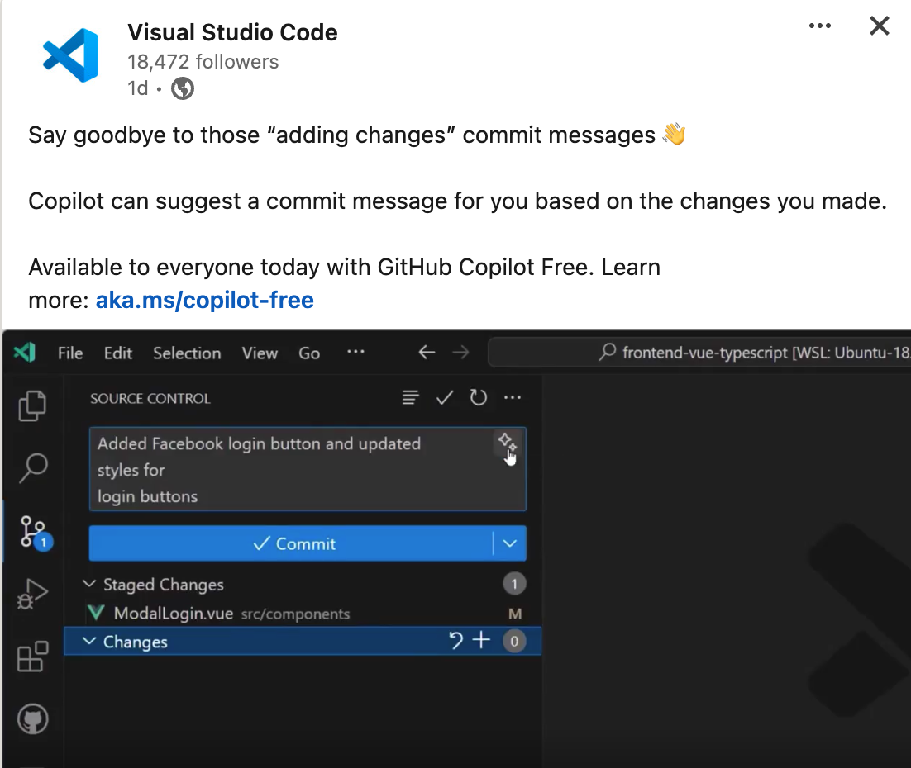

# 前情提要：

認識我的人都知道我是個 Github Copilot 的愛用者（因為開源者專案，直接獲得免費，雖然說現在也開放[免費額度了](https://docs.github.com/en/copilot/managing-copilot/managing-copilot-as-an-individual-subscriber/about-github-copilot-free)）。

裡面最常使用的功能就是自動寫 Commit Message 的功能，讓我每次都不需要想我到底改了什麼，或是需要使用哪些規則來寫。


# 目前 Github Copilot 的 Message 比較制式的問題

但是如果想要做出一些特別的 Commit Message ，比如說:


甚至更生動的會使用所謂的「 [emoji commit message](https://gist.github.com/parmentf/035de27d6ed1dce0b36a) 」:


但是原來 Github Copilot 給的格式就還蠻制式的，該如何修改呢？

# 客製化 Commit Message (Custom instructions for GitHub Copilot )

2024 的 12月. Github 公開了新的設定 ([Custom instructions for GitHub Copilot](https://code.visualstudio.com/docs/copilot/copilot-customization) ) 可以透過設定來讓你的 Commit Message 更有特色。

```
  "github.copilot.chat.testGeneration.instructions": [
    {
      "text": "Always use vitest for testing React components."
    },
    {
      "text": "Use Jest for testing JavaScript code."
    },
    {
      "file": "code-style.md" // import instructions from file `code-style.md`
    }
  ],
```


以下提供一個範例，可以快速讓你 Commit Messsage 變成更豐富的格式。

快速修改 github copilot commit msg 的格式： 

1. 透過 [vscode://settings/github.copilot.chat.commitMessageGeneration.instructions](vscode://settings/github.copilot.chat.commitMessageGeneration.instructions) 打開 vs code 

2. 加入 
   ```
   "text": "Start each commit message with an emoji representing the change type, then provide a concise summary of what changed and why."
   ```

   

 Done. 改成這樣很好看啊 :)


