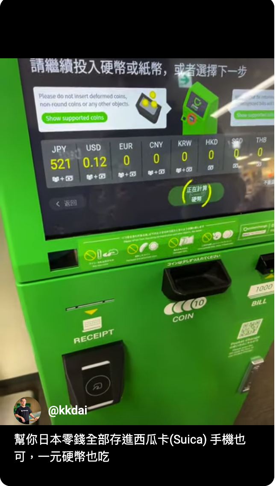

**(✨  影片示範看這裡  ✨  [https://youtube.com/shorts/ffbuUVK_bsE?si=LopZUGuQ7mEpRDcd](https://youtube.com/shorts/ffbuUVK_bsE?si=LopZUGuQ7mEpRDcd))**

##  還在為日本零錢煩惱嗎？ (￣▽￣;)

每次去日本玩，是不是都有一樣的困擾？ 🤔

*   明明有 Suica 卡，卻還是收到一堆零錢！ 😫
*   日本物價高，零錢好難花！ (｡ŏ_ŏ)  怕麻煩乾脆不拿出來...

結果口袋越來越重，回國前還是剩一堆！ 😰   別擔心！有了 **Pocket Exchange**，輕鬆告別零錢困擾！ 😎

##  Pocket Exchange  是什麼？哪裡找？ 🤔

Pocket Exchange 就像個零錢 ATM，可以把你的硬幣通通存進 Suica 卡！ 😮  超方便！ 👍

我在成田機場第二航廈 61 登機口附近找到一台，就在咖啡廳旁邊！ ☕  其他地點可以參考官網：

*   **[Pocket Exchange 官方網站 （所有機器地點）](https://www.pocket-change.jp/tw/where-to-find/)**

##  常見問題  🙋‍♀️🙋‍♂️

**Q：可以用手機 Suica 嗎？**

A：當然可以囉！ (๑•̀ㅂ•́)و✧

**Q：1 元硬幣可以存嗎？**

A：沒問題！  ( • ̀ω•́ )✧

**Q：其他硬幣呢？**

A：大部分都可以，但有些可能不吃喔！建議參考機器上的說明。 😉

##  找不到 Pocket Exchange 怎麼辦？ 😱

別慌！7-11 也有自助結帳機可以讓你清掉零錢！ 😉  不過要注意，需要 1000 日圓以上才能存進卡片喔！ 😅  如果零錢不夠多，那就... 買個東西花掉吧！ ( ´∀｀)  (小心又會產生新的零錢喔！ 🤣)

##  最後  

希望這篇文章對你有幫助！ 🥰  下次去日本玩，別再讓零錢成為你的負擔啦！ 😄