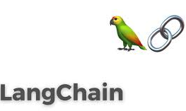
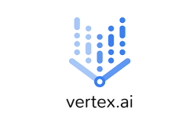

# 前情提要

前面提供相當多透過 LangChain 來打造一個 LINE Bot 的案例。但是如果希望使用更穩定的後台，並且希望使用更多 AI 相關的功能，那麼 Vertex AI 就是就是一個很好的選擇。接下來會開始逐步介紹整個移植過程並且介紹需要介紹的地方，還有可能會出現的問題。


## 透過 LangChain 與 Gemini 打造 LINE Bot 到 Vertex AI

首先先給各位一個簡單的 LangChain + Gemini 打造 LINE Bot 的範例程式碼：

處理 Webhook 相關程式碼：

```
    for event in events:
        if not isinstance(event, MessageEvent):
            continue

        if (event.message.type == "text"):
            # Process text message using LangChain
            msg = event.message.text
            response = generate_text_with_langchain(f'{msg}, reply in zh-TW:')
            reply_msg = TextSendMessage(text=response)
            await line_bot_api.reply_message(
                event.reply_token,
                reply_msg
            )
```

接下來解釋一下 `generate_text_with_langchain` 的內容：

```

# Initialize LangChain with Gemini
os.environ["GOOGLE_API_KEY"] = gemini_key

....

def generate_text_with_langchain(prompt):
    """
    Generate a text completion using LangChain with Gemini model.
    """
    # Create a chat prompt template with system instructions
    prompt_template = ChatPromptTemplate.from_messages([
        SystemMessage(
            content="You are a helpful assistant that responds in Traditional Chinese (zh-TW)."),
        HumanMessage(content=prompt)
    ])

    # Format the prompt and call the model
    formatted_prompt = prompt_template.format_messages()
    response = text_model.invoke(formatted_prompt)

    return response.content
```

這就是部分片段的透過 LangChain 加上 Gemini 來打造 LINE Bot 的程式碼，[完成程式碼](https://github.com/kkdai/linebot-gemini-python/blob/a746ad144bf4e0a760e5d6b1d361b5a7745bbadb/main.py)。


## 什麼是 Vertex AI？有什麼特別功能？



Vertex AI 是 Google Cloud 提供的一個全面性機器學習平台，旨在簡化模型的訓練、部署和管理。它特別適合需要企業級解決方案的開發者。與直接使用 Gemini API 不同，Vertex AI 提供了以下獨特功能：

1. 整合 Gemini 模型與更多選擇
   Vertex AI 支援 Gemini 系列模型（如 gemini-pro 和 gemini-1.5-flash），同時也支援其他模型（如 PaLM 和 Codey），讓你有更多選擇來滿足不同需求。
2. 託管運行時與自動擴展
   透過 Vertex AI 的 Reasoning Engine，你可以輕鬆部署 LangChain 應用程式，並享受自動擴展、安全性和監控功能，無需自行管理伺服器。
3. 多模態支援
   Vertex AI 的 Gemini 模型支援多模態輸入（文字、圖片、甚至影片），這對於打造功能豐富的 LINE Bot（如處理圖片訊息）非常有用。
4. 企業級安全性與合規性
   Vertex AI 提供 IAM（身份與存取管理）、資料加密和區域擴展功能，確保應用程式符合企業需求。
5. 工具整合與函數調用
   Vertex AI 支援 Function Calling，讓模型可以與外部 API 或工具互動，例如天氣查詢或資料庫搜尋，提升 LINE Bot 的實用性。

## 開始移植 Gemini 到 Vertex AI 

首先會需要兩個主要參數

- [Project_ID] : 你的 GCP Project ID
- [Location] : Vertex AI 的地區! Vertex AI 的地區! Vertex AI 的地區! (很重要講三次)

接下來 這裡有一個很好的 [Colab](https://colab.research.google.com/github/GoogleCloudPlatform/generative-ai/blob/main/gemini/getting-started/intro_gemini_2_0_flash.ipynb) 可以讓你去了解一下。

主要程式碼如下：

```
import os
from google import genai
from google.genai.types import (
    FunctionDeclaration,
    GenerateContentConfig,
    GoogleSearch,
    HarmBlockThreshold,
    HarmCategory,
    MediaResolution,
    Part,
    Retrieval,
    SafetySetting,
    Tool,
    ToolCodeExecution,
    VertexAISearch,
)

PROJECT_ID = ""  # @param {type: "string", placeholder: "[your-project-id]", isTemplate: true}
if not PROJECT_ID or PROJECT_ID == "[your-project-id]":
    PROJECT_ID = str(os.environ.get("GOOGLE_CLOUD_PROJECT"))

LOCATION = os.environ.get("GOOGLE_CLOUD_REGION", "us-central1")

client = genai.Client(vertexai=True, project=PROJECT_ID, location=LOCATION)

# 設定 model
MODEL_ID = "gemini-2.0-flash-001"  # @param {type: "string"}

# 產生輸出
response = client.models.generate_content(
    model=MODEL_ID, contents="What's the largest planet in our solar system?"
)

display(Markdown(response.text))
```


## 那該如何從 LangChain + Gemini 移植到 LangChain + VertexAI 呢？

跟據 LangChain 的文件上，主要使用 Google Vertex AI 會使用到 `langchain_google_vertexai` 裡面的 `VertexAI` ，需要注意的事情如下：

- 如果放在 GCP 的 Cloud Run 就不需要放 Services Account 的 JSON 內容
- 如果不是放在 GCP 上，就必須要將 JSON 內容放入 `GOOGLE_APPLICATION_CREDENTIALS` 系統參數中。


### 需要注意的問題：

1. 關於以下錯誤該如何解決?

```
details = "Publisher Model `projects/PROJECT_ID/locations/asia-east1/publishers/google/models/gemini-2.0-flash` not found."
```

