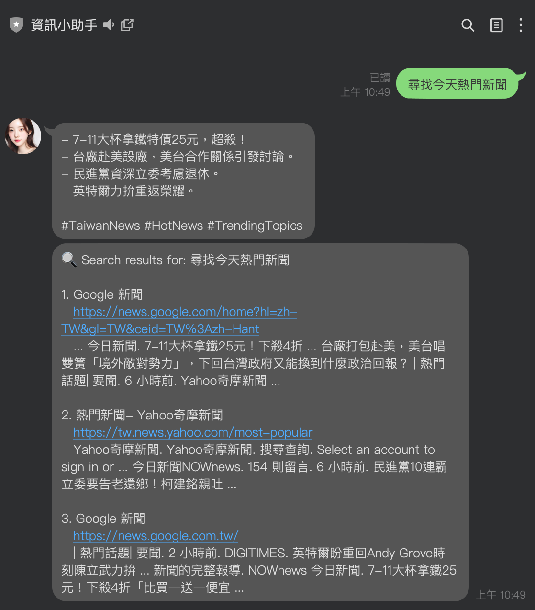
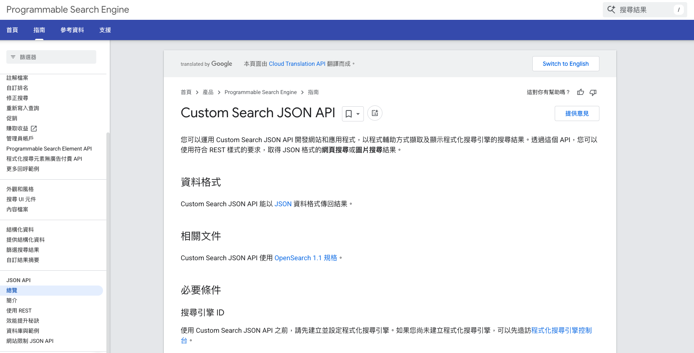

## 前情提要

一直以來我們都知道透過 LLM 上的 function call ，是可以讓 LLM 有了使用工具的能力。可以去做網頁搜尋，或是查詢資料庫，甚至是做一些特殊的工作。 

而在處理網頁搜尋的時候，通常是會使用到一些外部服務 [SerpAPI](https://serpapi.com/)  相關的付費服務。 如果你原本的服務是建置在 Google Cloud Platform 上面，有沒有想過是否有可以使用的服務呢？ 本篇文章就來介紹一下，如何透過 Google Custom Search API 搜尋 Google 並且將結果總結回覆。


## 如何快速取的 Google Search 的網頁

以往來說，如果你是在本地端直接來呼叫，可以透過 `https://www.google.com/search?q=YOUR_KEYWORD` 來直接呼叫網址顯示相關的搜尋結果。 這個時候，你也可以透過一些 Crawler 來搜尋以下的結果，但是.... 但是

- 如果你服務放在 GCP 不能直接爬 Google 網頁
- 如果你服務放在 GCP 不能直接爬 Google 網頁
- 如果你服務放在 GCP 不能直接爬 Google 網頁

這個時候，就應該要去思考有沒有其他的方式可以解決。


## Google Custom Search JSON API



(相關[說明網址](https://developers.google.com/custom-search/v1/overview?hl=zh-tw))

Google Custom Search JSON API 提供了免費提供每天 100 個搜尋查詢。如果您需要更多，請在 API 控制台中申請[billing](https://cloud.google.com/billing/docs/how-to/manage-billing-account?hl=zh-tw)功能。額外要求的費用為每 1 千筆查詢 $5 美元，每日最多 1 萬次查詢。

接下來給大家一個範例程式碼，看要如何呼叫 Google Custom Search JSON API

```python
def search_with_google_custom_search(keywords, search_api_key, cx, num_results=10):
    """
    使用 Google Custom Search API 根據關鍵字進行搜尋。

    :param keywords: 關鍵字列表
    :param search_api_key: Google Custom Search API 的 API 金鑰
    :param cx: 搜尋引擎 ID
    :param num_results: 要返回的搜尋結果數量，預設為 10
    :return: 搜尋結果列表，每個結果包含標題、連結和摘要
    """
    query = " ".join(keywords)  # 將關鍵字組合成搜尋查詢
    url = f"https://www.googleapis.com/customsearch/v1?key={search_api_key}&cx={cx}&q={query}&num={num_results}"

    try:
        logger.info(f"Searching for: {query}")
        response = requests.get(url)
        response.raise_for_status()  # 如果請求失敗，拋出異常
        result_data = response.json()

        # Check if there are search results
        if "items" not in result_data:
            logger.warning(f"No search results for query: {query}")
            return []

        results = result_data.get("items", [])
        formatted_results = []
        for item in results:
            formatted_results.append(
                {
                    "title": item.get("title", "No title"),
                    "link": item.get("link", ""),
                    "snippet": item.get("snippet", "No description available"),
                }
            )
        return formatted_results
    except requests.exceptions.RequestException as e:
        logger.error(f"Google Custom Search API 請求失敗：{e}")
        return []
```


這裡你會需要兩個數值:

- `search_api_key`:  這個你在[說明網址](https://developers.google.com/custom-search/v1/overview?hl=zh-tw) 會取得
- `cx`: 這個是 Google Search ID ，這個 [Custom Search Dashboard](https://programmablesearchengine.google.com/controlpanel/overview)   取得你自己的。


## 取得關鍵字

另外一個需要詳細處理的部分在於，如果你的問題是一整句話，如果要放入 Google Search 的話，比較好的方式是找出「關鍵詞」。這個部分，我們會使用 Gemini 來處理。

```python
def extract_keywords_with_gemini(text, gemini_api_key, num_keywords=5):
    """
    使用 Gemini API 從文字中提取關鍵字。

    :param text: 使用者輸入的文字
    :param gemini_api_key: Gemini API 的 API 金鑰
    :param num_keywords: 要提取的關鍵字數量，預設為 5
    :return: 提取的關鍵字列表
    """
    try:
        # 設定 API 金鑰
        current_key = genai.get_api_key()

        # Only configure if needed (prevent reconfiguring when already set correctly)
        if current_key != gemini_api_key:
            genai.configure(api_key=gemini_api_key)

        # 建立 Gemini 模型
        model = genai.GenerativeModel("gemini-1.5-flash")

        # 準備提示詞，要求模型提取關鍵字
        prompt = f"""從以下文字中提取 {num_keywords} 個最重要的關鍵字或短語，只需返回關鍵字列表，不要有額外文字：

{text}

關鍵字："""

        # 生成回應
        response = model.generate_content(prompt)

        # 處理回應，將文字分割成關鍵字列表
        if response.text:
            # 清理結果，移除數字、破折號和多餘空白
            keywords_text = response.text.strip()
            # 分割文字得到關鍵字列表
            keywords = [kw.strip() for kw in keywords_text.split("\n")]
            # 移除可能的數字前綴、破折號或其他標點符號
            keywords = [kw.strip("0123456789. -\"'") for kw in keywords]
            # 移除空項
            keywords = [kw for kw in keywords if kw]
            return keywords[:num_keywords]  # 確保只返回指定數量的關鍵字
        return []
    except Exception as e:
        logger.error(f"Gemini API 提取關鍵字失敗：{e}")
        # If direct text contains useful terms, use it directly
        if len(text) < 100:  # If the text is short, it might be a good search query already
            return [text]
        return []
```

以上的程式碼，會根據你的詢問去抓取出最多五個關鍵詞，幫助做搜尋使用。這裡使用到的是 `gemini-1.5-flash` 。


## 資訊總結的部分：

資訊總結的部分，這裡使用 LangChain 來呼叫。大家可以快速參考一下相關程式碼：

```python
def summarize_text(text: str, max_tokens: int = 100) -> str:
    '''
    Summarize a text using the Google Generative AI model.
    '''
    llm = ChatGoogleGenerativeAI(
        model="gemini-1.5-flash",
        temperature=0,
        max_tokens=None,
        timeout=None,
        max_retries=2,
    )

    prompt_template = """用台灣用語的繁體中文，簡潔地以條列式總結文章重點。在摘要後直接加入相關的英文 hashtag，以空格分隔。內容來源可以是網頁、文章、論文、影片字幕或逐字稿。

    原文： "{text}"
    請遵循以下步驟來完成此任務：

    # 步驟
    1. 從提供的內容中提取重要重點，無論來源是網頁、文章、論文、影片字幕或逐字稿。
    2. 將重點整理成條列式，確保每一點為簡短且明確的句子。
    3. 使用符合台灣用語的簡潔繁體中文。
    4. 在摘要結尾處，加入至少三個相關的英文 hashtag，並以空格分隔。

    # 輸出格式
    - 重點應以條列式列出，每一點應為一個短句或片語，語言必須簡潔明瞭。
    - 最後加入至少三個相關的英文 hashtag，每個 hashtag 之間用空格分隔。

    # 範例
    輸入：
    文章內容：
    台灣的報告指出，環境保護的重要性日益增加。許多人開始選擇使用可重複使用的產品。政府也實施了多項政策來降低廢物。

    摘要：

    輸出：
    - 環境保護重要性增加
    - 越來越多人使用可重複產品
    - 政府實施減廢政策
    #EnvironmentalProtection #Sustainability #Taiwan
    """

    prompt = PromptTemplate.from_template(prompt_template)

    summarize_chain = load_summarize_chain(
        llm=llm, chain_type="stuff", prompt=prompt)
    document = Document(page_content=text)
    summary = summarize_chain.invoke([document])
    return summary["output_text"]
```


## 未來發展

本來做這個只是為了讓我的「[資訊小幫手](https://github.com/kkdai/linebot-helper-python)」，希望他可以有更多基本功能來整合 Google Search 並且試著總結一些問題。 發現了有 Custom Search API 之後，或許之後可以有更多有趣的應用。

也歡迎大家自己部署自己的 「[資訊小幫手](https://github.com/kkdai/linebot-helper-python)」。如果你有一些更特別的應用，也歡迎告訴我。


