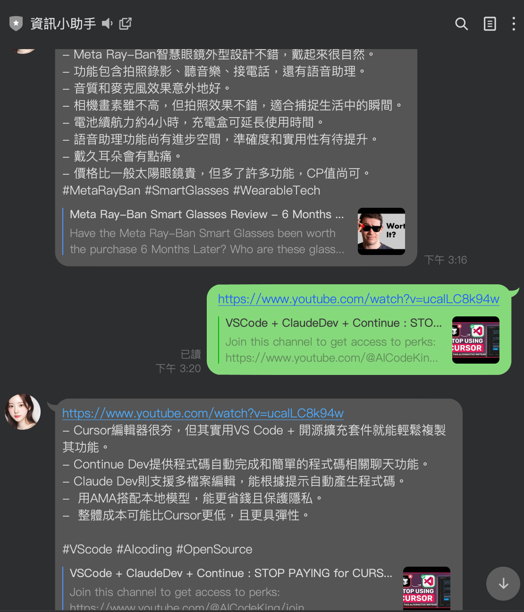

# 前言

之前有一篇文章「[[Google Cloud] 如何在 GCP Cloud Run 上面透過 LangChain 取得 YouTube 的相關資訊](https://www.evanlin.com/langchain-youtube-gcp/)」，雖然有講過使用 Secret Manager 與 GCP. 相關的 LangChain YouTube 套件來試著抓取資料。但是近期 YouTube 又開始修該他的讀取規範，造成原來的方式不能成功，這裡記錄一下主要錯誤訊息，還有該如何解決。


## 主要的問題

有一天 YouTube 的字幕開始抓不到，查詢 Log 出現以下內容。 

```
During handling of the above exception, another exception occurred:
youtube_transcript_api._errors.RequestBlocked:
Could not retrieve a transcript for the video https://www.youtube.com/watch?v=ViA4-YWx8Y4! This is most likely caused by:
YouTube is blocking requests from your IP. This usually is due to one of the following reasons:
- You have done too many requests and your IP has been blocked by YouTube
- You are doing requests from an IP belonging to a cloud provider (like AWS, Google Cloud Platform, Azure, etc.). Unfortunately, most IPs from cloud providers are blocked by YouTube.

There are two things you can do to work around this:
1. Use proxies to hide your IP address, as explained in the "Working around IP bans" section of the README (https://github.com/jdepoix/youtube-transcript-api?tab=readme-ov-file#working-around-ip-bans-requestblocked-or-ipblocked-exception).
2. (NOT RECOMMENDED) If you authenticate your requests using cookies, you will be able to continue doing requests for a while. However, YouTube will eventually permanently ban the account that you have used to authenticate with! So only do this if you don't mind your account being banned!
If you are sure that the described cause is not responsible for this error and that a transcript should be retrievable, please create an issue at https://github.com/jdepoix/youtube-transcript-api/issues. Please add which version of youtub
```

這邊快速提到主要出現的問題：

- 由於透過 LangChain 架構中， `GoogleApiYoutubeLoader` 也是呼叫 [https://github.com/jdepoix/youtube-transcript-api/](https://github.com/jdepoix/youtube-transcript-api/) 來使用。
- 由於部署在 GCP 上面，造成 YouTube 開始阻擋所有同一個雲端的需求。
- 這邊套件是建議使用 [Webshare](https://www.webshare.io/?referral_code=1yl49cgzfedr) 這類型的 Proxy 服務，來去抓取相關資料。

## WebShare


 [Webshare](https://www.webshare.io/?referral_code=1yl49cgzfedr)  是一個第三方的付費 Proxy 服務，可以讓你的 Web Request 可以透過這個服務達到以下的相關事項：

- 想要在 GCP 上面存取（爬蟲） Google 服務（Map, YouTube, Google Search)
- 想要爬一些比較有阻擋 CSP (Cloud Services Provider) IP 的 CDN 服務（比如說 CloudFlare)

他也有相關的免費 Proxy 額度可以使用：

- 五個 Proxy
- 一個月 1GB usage

對於 Youtube 字幕來說，這樣流量不會是問題。

使用上也蠻簡單的，這裡附上透過  [Webshare](https://www.webshare.io/?referral_code=1yl49cgzfedr)  抓取 [YouTube Transcript](https://github.com/jdepoix/youtube-transcript-api/) 的程式碼：

```
from youtube_transcript_api import YouTubeTranscriptApi
from youtube_transcript_api.proxies import WebshareProxyConfig
import os


def get_transcripts(video_id, languages):
    # Get proxy credentials from environment variables
    proxy_username = os.environ.get("PROXY_USERNAME")
    proxy_password = os.environ.get("PROXY_PASSWORD")

    ytt_api = YouTubeTranscriptApi(
        proxy_config=WebshareProxyConfig(
            proxy_username=proxy_username,
            proxy_password=proxy_password,
        )
    )
    transcript_list = ytt_api.fetch(video_id, languages=languages)
    transcript_texts = [snippet["text"] for snippet in transcript_list.to_raw_data()]
    return " ".join(transcript_texts)


# Example usage (only runs when script is executed directly)
if __name__ == "__main__":
    video_id = "YOUR_VIDEO_ID"
    languages = ["en", "de"]
    transcript_text = get_transcripts(video_id, languages)
    print(transcript_text)
```

比起直接連線來說，雖然會比較慢一點。但是真的可以直接抓取資料。


## 可能要避免的部分（額外費用)

雖然  [Webshare](https://www.webshare.io/?referral_code=1yl49cgzfedr) 有免費的額度又好用，但是如果你抓取次數太頻繁可能會被  [Webshare](https://www.webshare.io/?referral_code=1yl49cgzfedr)  阻擋掉叫你去付錢。這邊要小心。

```
youtube_transcript_api._errors.RequestBlocked:

Could not retrieve a transcript for the video https://www.youtube.com/watch?v=ViA4-YWx8Y4! This is most likely caused by:

YouTube is blocking your requests, despite you using Webshare proxies. Please make sure that you have purchased "Residential" proxies and NOT "Proxy Server" or "Static Residential", as those won't work as reliably! The free tier also uses "Proxy Server" and will NOT work!

The only reliable option is using "Residential" proxies (not "Static Residential"), as this allows you to rotate through a pool of over 30M IPs, which means you will always find an IP that hasn't been blocked by YouTube yet!

You can support the development of this open source project by making your Webshare purchases through this affiliate link: https://www.webshare.io/?referral_code=w0xno53eb50g
Thank you for your support! <3
```

