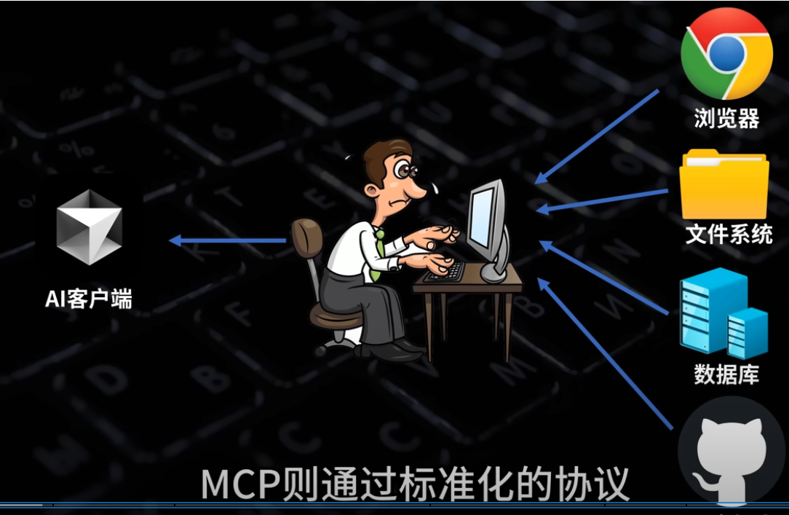
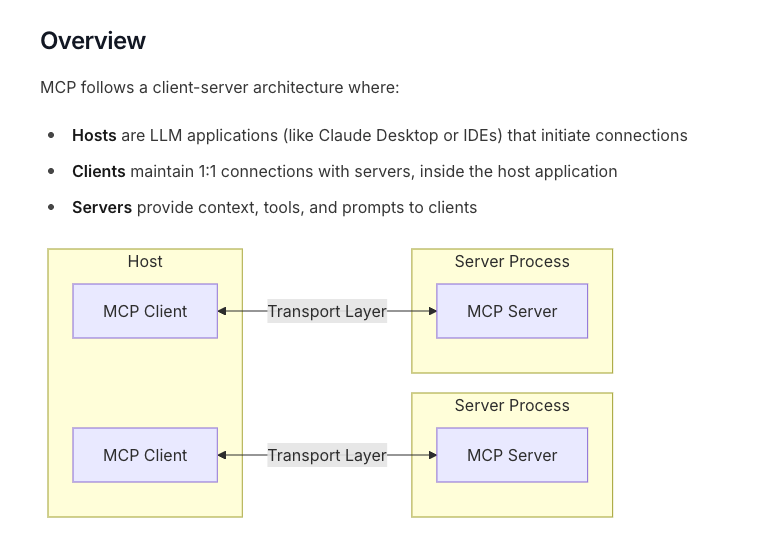
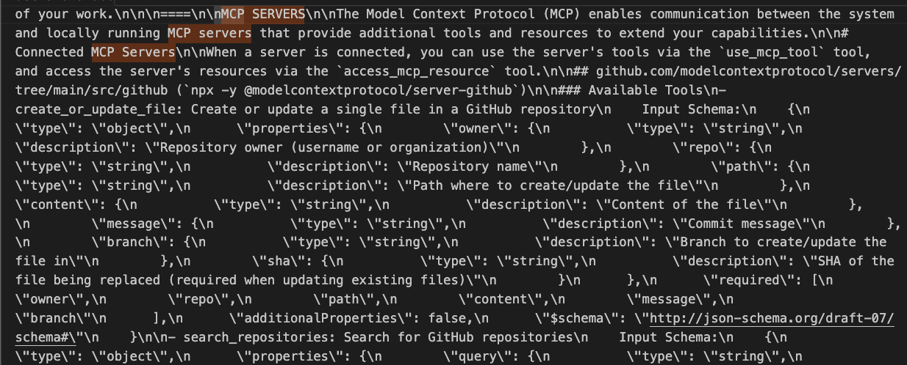
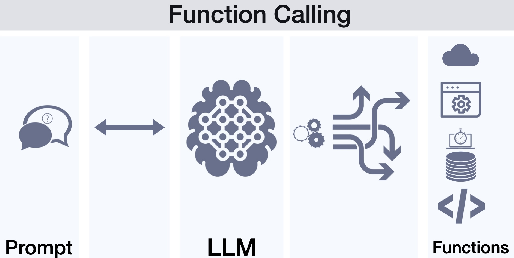

## 前情提要

最近 MCP 是非常熱門的討論話題，但是大家提到 MCP 不免會想到 Anthropic 的 Claude 或是其他語言的模型。這一篇文章要告訴大家關於 MCP 的一些基礎原理，並且如何使用 Google Gemini 來呼叫 MCP 。希望能給大家一些整理。

## 什麼是 *MCP*（Model Context Protocol）

[根據 Anthropic 的文件上面有提到](https://docs.anthropic.com/zh-TW/docs/agents-and-tools/mcp): MCP 是一個開放協議，用於標準化應用程式如何為大型語言模型（LLM）提供上下文。您可以將 MCP 想像成 AI 應用程式的 USB-C 接口。就像 USB-C 為您的設備提供了一個標準化的方式來連接各種外圍設備和配件一樣，MCP 為 AI 模型提供了一個標準化的方式來連接不同的數據源和工具。

這邊也分享 YT [https://www.youtube.com/watch?v=McNRkd5CxFY&t=17s]( https://www.youtube.com/watch?v=McNRkd5CxFY&t=17s) 上面的架構圖，讓大家更容易理解

（圖片來源 [技术爬爬虾  TechShrimp](https://www.youtube.com/@Tech_Shrimp) :[MCP是啥？技术原理是什么？一个视频搞懂MCP的一切。Windows系统配置MCP，Cursor,Cline 使用MCP](https://www.youtube.com/watch?v=McNRkd5CxFY&t=17s)）

這邊可以看出來， 透過 MCP 這邊提到的 AI 客戶端（大家常使用的 ChatGPT, Claude, Gemini 的等等）都可以透過 MCP 架構直接來對這些服務做「操作」。

### MCP 服務中的架構圖

(架構圖：  [MCP Core architecture](https://modelcontextprotocol.io/docs/concepts/architecture))

這個架構圖，有清楚的敘述出關於 MCP 的 Client Server 的架構，這邊再強調一下。

- **MCP Host**: 使用這些 MCP 服務的應用，可能是 Cline, Windsurf 或是 Claude Desktop)
- **MCP Server**:  許多地方應該都要介紹過，這裡不太贅述。之後也會有範例程式碼。就是一個萬用的溝通協定，讓每一個 MCP Host 可以更容易去使用一些外部功能。並且變成一個共通的協定。
- **MCP Client**:  在每一個 Host 中，確定使用某個 MCP Server 後。在 Host 中，會有其相關的 client 這裡將會是用 Prompt 存在著。接下來會詳細敘述。

## MCP 運作細節

完整細節可以參考網路上這位的說明，不過我將內容改成 Google Gemini 相關的應用。除了換掉影片中使用的 DeepSeek 之外，也可以讓整個使用更符合資訊安全相關的應用。 

##### 參考影片： 

[技术爬爬虾  TechShrimp](https://www.youtube.com/@Tech_Shrimp) [MCP是怎么对接大模型的？抓取AI提示词，拆解MCP的底层原理](https://www.youtube.com/watch?v=wiLQgCDzp44)

### 透過 CloudFlare 建立 AI API Gateway 

(如果要查看相關細節，需要使用 OpenRouter 或是 OpenAI Compatible )

- 建立一個 [Cloudflare 帳號](https://dash.cloudflare.com/)
- 建立 AI -> API Gateway
- 選項選擇 OpenRouter  ，然後記得去 [OpenRouter 申請帳號](https://openrouter.ai/)

如果要查看 MCP 溝通細節，就得使用 OpenAI 或是 OpenRouter 。這裡查看[影片](https://www.youtube.com/watch?v=wiLQgCDzp44)可以看到完整教學。這裡將直接貼出相關細節。

以上是透過 Cloudflare 抓取封包後，來解析 MCP 的溝通機制：

- 你會發現 MCP Server 所有安裝的 Server  跟功能都被當作 Promopt 輸入給該模型。
- 每一個 MCP Server 能做什麼，會寫在 Prompt 之中（圖片可以看到 Github Repository MCP Server)

以上這些資料很重要，稍後會在下一個章節 MCP 跟 Function Call 來討論。

### MCP 跟 Function Call 的差別

原本 LLM 有一些模型會透過 Function Calling 來決定要如何呼叫一些工具，這裡其實需要 Model 額外的支持，雖然說大家常見的 LLM 提供商 OpenAI, Google, Anthropic 都已經支援 Function Calling ，但是每一次都要為了這些工具額外去寫相關的 Function Calling App 還是很讓人頭痛。

這也是為什麼 MCP 會紅的原因，他讓原本的 Function Calling App 變成一個共用機制。每一個相關的應用廠商，都可以寫出自己的 MCP Servers ，也可以讓使用的服務變得更多人可以使用。

並且，很重要的：

- MCP 讓不能使用 Function Calling 的 Model 也能使用 MCP Servers
- MCP 讓不能使用 Function Calling 的 Model 也能使用 MCP Servers
- MCP 讓不能使用 Function Calling 的 Model 也能使用 MCP Servers

因為 [技术爬爬虾  TechShrimp](https://www.youtube.com/@Tech_Shrimp) [MCP是怎么对接大模型的？抓取AI提示词，拆解MCP的底层原理](https://www.youtube.com/watch?v=wiLQgCDzp44) 影片中使用到的相關模型是 DeepSeekChat 其實還不支援 Function Calling ，但是他也是可以在透過 MCP Server 來互動。

## 使用 Cline 作為 MCP host

## 參考資料：

- [MCP Core architecture](https://modelcontextprotocol.io/docs/concepts/architecture)
- [技术爬爬虾  TechShrimp](https://www.youtube.com/@Tech_Shrimp) :[MCP是啥？技术原理是什么？一个视频搞懂MCP的一切。Windows系统配置MCP，Cursor,Cline 使用MCP](https://www.youtube.com/watch?v=McNRkd5CxFY&t=17s)
- [高見龍: MCP 是什麼？可以吃嗎？](https://www.youtube.com/watch?v=cdBRAVYZKFo)

