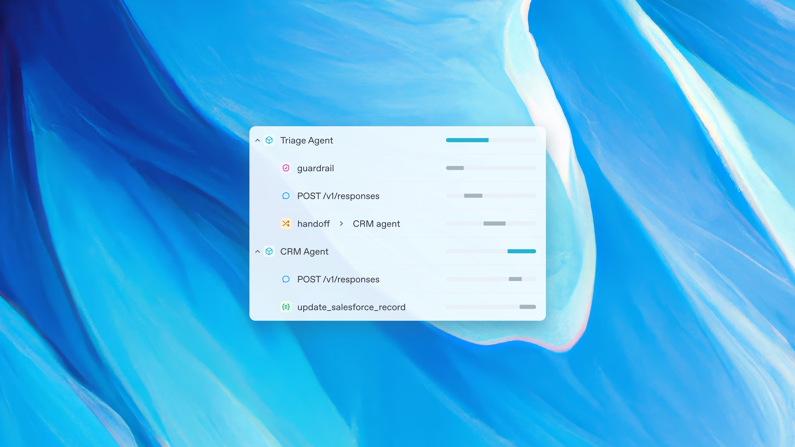

# 前言

 OpenAI 在 03/11 發佈了新的 [OpenAI-Agent SDK 的套件 (OpenAI-Agents-Python)](https://github.com/openai/openai-agents-python)，裡面不僅僅支援多 Agent 可以相互作用外，還宣佈了[可以支援 MCP Server](https://github.com/openai/openai-agents-python/blob/9c53abe8c15ab2cf1c5591c1db1f61b52a1b24dc/docs/mcp.md) 。

本篇文章將介紹如何透過 OpenAI-Agents SDK 來打造一個最簡單的 LINE Bot 功能，作為之後 MCP 與其他功能的起始專案。

#### 範例程式碼：  [https://github.com/kkdai/linebot-openai-agent](https://github.com/kkdai/linebot-openai-agent)

## 快速簡介 OpenAI-Agents-SDK

 [OpenAI-Agent SDK 的套件 (OpenAI-Agents-Python)](https://github.com/openai/openai-agents-python)  OpenAI推出了一系列新工具和API，包括Responses API和Agents SDK，這些工具旨在簡化開發者和企業構建智能代理的過程。Responses API結合了Chat Completions API的簡單性和Assistants API的工具使用能力，支持網頁搜索、文件搜索和電腦使用等內建功能。Agents SDK提供了改進的可觀察性和安全檢查，簡化多代理工作流程的編排，並支持智能代理之間的控制轉移，從而提升各行各業的生產力。

並且這個套件同時也提供[支援 MCP Server](https://openai.github.io/openai-agents-python/mcp/) 的功能，詳細部分下一次再介紹。


## 透過 Custom Provider 來使用 Google Gemini

先來讓 OpenAI-Agents SDK 可以使用其他公司的模型，這邊使用的是 Custom Provider。官方的敘述如下：


這邊我們使用 [custom_example_provider.py](https://github.com/openai/openai-agents-python/blob/main/examples/model_providers/custom_example_provider.py) 範例程式碼來參考，實際完成整合可以看 範例程式碼：  [https://github.com/kkdai/linebot-openai-agent](https://github.com/kkdai/linebot-openai-agent)


```
BASE_URL = os.getenv("EXAMPLE_BASE_URL") or ""
API_KEY = os.getenv("EXAMPLE_API_KEY") or ""
MODEL_NAME = os.getenv("EXAMPLE_MODEL_NAME") or ""

# Initialize OpenAI client
client = AsyncOpenAI(base_url=BASE_URL, api_key=API_KEY)
set_tracing_disabled(disabled=True)
```

這邊主要需要三個環境參數，以下開始詳細說明：

- `BASE_URL`: 也就是 Custom Provider 的 API 網址，如果要使用 Google Gemini 請記得改成 `https://generativelanguage.googleapis.com/v1beta/`。
- `API_KEY`: 這邊就寫成自己的 Google Gemini API Key
- `MODEL_NAME`: 這邊記得要改成 Gemini 的 Model ，要省費用可以使用 `gemini-1.5-flash`。

然後這樣的透過 `AsyncOpenAI()` 就可以呼叫 Google Gemini 的服務了。


## 加入簡單的 Tools 

這個範例參考原本的 Tools 的寫法，並且加入兩個 Tools 。

```
@function_tool
def get_weather(city: str):
    """Get weather information for a city"""
    print(f"[debug] getting weather for {city}")
    return f"The weather in {city} is sunny."


@function_tool
def translate_to_chinese(text: str):
    """Translate text to Traditional Chinese"""
    print(f"[debug] translating: {text}")
    return f"Translating to Chinese: {text}"
```

這邊可以看到有兩個工具可以使用，一個是 `translate_to_chinese` 另外一個是 `get_weather` ，當然因為這是一個範例，裡面就直接回覆天氣很好即可。 

## 整合 LINE Bot SDK 跟 OpenAI-Agents-SDK

這邊程式碼分成兩個部分解釋，首先是針對 LINE Bot 的 WebHook 處理的部分。這邊沒有太多其他的部分：


```
for event in events:
        if not isinstance(event, MessageEvent):
            continue

        if event.message.type == "text":
            # Process text message
            msg = event.message.text
            user_id = event.source.user_id
            print(f"Received message: {msg} from user: {user_id}")

            # Use the user's prompt directly with the agent
            response = await generate_text_with_agent(msg)
            reply_msg = TextSendMessage(text=response)
            await line_bot_api.reply_message(
                event.reply_token,
                reply_msg
            )
        elif event.message.type == "image":
            return 'OK'
        else:
            continue
```

主要會去呼叫 `generate_text_with_agent` 並且等待他的結果。

```
async def generate_text_with_agent(prompt):
    """
    Generate a text completion using OpenAI Agent.
    """
    # Create agent with appropriate instructions
    agent = Agent(
        name="Assistant",
        instructions="You are a helpful assistant that responds in Traditional Chinese (zh-TW). Provide informative and helpful responses.",
        model=OpenAIChatCompletionsModel(
            model=MODEL_NAME, openai_client=client),
        tools=[get_weather, translate_to_chinese],
    )

    try:
        result = await Runner.run(agent, prompt)
        return result.final_output
    except Exception as e:
        print(f"Error with OpenAI Agent: {e}")
        return f"抱歉，處理您的請求時出現錯誤: {str(e)}"
```

這邊使用 `OpenAIChatCompletionModel` 的時候，需要透過 `model=MODEL_NAME, openai_client=client)` 來使用 Custom Model Provider 。這樣才能正確使用到 Google Gemini 的 Model 。

要使用 Tools ，就必須要使用到 `tools=[get_weather, translate_to_chinese]` 將所有支援的 Tools 加入進來。才能正確引用到。 

## 成果與如何使用


部署完畢後，這是一個簡單的截圖。使用也很簡單，直接就詢問他問題。如果跟翻譯有關，就會直接使用到 `translate_to_chinese` ，如果要抓取城市的天氣，他則會先跟你確認清楚城市的名稱後，一率都回覆你天氣晴朗。

## 快速總結與未來發展

本篇文章提供了範例程式碼，並且提供了如何使用  [OpenAI-Agent SDK 的套件 (OpenAI-Agents-Python)](https://github.com/openai/openai-agents-python)  來串接 LINE Bot SDK 。 之後的幾篇文章，我們將開始串接一些有用的 MCP Server 並且讓我們的 LINE Bot 有更完整的功能。
